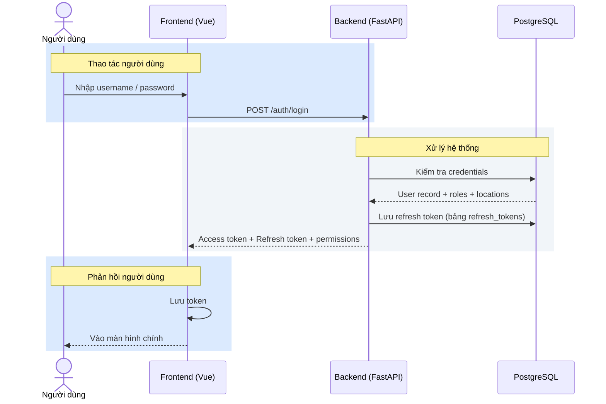
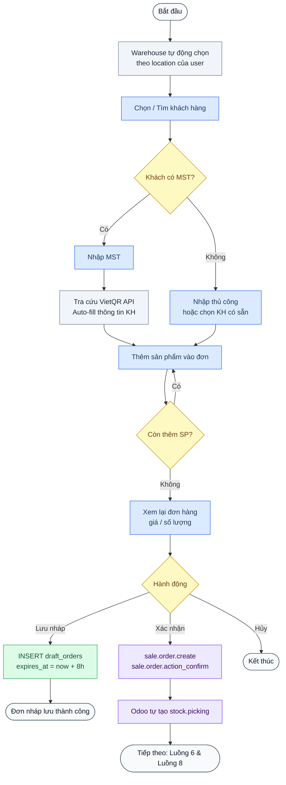
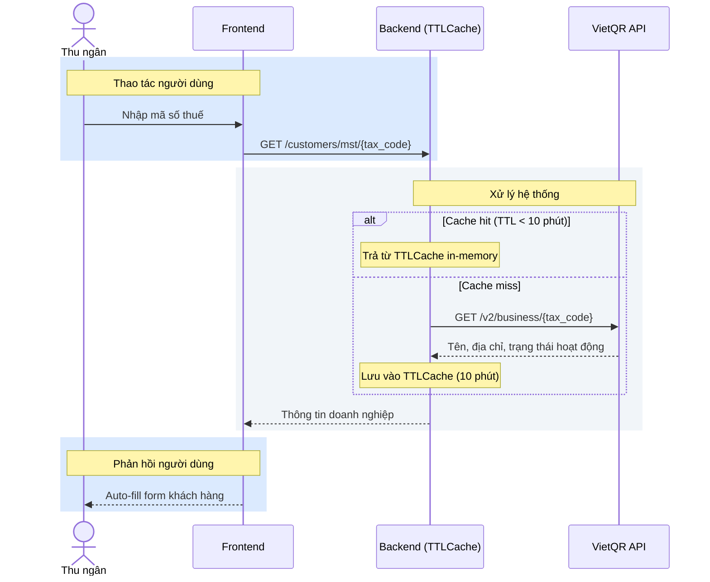
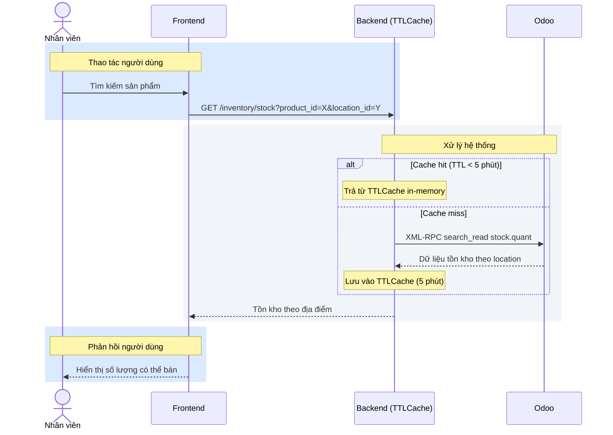
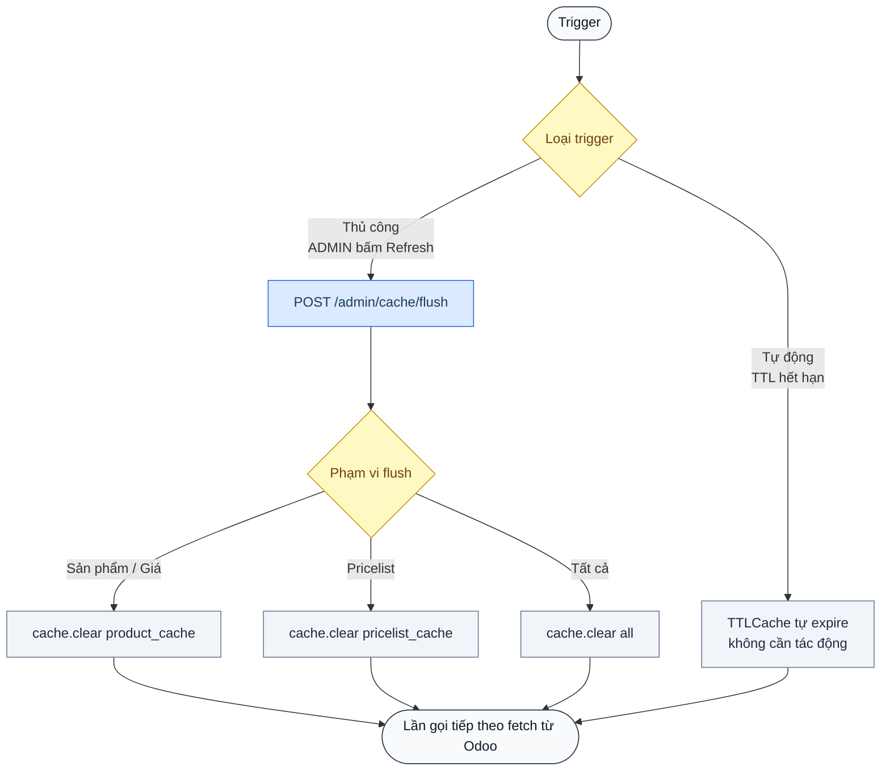
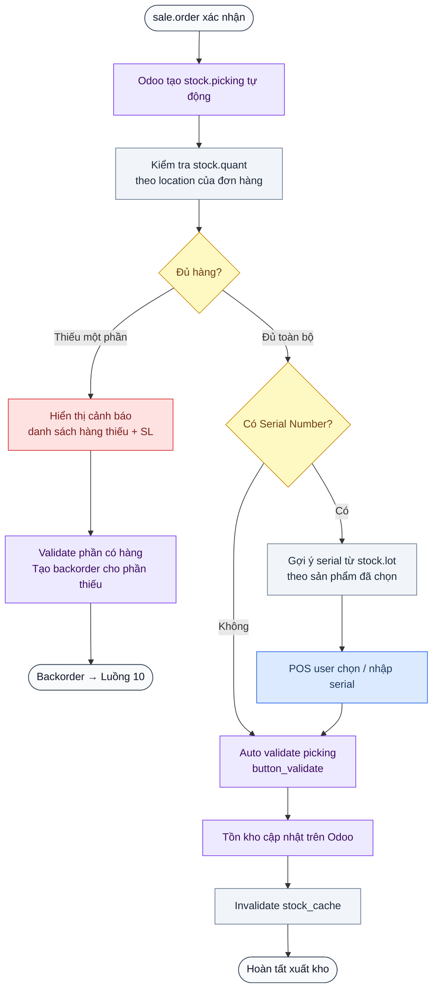
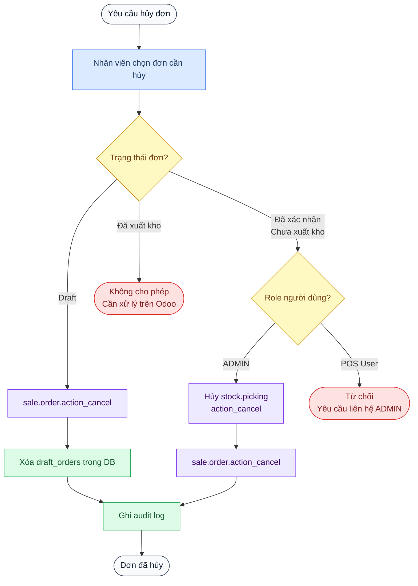
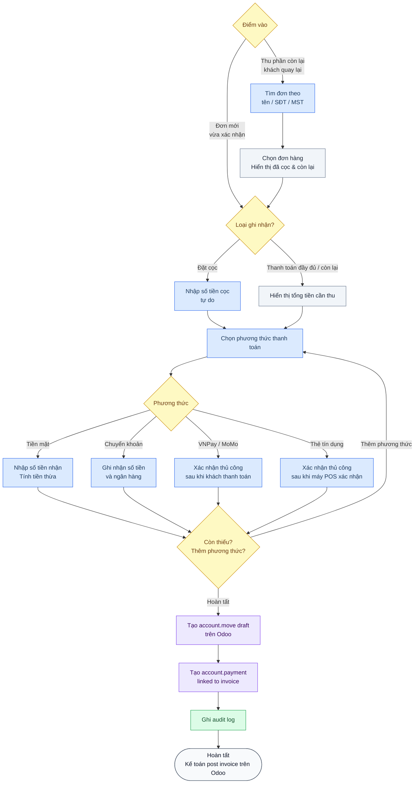
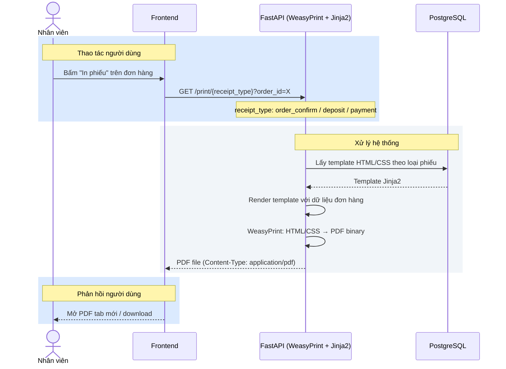
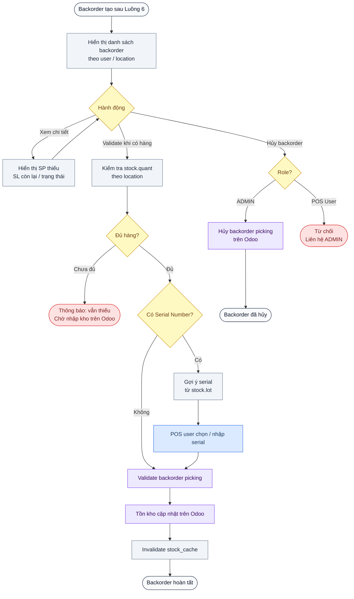

# VJ Mobile POS — Process Flow

> Trạng thái: Draft  
> Cập nhật: 2026-04-14  
> Phiên bản: 0.5

Chỉ bao gồm các luồng đã xác định đủ nội dung.  
Các câu hỏi còn mở xem tại [open_questions.md](open_questions.md).

---

## Chú thích màu sắc

| Màu | Ý nghĩa |
|---|---|
| 🔵 Xanh dương | Thao tác của **người dùng** |
| ⬜ Xám nhạt | Xử lý **hệ thống** / Backend |
| 🟣 Tím nhạt | Thao tác trên **Odoo** (XML-RPC) |
| 🟢 Xanh lá | Truy vấn / ghi **Database** |
| 🟡 Vàng | Điểm **quyết định** |
| 🔴 Đỏ nhạt | **Cảnh báo** / Từ chối |

---

## 1. Luồng Đăng nhập (Authentication)

---

## 2. Luồng Bán hàng — Tạo đơn & Xác nhận

---

## 3. Luồng Tra cứu MST

---

## 4. Luồng Kiểm tra tồn kho

---

## 5. Luồng Làm mới Cache

---

## 6. Luồng Xuất kho (Auto validate + Serial + Backorder)

---

## 7. Luồng Hủy đơn hàng

---

## 8. Luồng Nhận thanh toán (Ghi nhận thủ công)

---

## 9. Luồng In phiếu bán hàng (Generate PDF)

---

## 10. Luồng Quản lý Backorder

