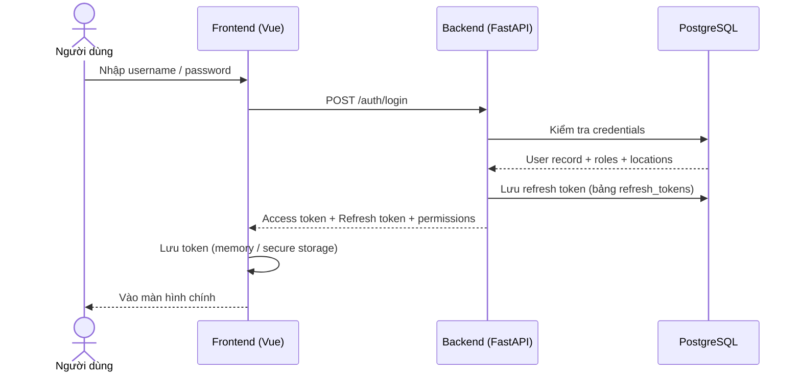
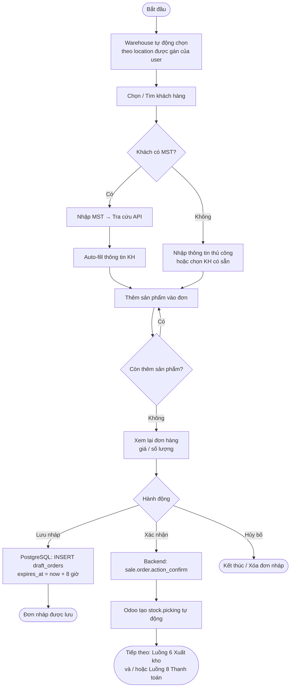
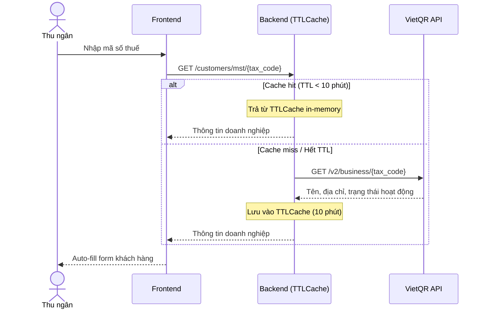
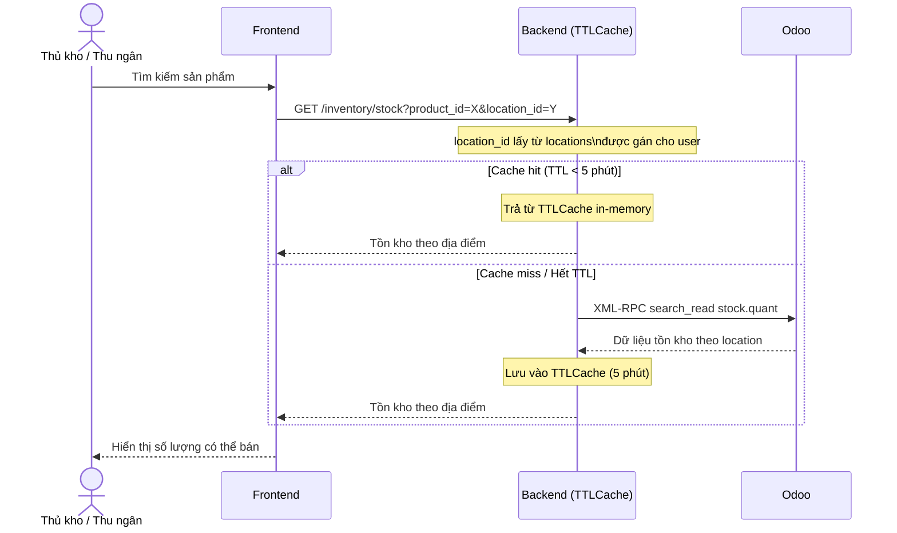
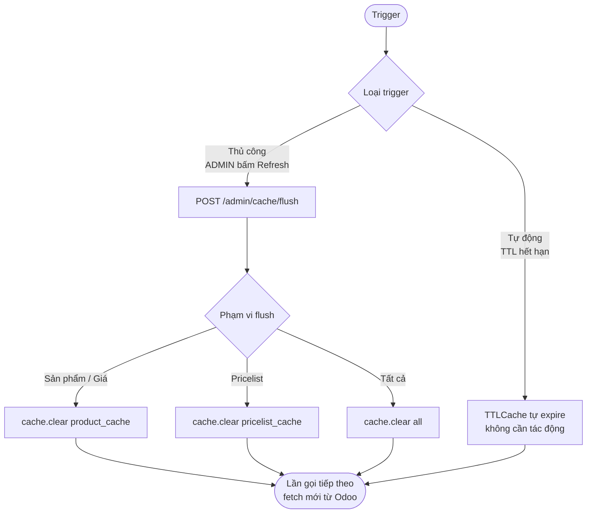
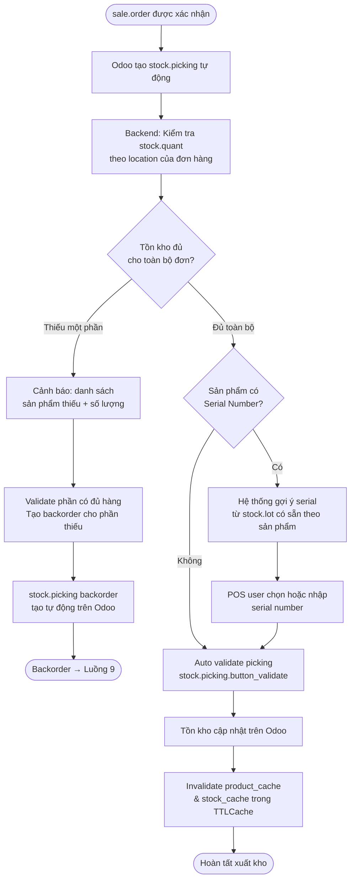
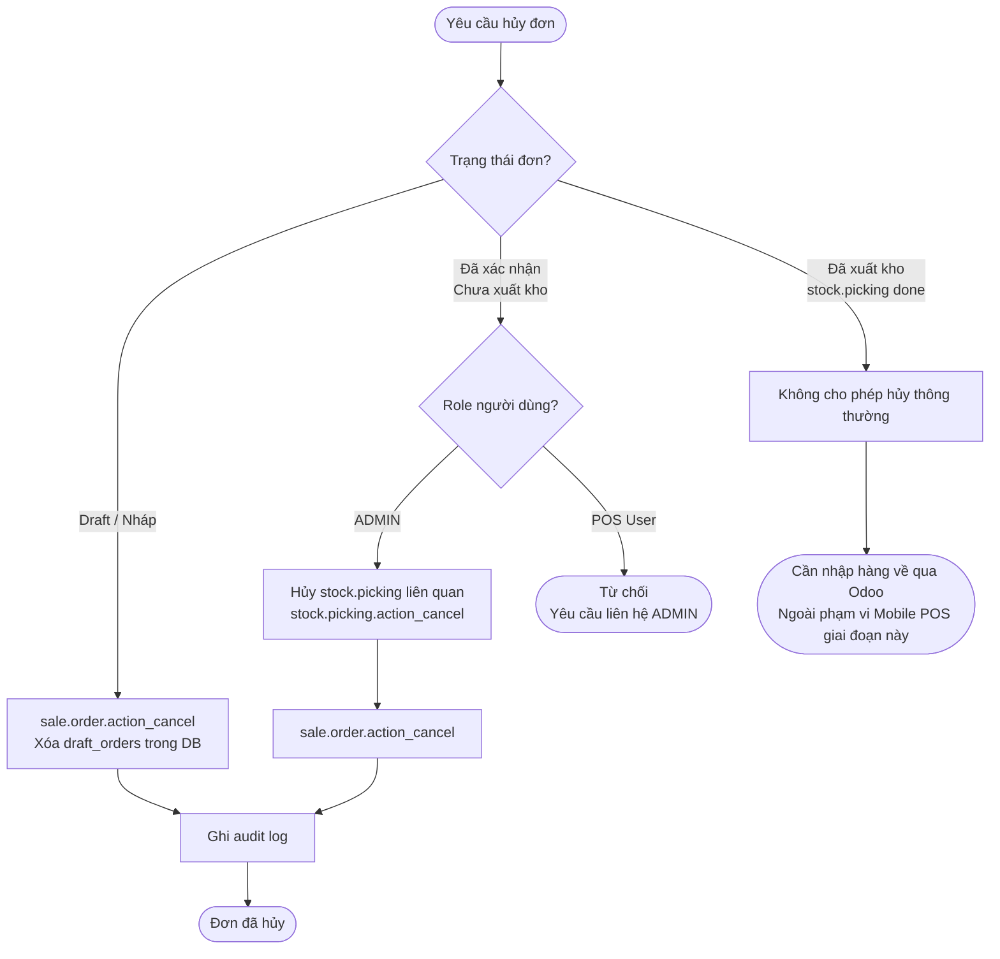
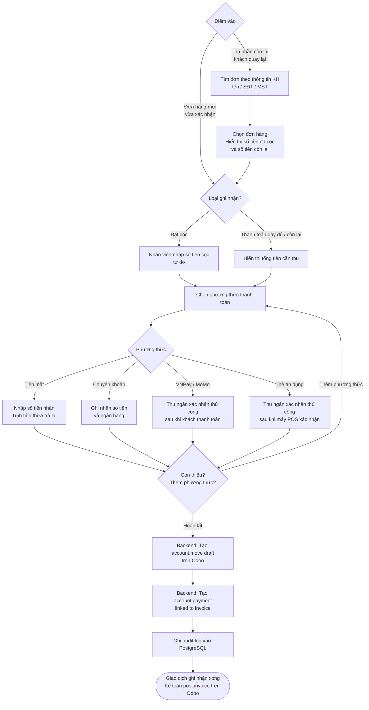
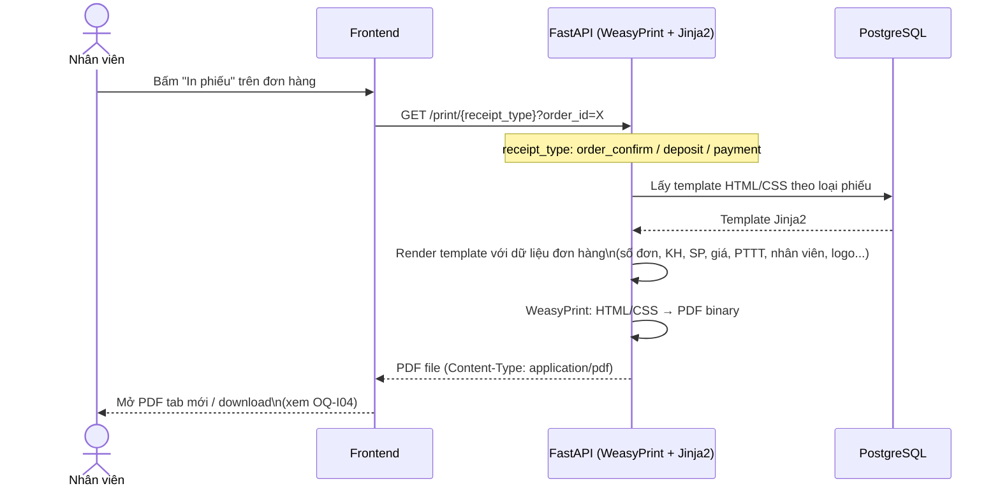
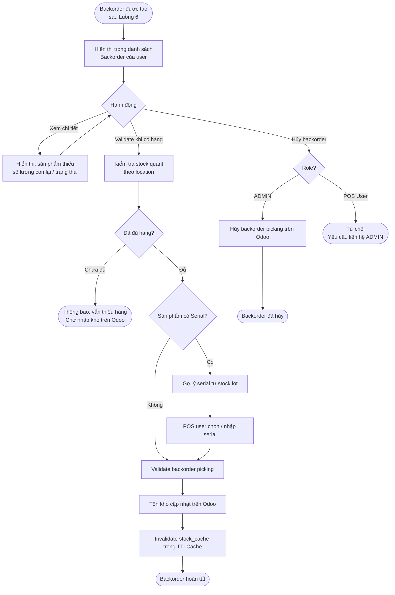

# VJ Mobile POS — Process Flow

> Trạng thái: Draft  
> Cập nhật: 2026-04-14  
> Phiên bản: 0.4

Chỉ bao gồm các luồng đã xác định đủ nội dung.  
Các câu hỏi còn mở xem tại [open_questions.md](open_questions.md).

---

## 1. Luồng Đăng nhập (Authentication)

---

## 2. Luồng Bán hàng — Tạo đơn & Xác nhận

> Warehouse tự động chọn theo location được gán của user.  
> Sau bước confirm → xem Luồng 6 (Xuất kho) và Luồng 8 (Thanh toán).

---

## 3. Luồng Tra cứu MST

---

## 4. Luồng Kiểm tra tồn kho

---

## 5. Luồng Làm mới Cache (Cache Invalidation)

---

## 6. Luồng Xuất kho (Auto validate + Serial + Backorder)

---

## 7. Luồng Hủy đơn hàng

---

## 8. Luồng Nhận thanh toán (Ghi nhận thủ công)

> Hỗ trợ nhiều phương thức trong 1 đơn.  
> `account.payment` tạo từ Mobile POS dựa trên thanh toán thực tế.  
> `account.move` (invoice) ở trạng thái draft — kế toán post trên Odoo.

---

## 9. Luồng In phiếu bán hàng (Generate PDF)

> 3 loại phiếu: Xác nhận đơn, Đặt cọc, Thanh toán.  
> FastAPI render HTML/CSS (Jinja2) → WeasyPrint → PDF binary — toàn bộ trong Python.

---

## 10. Luồng Quản lý Backorder

