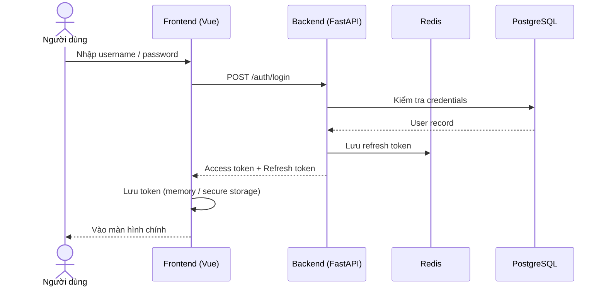
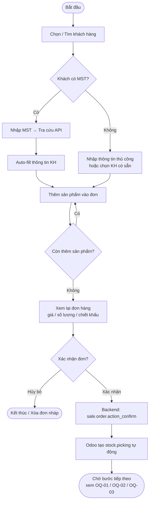
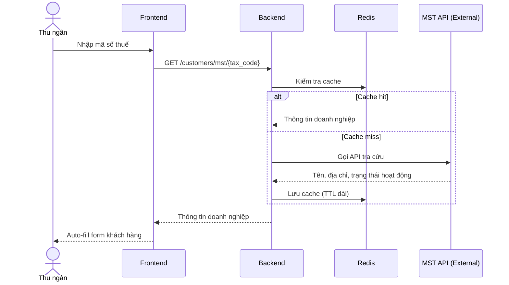
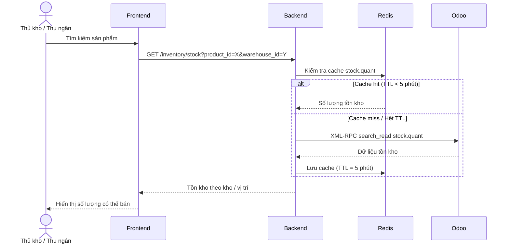
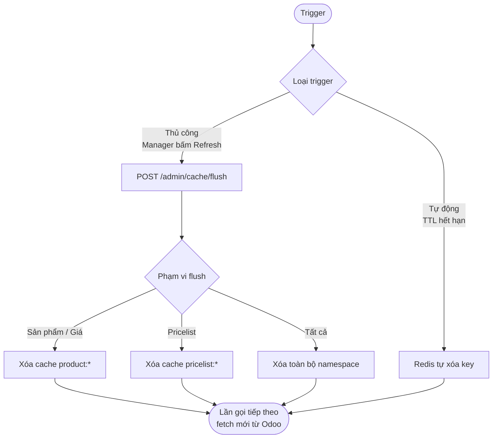

# VJ Mobile POS — Process Flow

> Trạng thái: Draft  
> Cập nhật: 2026-04-14  
> Phiên bản: 0.1

Chỉ bao gồm các luồng đã xác định đủ nội dung.  
Các luồng chưa xác định (Xuất kho, Thanh toán, Hủy đơn) xem tại [open_questions.md](open_questions.md).

---

## 1. Luồng Đăng nhập (Authentication)

---

## 2. Luồng Bán hàng — Tạo đơn & Xác nhận

> Luồng kết thúc tại bước Odoo tạo `stock.picking`.  
> Bước tiếp theo (xuất kho / thanh toán) chờ xác nhận — xem OQ-01, OQ-02, OQ-03.

---

## 3. Luồng Tra cứu MST

---

## 4. Luồng Kiểm tra tồn kho

---

## 5. Luồng Làm mới Cache (Cache Invalidation)

