# VJ Mobile POS — Process Flow

> Trạng thái: Draft  
> Cập nhật: 2026-04-17  
> Phiên bản: 0.9

Chỉ bao gồm các luồng đã xác định đủ nội dung.  
Các câu hỏi còn mở xem tại [open_questions.md](open_questions.md).

---

## Chú thích màu sắc

| Màu | Ý nghĩa |
|---|---|
| 🔵 Xanh dương | Thao tác của **Nhân viên bán hàng / Thu ngân** |
| 🩵 Xanh ngọc | Thao tác / Thông báo liên quan **Kế Toán Thuế** |
| ⬜ Xám nhạt | Xử lý **hệ thống** (Backend / Odoo / Database) |
| 🟡 Vàng | Điểm **quyết định** |
| 🔴 Đỏ nhạt | **Cảnh báo** / Từ chối |

---

## Mục lục

### Phần A — Business Flows (Nghiệp vụ)

| # | Luồng | Mô tả |
|---|---|---|
| A1 | Bán hàng — Tạo đơn & Xác nhận | Chọn SP, serial, xác nhận hoặc lưu nháp |
| A2 | Nhận thanh toán | Chọn KH (nếu chưa), ghi nhận thủ công, multi-payment, đặt cọc |
| A3 | Xuất kho | Auto validate picking + serial + backorder |
| A4 | Quản lý Backorder | Theo dõi, validate, hủy backorder |
| A5 | Hủy đơn hàng | Hủy theo trạng thái + phân quyền |
| A6 | Xuất hoá đơn điện tử | Tạo nháp trên Misa + thông báo kế toán thuế |
| A7 | Tạo / Cập nhật Khách hàng | Tìm / tạo / sửa `res.partner`, auto-fill MST qua VietQR, sync Odoo ngay |

### Phần B — Technical Flows (Kỹ thuật)

| # | Luồng | Mô tả |
|---|---|---|
| B1 | Đăng nhập | JWT auth + hr.employee info |
| B2 | Làm mới Cache | TTL auto-expire + flush thủ công |
| B3 | Quản lý User | Tạo user liên kết hr.employee, phân quyền |
| B4 | Reset Password | Gửi email token qua AWS SES |
| B5 | Kiểm tra tồn kho | Tra cứu stock.quant theo location |
| B6 | Tra cứu MST | VietQR API + TTLCache |
| B7 | In phiếu bán hàng | Generate PDF (A4/A5) từ template |
| B8 | Tích hợp Misa (eInvoice) | Xác thực, tạo hoá đơn nháp, xử lý lỗi |
| B9 | Tích hợp Đơn vị giao hàng / COD | Tạo vận đơn, nhận callback xác nhận thu tiền |
| B10 | Tích hợp VNPay API | Payment URL, IPN callback, HMAC-SHA512 |
| B11 | Tích hợp MoMo API | Payment request, IPN callback, HMAC-SHA256 |
| B12 | Tích hợp VietQR Payment | Sinh QR chuyển khoản, xác nhận từ ngân hàng |

---

# Phần A — Business Flows

---

## A1. Luồng Bán hàng — Tạo đơn & Xác nhận

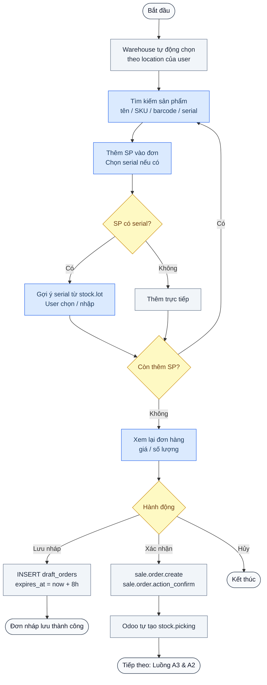
```mermaid
flowchart TD
    classDef user fill:#DBEAFE,stroke:#2563EB,color:#1e3a5f
    classDef system fill:#F1F5F9,stroke:#64748B,color:#1e293b
    classDef accountant fill:#CCFBF1,stroke:#0D9488,color:#134E4A
    classDef decision fill:#FEF9C3,stroke:#CA8A04,color:#713f12
    classDef terminal fill:#F8FAFC,stroke:#334155,color:#0f172a
    classDef warning fill:#FEE2E2,stroke:#DC2626,color:#7f1d1d

    A([Bắt đầu]):::terminal --> B[Warehouse tự động chọn\ntheo location của user]:::system
    B --> C[Tìm kiếm sản phẩm\ntên / SKU / barcode / serial]:::user
    C --> D[Thêm SP vào đơn\nChọn serial nếu có]:::user
    D --> E{SP có serial?}:::decision
    E -- Có --> F[Gợi ý serial từ stock.lot\nUser chọn / nhập]:::user
    E -- Không --> G[Thêm trực tiếp]:::system
    F --> H{Còn thêm SP?}:::decision
    G --> H
    H -- Có --> C
    H -- Không --> I[Xem lại đơn hàng\ngiá / số lượng]:::user
    I --> J{Hành động}:::decision
    J -- Lưu nháp --> K[INSERT draft_orders\nexpires_at = now + 8h]:::system
    K --> L([Đơn nháp lưu thành công]):::terminal
    J -- Xác nhận --> M[sale.order.create\nsale.order.action_confirm]:::system
    M --> N[Odoo tự tạo stock.picking]:::system
    N --> O([Tiếp theo: Luồng A3 & A2]):::terminal
    J -- Hủy --> P([Kết thúc]):::terminal
```

**Ghi chú:**
- KH không bắt buộc ở bước này — chỉ bắt buộc trước khi thanh toán (A2)
- SP hết hàng: cho phép thêm kèm cảnh báo, ghi `**` trong tên SP (OQ-Q04)
- Serial chọn ngay khi thêm SP (OQ-Q04)

---

## A2. Luồng Nhận thanh toán (Ghi nhận thủ công)

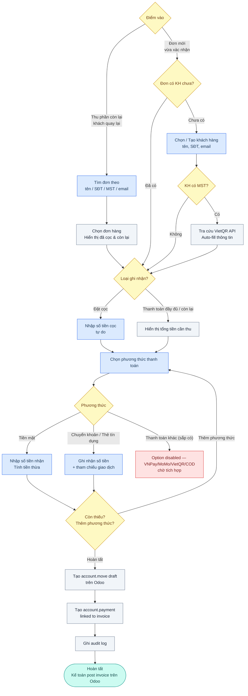
```mermaid
flowchart TD
    classDef user fill:#DBEAFE,stroke:#2563EB,color:#1e3a5f
    classDef system fill:#F1F5F9,stroke:#64748B,color:#1e293b
    classDef accountant fill:#CCFBF1,stroke:#0D9488,color:#134E4A
    classDef decision fill:#FEF9C3,stroke:#CA8A04,color:#713f12
    classDef terminal fill:#F8FAFC,stroke:#334155,color:#0f172a
    classDef warning fill:#FEE2E2,stroke:#DC2626,color:#7f1d1d

    START{Điểm vào}:::decision -- Đơn mới\nvừa xác nhận --> CK
    START -- Thu phần còn lại\nkhách quay lại --> SEARCH[Tìm đơn theo\ntên / SĐT / MST / email]:::user
    SEARCH --> FOUND[Chọn đơn hàng\nHiển thị đã cọc & còn lại]:::system
    FOUND --> B

    CK{Đơn có KH chưa?}:::decision
    CK -- Chưa có --> SELKH[Chọn / Tạo khách hàng\ntên, SĐT, email]:::user
    CK -- Đã có --> B
    SELKH --> MST{KH có MST?}:::decision
    MST -- Có --> LOOKUP[Tra cứu VietQR API\nAuto-fill thông tin]:::system
    MST -- Không --> B
    LOOKUP --> B

    B{Loại ghi nhận?}:::decision -- Đặt cọc --> C[Nhập số tiền cọc\ntự do]:::user
    B -- Thanh toán đầy đủ / còn lại --> D[Hiển thị tổng tiền cần thu]:::system
    C --> E[Chọn phương thức thanh toán]:::user
    D --> E
    E --> F{Phương thức}:::decision
    F -- Tiền mặt --> G[Nhập số tiền nhận\nTính tiền thừa]:::user
    F -- Chuyển khoản / Thẻ tín dụng --> H[Ghi nhận số tiền\n+ tham chiếu giao dịch]:::user
    F -- Thanh toán khác (sắp có) --> DISABLED[Option disabled — VNPay/MoMo/VietQR/COD\nchờ tích hợp]:::warning
    G --> K{Còn thiếu?\nThêm phương thức?}:::decision
    H --> K
    K -- Thêm phương thức --> E
    K -- Hoàn tất --> L[Tạo account.move draft\ntrên Odoo]:::system
    L --> M[Tạo account.payment\nlinked to invoice]:::system
    M --> N[Ghi audit log]:::system
    N --> O([Hoàn tất\nKế toán post invoice trên Odoo]):::accountant
```

**Ghi chú:**
- **Bắt buộc chọn/tạo KH trước khi thanh toán** — nếu đơn chưa có KH sẽ mở dialog chọn KH
- Hỗ trợ đặt cọc nhiều lần (OQ-O01)
- Đơn cọc không hết hạn (OQ-O02)
- Nhiều phương thức trong 1 đơn (OQ-C03)
- **Phương thức** (giai đoạn 1): 3 option — Tiền mặt, Chuyển khoản/Thẻ, Thanh toán khác (disabled). VNPay/MoMo/VietQR Payment/COD chờ tích hợp API trong sprint sau.

---

## A3. Luồng Xuất kho (Auto validate + Serial + Backorder)

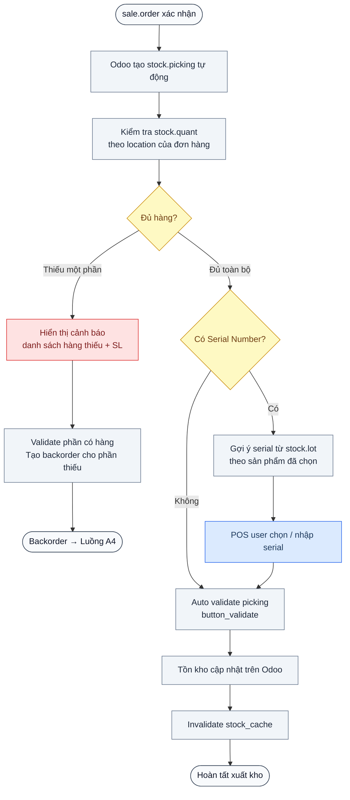
```mermaid
flowchart TD
    classDef user fill:#DBEAFE,stroke:#2563EB,color:#1e3a5f
    classDef system fill:#F1F5F9,stroke:#64748B,color:#1e293b
    classDef accountant fill:#CCFBF1,stroke:#0D9488,color:#134E4A
    classDef decision fill:#FEF9C3,stroke:#CA8A04,color:#713f12
    classDef terminal fill:#F8FAFC,stroke:#334155,color:#0f172a
    classDef warning fill:#FEE2E2,stroke:#DC2626,color:#7f1d1d

    A([sale.order xác nhận]):::terminal --> B[Odoo tạo stock.picking tự động]:::system
    B --> C[Kiểm tra stock.quant\ntheo location của đơn hàng]:::system
    C --> D{Đủ hàng?}:::decision
    D -- Đủ toàn bộ --> E{Có Serial Number?}:::decision
    D -- Thiếu một phần --> F[Hiển thị cảnh báo\ndanh sách hàng thiếu + SL]:::warning
    F --> G[Validate phần có hàng\nTạo backorder cho phần thiếu]:::system
    G --> H([Backorder → Luồng A4]):::terminal
    E -- Không --> I[Auto validate picking\nbutton_validate]:::system
    E -- Có --> J[Gợi ý serial từ stock.lot\ntheo sản phẩm đã chọn]:::system
    J --> K[POS user chọn / nhập serial]:::user
    K --> I
    I --> L[Tồn kho cập nhật trên Odoo]:::system
    L --> M[Invalidate stock_cache]:::system
    M --> N([Hoàn tất xuất kho]):::terminal
```

---

## A4. Luồng Quản lý Backorder

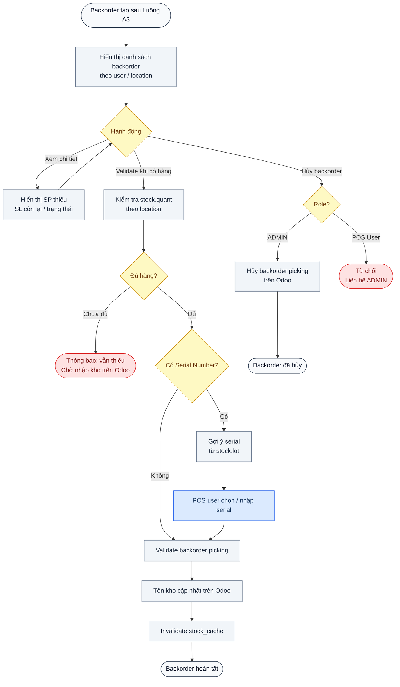
```mermaid
flowchart TD
    classDef user fill:#DBEAFE,stroke:#2563EB,color:#1e3a5f
    classDef system fill:#F1F5F9,stroke:#64748B,color:#1e293b
    classDef accountant fill:#CCFBF1,stroke:#0D9488,color:#134E4A
    classDef decision fill:#FEF9C3,stroke:#CA8A04,color:#713f12
    classDef terminal fill:#F8FAFC,stroke:#334155,color:#0f172a
    classDef warning fill:#FEE2E2,stroke:#DC2626,color:#7f1d1d

    A([Backorder tạo sau Luồng A3]):::terminal --> B[Hiển thị danh sách backorder\ntheo user / location]:::system
    B --> C{Hành động}:::decision
    C -- Xem chi tiết --> D[Hiển thị SP thiếu\nSL còn lại / trạng thái]:::system
    D --> C
    C -- Validate khi có hàng --> E[Kiểm tra stock.quant\ntheo location]:::system
    E --> F{Đủ hàng?}:::decision
    F -- Chưa đủ --> G([Thông báo: vẫn thiếu\nChờ nhập kho trên Odoo]):::warning
    F -- Đủ --> H{Có Serial Number?}:::decision
    H -- Không --> I[Validate backorder picking]:::system
    H -- Có --> J[Gợi ý serial\ntừ stock.lot]:::system
    J --> K[POS user chọn / nhập serial]:::user
    K --> I
    I --> L[Tồn kho cập nhật trên Odoo]:::system
    L --> M[Invalidate stock_cache]:::system
    M --> N([Backorder hoàn tất]):::terminal
    C -- Hủy backorder --> O{Role?}:::decision
    O -- ADMIN --> P[Hủy backorder picking\ntrên Odoo]:::system
    P --> Q([Backorder đã hủy]):::terminal
    O -- POS User --> R([Từ chối\nLiên hệ ADMIN]):::warning
```

---

## A5. Luồng Hủy đơn hàng

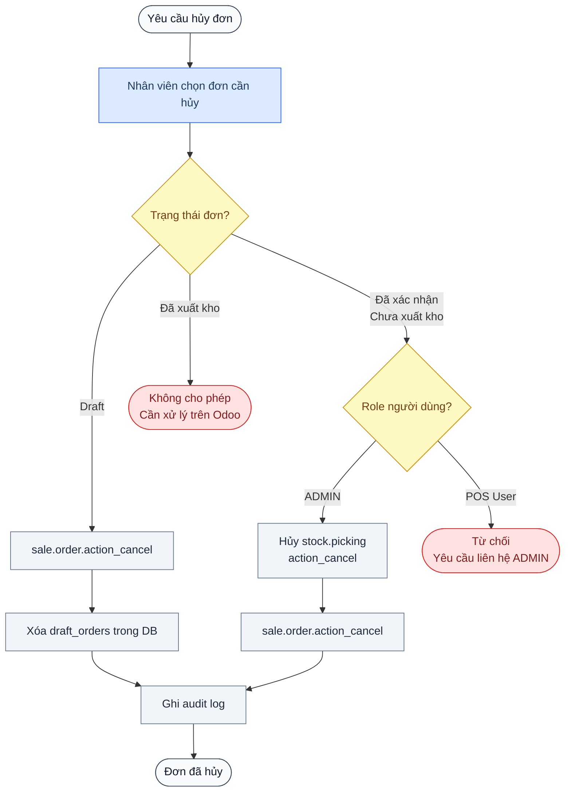
```mermaid
flowchart TD
    classDef user fill:#DBEAFE,stroke:#2563EB,color:#1e3a5f
    classDef system fill:#F1F5F9,stroke:#64748B,color:#1e293b
    classDef accountant fill:#CCFBF1,stroke:#0D9488,color:#134E4A
    classDef decision fill:#FEF9C3,stroke:#CA8A04,color:#713f12
    classDef terminal fill:#F8FAFC,stroke:#334155,color:#0f172a
    classDef warning fill:#FEE2E2,stroke:#DC2626,color:#7f1d1d

    A([Yêu cầu hủy đơn]):::terminal --> B[Nhân viên chọn đơn cần hủy]:::user
    B --> C{Trạng thái đơn?}:::decision
    C -- Draft --> D[sale.order.action_cancel]:::system
    D --> E[Xóa draft_orders trong DB]:::system
    E --> F[Ghi audit log]:::system
    F --> G([Đơn đã hủy]):::terminal
    C -- Đã xác nhận\nChưa xuất kho --> H{Role người dùng?}:::decision
    H -- ADMIN --> I[Hủy stock.picking\naction_cancel]:::system
    I --> J[sale.order.action_cancel]:::system
    J --> F
    H -- POS User --> K([Từ chối\nYêu cầu liên hệ ADMIN]):::warning
    C -- Đã xuất kho --> L([Không cho phép\nCần xử lý trên Odoo]):::warning
```

---

## A6. Luồng Xuất hoá đơn điện tử (Misa)

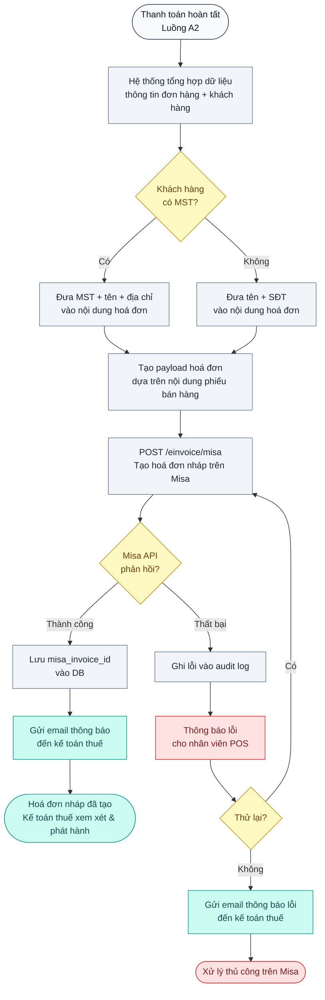
```mermaid
flowchart TD
    classDef user fill:#DBEAFE,stroke:#2563EB,color:#1e3a5f
    classDef system fill:#F1F5F9,stroke:#64748B,color:#1e293b
    classDef accountant fill:#CCFBF1,stroke:#0D9488,color:#134E4A
    classDef decision fill:#FEF9C3,stroke:#CA8A04,color:#713f12
    classDef terminal fill:#F8FAFC,stroke:#334155,color:#0f172a
    classDef warning fill:#FEE2E2,stroke:#DC2626,color:#7f1d1d

    A([Thanh toán hoàn tất\nLuồng A2]):::terminal --> B[Hệ thống tổng hợp dữ liệu\nthông tin đơn hàng + khách hàng]:::system
    B --> C{Khách hàng\ncó MST?}:::decision
    C -- Có --> D[Đưa MST + tên + địa chỉ\nvào nội dung hoá đơn]:::system
    C -- Không --> E[Đưa tên + SĐT\nvào nội dung hoá đơn]:::system
    D --> F[Tạo payload hoá đơn\ndựa trên nội dung phiếu bán hàng]:::system
    E --> F
    F --> G[POST /einvoice/misa\nTạo hoá đơn nháp trên Misa]:::system
    G --> H{Misa API\nphản hồi?}:::decision
    H -- Thành công --> I[Lưu misa_invoice_id\nvào DB]:::system
    I --> J[Gửi email thông báo\nđến kế toán thuế]:::accountant
    J --> K([Hoá đơn nháp đã tạo\nKế toán thuế xem xét & phát hành]):::accountant
    H -- Thất bại --> L[Ghi lỗi vào audit log]:::system
    L --> M[Thông báo lỗi\ncho nhân viên POS]:::warning
    M --> N{Thử lại?}:::decision
    N -- Có --> G
    N -- Không --> P[Gửi email thông báo lỗi\nđến kế toán thuế]:::accountant
    P --> O([Xử lý thủ công trên Misa]):::warning
```

**Ghi chú:**
- Hoá đơn chỉ được tạo ở trạng thái **nháp** — kế toán thuế phát hành chính thức trên Misa
- Nội dung hoá đơn dựa trên phiếu bán hàng (A8 / B7): danh sách sản phẩm, số lượng, đơn giá, tổng tiền
- Email thông báo gửi đến địa chỉ kế toán thuế được cấu hình trong hệ thống
- Nếu Misa API thất bại: audit log lưu lại để xử lý thủ công, không ảnh hưởng đến đơn hàng

---

## A7. Luồng Tạo / Cập nhật Khách hàng

Luồng quản lý `res.partner` — cả POS User và ADMIN đều được phép **tạo** và **cập nhật** (per OQ-J04, OQ-AE03). Entry points: từ màn Tạo đơn hàng (bấm "Chọn khách hàng"), hoặc từ Dialog Thanh toán (nếu chưa có KH), hoặc từ admin CRUD trong tương lai.

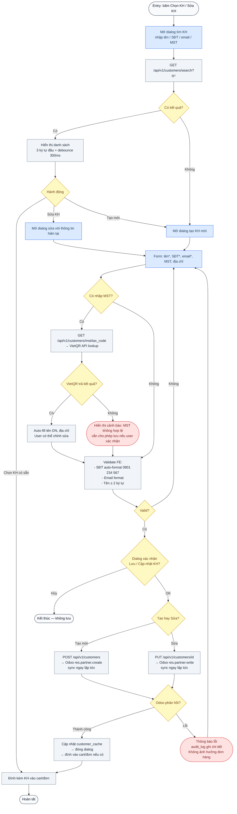
```mermaid
flowchart TD
    classDef user fill:#DBEAFE,stroke:#2563EB,color:#1e3a5f
    classDef system fill:#F1F5F9,stroke:#64748B,color:#1e293b
    classDef accountant fill:#CCFBF1,stroke:#0D9488,color:#134E4A
    classDef decision fill:#FEF9C3,stroke:#CA8A04,color:#713f12
    classDef terminal fill:#F8FAFC,stroke:#334155,color:#0f172a
    classDef warning fill:#FEE2E2,stroke:#DC2626,color:#7f1d1d

    START([Entry: bấm Chọn KH / Sửa KH]):::terminal --> SEARCH[Mở dialog tìm KH\nnhập tên / SĐT / email / MST]:::user
    SEARCH --> Q[GET /api/v1/customers/search?q=]:::system
    Q --> HAS{Có kết quả?}:::decision
    HAS -- Có --> LIST[Hiển thị danh sách\n3 ký tự đầu + debounce 300ms]:::system
    LIST --> PICK{Hành động}:::decision
    PICK -- Chọn KH có sẵn --> SELECT[Đính kèm KH vào cart/đơn]:::system
    PICK -- Sửa KH --> EDIT[Mở dialog sửa với thông tin hiện tại]:::user
    PICK -- Tạo mới --> NEW
    HAS -- Không --> NEW[Mở dialog tạo KH mới]:::user

    NEW --> FORM[Form: tên*, SĐT*, email*, MST, địa chỉ]:::user
    EDIT --> FORM
    FORM --> MST{Có nhập MST?}:::decision
    MST -- Có --> VQ[GET /api/v1/customers/mst/tax_code\n→ VietQR API lookup]:::system
    VQ --> VQR{VietQR trả kết quả?}:::decision
    VQR -- Có --> AUTOFILL[Auto-fill tên DN, địa chỉ\nUser có thể chỉnh sửa]:::system
    VQR -- Không --> WARN1([Hiển thị cảnh báo: MST không hợp lệ\nvẫn cho phép lưu nếu user xác nhận]):::warning
    AUTOFILL --> VAL
    WARN1 --> VAL
    MST -- Không --> VAL[Validate FE:\n- SĐT auto-format 0901 234 567\n- Email format\n- Tên ≥ 2 ký tự]:::system

    VAL --> VOK{Valid?}:::decision
    VOK -- Không --> FORM
    VOK -- Có --> CONFIRM{Dialog xác nhận\nLưu / Cập nhật KH?}:::decision
    CONFIRM -- Hủy --> END1([Kết thúc — không lưu]):::terminal
    CONFIRM -- OK --> API{Tạo hay Sửa?}:::decision

    API -- Tạo mới --> POST[POST /api/v1/customers\n→ Odoo res.partner.create\nsync ngay lập tức]:::system
    API -- Sửa --> PUT[PUT /api/v1/customers/id\n→ Odoo res.partner.write\nsync ngay lập tức]:::system

    POST --> RES{Odoo phản hồi?}:::decision
    PUT --> RES
    RES -- Thành công --> OK[Cập nhật customer_cache\n→ đóng dialog\n→ đính vào cart/đơn nếu có]:::system
    RES -- Lỗi --> ERR([Thông báo lỗi\naudit_log ghi chi tiết\nKhông ảnh hưởng đơn hàng]):::warning
    OK --> SELECT
    SELECT --> DONE([Hoàn tất]):::terminal
    ERR --> FORM
```

**Ghi chú:**

- **Quyền**: cả POS User và ADMIN đều được PUT/POST — per OQ-J04, OQ-AE03 ("Đã sửa trong backend").
- **Bắt buộc** (OQ-J02): `tên`, `số điện thoại`, `email`. MST + địa chỉ **tùy chọn**.
- **Tìm kiếm** (OQ-J03): tên, SĐT, email, MST — BE handle logic.
- **SĐT auto-format** (OQ-AF02): khi gõ `0901234567` → hiển thị `0901 234 567`. Regex VN: `^(0|\+84)(\d{9,10})$`.
- **MST VietQR** (OQ-X01, B6): khi nhập MST và blur/submit → call VietQR API → auto-fill tên DN + địa chỉ. User có thể chỉnh sửa sau auto-fill.
- **Sync ngay** (OQ-X01): backend gọi `res.partner.create` / `write` qua JSON-RPC ngay khi bấm Lưu — không đợi batch. Cache `customer_cache` invalidate cho user hiện tại.
- **Confirm dialog** (OQ-Q01): xác nhận trước khi tạo/lưu/cập nhật.
- **Đính kèm vào cart**: nếu entry từ màn Tạo đơn (`/orders/new`), sau khi lưu thành công → `cart.setCustomer(...)` → đóng dialog → quay lại màn chính.
- **Error handling**: Odoo fail → giữ dialog mở, show error, audit_log ghi lại; user có thể retry hoặc hủy.
- **Không cho xóa KH**: out of scope giai đoạn này (chỉnh sửa trên Odoo nếu cần).

---

# Phần B — Technical Flows

---

## B1. Luồng Đăng nhập (Authentication)

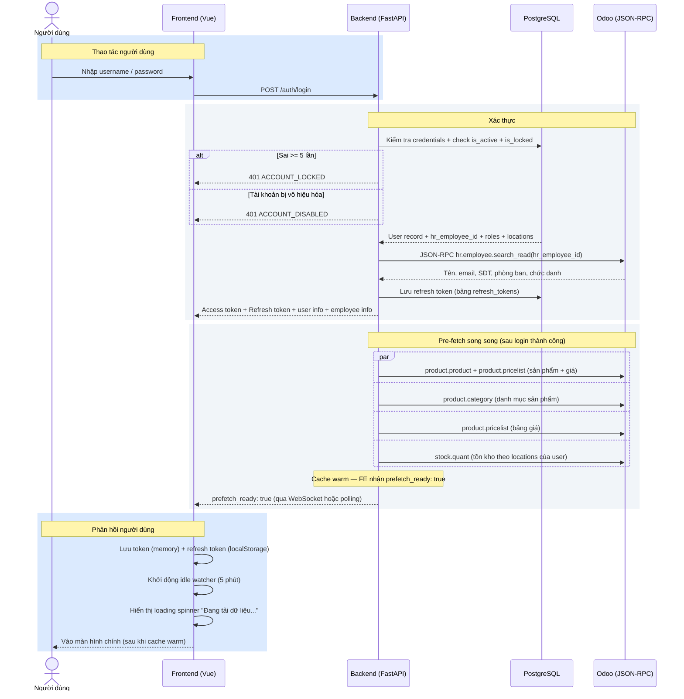
```mermaid
sequenceDiagram
    actor User as Người dùng
    participant FE as Frontend (Vue)
    participant BE as Backend (FastAPI)
    participant DB as PostgreSQL
    participant Odoo as Odoo (JSON-RPC)

    rect rgb(219, 234, 254)
        Note over User,FE: Thao tác người dùng
        User->>FE: Nhập username / password
        FE->>BE: POST /auth/login
    end
    rect rgb(241, 245, 249)
        Note over BE,Odoo: Xác thực
        BE->>DB: Kiểm tra credentials + check is_active + is_locked
        alt Sai >= 5 lần
            BE-->>FE: 401 ACCOUNT_LOCKED
        else Tài khoản bị vô hiệu hóa
            BE-->>FE: 401 ACCOUNT_DISABLED
        end
        DB-->>BE: User record + hr_employee_id + roles + locations
        BE->>Odoo: JSON-RPC hr.employee.search_read(hr_employee_id)
        Odoo-->>BE: Tên, email, SĐT, phòng ban, chức danh
        BE->>DB: Lưu refresh token (bảng refresh_tokens)
        BE-->>FE: Access token + Refresh token + user info + employee info
    end
    rect rgb(241, 245, 249)
        Note over BE,Odoo: Pre-fetch song song (sau login thành công)
        par
            BE->>Odoo: product.product + product.pricelist (sản phẩm + giá)
        and
            BE->>Odoo: product.category (danh mục sản phẩm)
        and
            BE->>Odoo: product.pricelist (bảng giá)
        and
            BE->>Odoo: stock.quant (tồn kho theo locations của user)
        end
        Note over BE: Cache warm — FE nhận prefetch_ready: true
        BE-->>FE: prefetch_ready: true (qua WebSocket hoặc polling)
    end
    rect rgb(219, 234, 254)
        Note over FE,User: Phản hồi người dùng
        FE->>FE: Lưu token (memory) + refresh token (localStorage)
        FE->>FE: Khởi động idle watcher (5 phút)
        FE->>FE: Hiển thị loading spinner "Đang tải dữ liệu..."
        FE-->>User: Vào màn hình chính (sau khi cache warm)
    end
```

**Ghi chú:**
- Credentials quản lý trên PostgreSQL local — không dùng tài khoản Odoo
- Thông tin cá nhân (tên, email, SĐT...) lấy từ `hr.employee` trên Odoo
- Khóa tài khoản sau 5 lần sai → ADMIN mở thủ công (OQ-M04, OQ-W03)
- Idle timeout 5 phút → tự đăng xuất (OQ-M03)
- Pre-fetch chạy song song ngay sau login — 4 Odoo calls đồng thời → giảm tải lần đầu dùng SP/tồn kho
- Prefetch timeout 60s — nếu vẫn fail sau 60s, hiển thị lỗi yêu cầu user liên hệ ADMIN.
- FE hiển thị loading cho đến khi `prefetch_ready: true` → không cho vào màn hình chính sớm khi cache chưa warm

---

## B2. Luồng Làm mới Cache

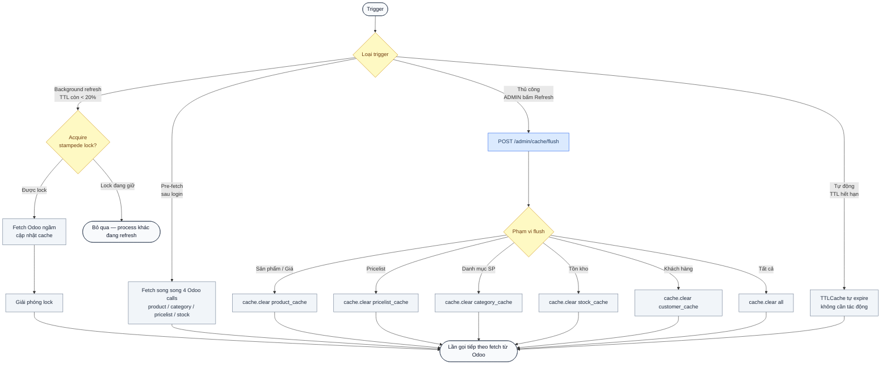
```mermaid
flowchart TD
    classDef user fill:#DBEAFE,stroke:#2563EB,color:#1e3a5f
    classDef system fill:#F1F5F9,stroke:#64748B,color:#1e293b
    classDef decision fill:#FEF9C3,stroke:#CA8A04,color:#713f12
    classDef terminal fill:#F8FAFC,stroke:#334155,color:#0f172a
    classDef warning fill:#FEE2E2,stroke:#DC2626,color:#7f1d1d

    A([Trigger]):::terminal --> B{Loại trigger}:::decision
    B -- Thủ công\nADMIN bấm Refresh --> C[POST /admin/cache/flush]:::user
    B -- Tự động\nTTL hết hạn --> D[TTLCache tự expire\nkhông cần tác động]:::system
    B -- Pre-fetch\nsau login --> PF[Fetch song song 4 Odoo calls\nproduct / category / pricelist / stock]:::system
    B -- Background refresh\nTTL còn < 20% --> BR{Acquire\nstampede lock?}:::decision
    BR -- Được lock --> BRF[Fetch Odoo ngầm\ncập nhật cache]:::system
    BR -- Lock đang giữ --> BRS([Bỏ qua — process khác đang refresh]):::terminal
    BRF --> BRD[Giải phóng lock]:::system
    BRD --> I
    PF --> I
    C --> E{Phạm vi flush}:::decision
    E -- Sản phẩm / Giá --> F[cache.clear product_cache]:::system
    E -- Pricelist --> G[cache.clear pricelist_cache]:::system
    E -- Danh mục SP --> GA[cache.clear category_cache]:::system
    E -- Tồn kho --> GB[cache.clear stock_cache]:::system
    E -- Khách hàng --> GC[cache.clear customer_cache]:::system
    E -- Tất cả --> H[cache.clear all]:::system
    F --> I([Lần gọi tiếp theo fetch từ Odoo]):::terminal
    G --> I
    GA --> I
    GB --> I
    GC --> I
    H --> I
    D --> I
```

**TTL mặc định:**

| Cache | TTL |
|---|---|
| Sản phẩm + giá | 30 phút |
| Pricelist | 1 giờ |
| Danh mục SP (`product.category`) | 8 tiếng |
| Tồn kho (`stock.quant`) | 5 phút |
| Khách hàng (`res.partner`) | 60 phút |
| MST (VietQR) | 10 phút |

---

## B3. Luồng Quản lý User (ADMIN)

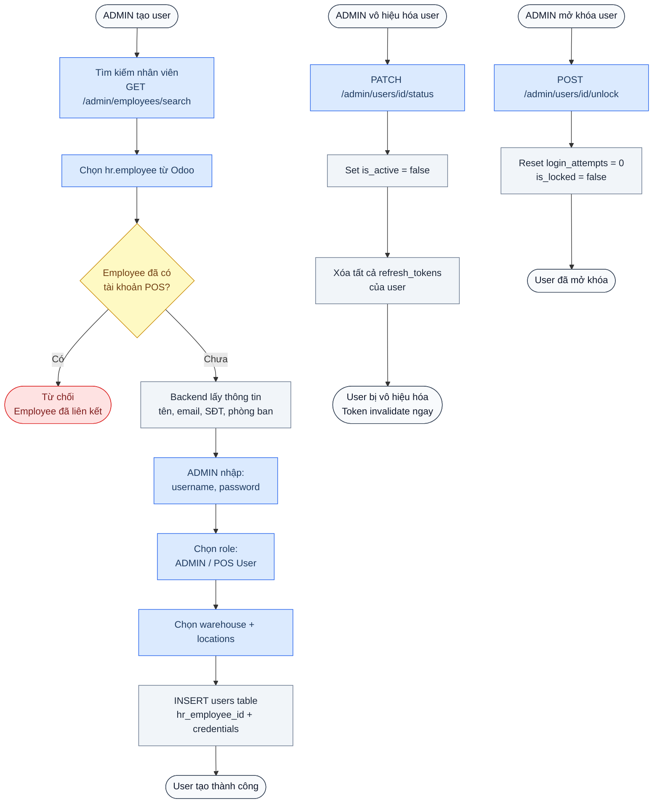
```mermaid
flowchart TD
    classDef user fill:#DBEAFE,stroke:#2563EB,color:#1e3a5f
    classDef system fill:#F1F5F9,stroke:#64748B,color:#1e293b
    classDef accountant fill:#CCFBF1,stroke:#0D9488,color:#134E4A
    classDef decision fill:#FEF9C3,stroke:#CA8A04,color:#713f12
    classDef terminal fill:#F8FAFC,stroke:#334155,color:#0f172a
    classDef warning fill:#FEE2E2,stroke:#DC2626,color:#7f1d1d

    A([ADMIN tạo user]):::terminal --> B[Tìm kiếm nhân viên\nGET /admin/employees/search]:::user
    B --> C[Chọn hr.employee từ Odoo]:::user
    C --> D{Employee đã có\ntài khoản POS?}:::decision
    D -- Có --> E([Từ chối\nEmployee đã liên kết]):::warning
    D -- Chưa --> F[Backend lấy thông tin\ntên, email, SĐT, phòng ban]:::system
    F --> G[ADMIN nhập:\nusername, password]:::user
    G --> H[Chọn role:\nADMIN / POS User]:::user
    H --> I[Chọn warehouse + locations]:::user
    I --> J[INSERT users table\nhr_employee_id + credentials]:::system
    J --> K([User tạo thành công]):::terminal

    L([ADMIN vô hiệu hóa user]):::terminal --> M[PATCH /admin/users/id/status]:::user
    M --> N[Set is_active = false]:::system
    N --> O[Xóa tất cả refresh_tokens\ncủa user]:::system
    O --> P([User bị vô hiệu hóa\nToken invalidate ngay]):::terminal

    Q([ADMIN mở khóa user]):::terminal --> R[POST /admin/users/id/unlock]:::user
    R --> S[Reset login_attempts = 0\nis_locked = false]:::system
    S --> T([User đã mở khóa]):::terminal
```

**Ghi chú:**
- Thông tin cá nhân kế thừa từ `hr.employee` — không nhập thủ công
- 1 `hr.employee` chỉ liên kết 1 user POS
- Admin mặc định không cần `hr_employee_id`
- Vô hiệu hóa → invalidate token ngay lập tức (OQ-M02)

---

## B4. Luồng Reset Password

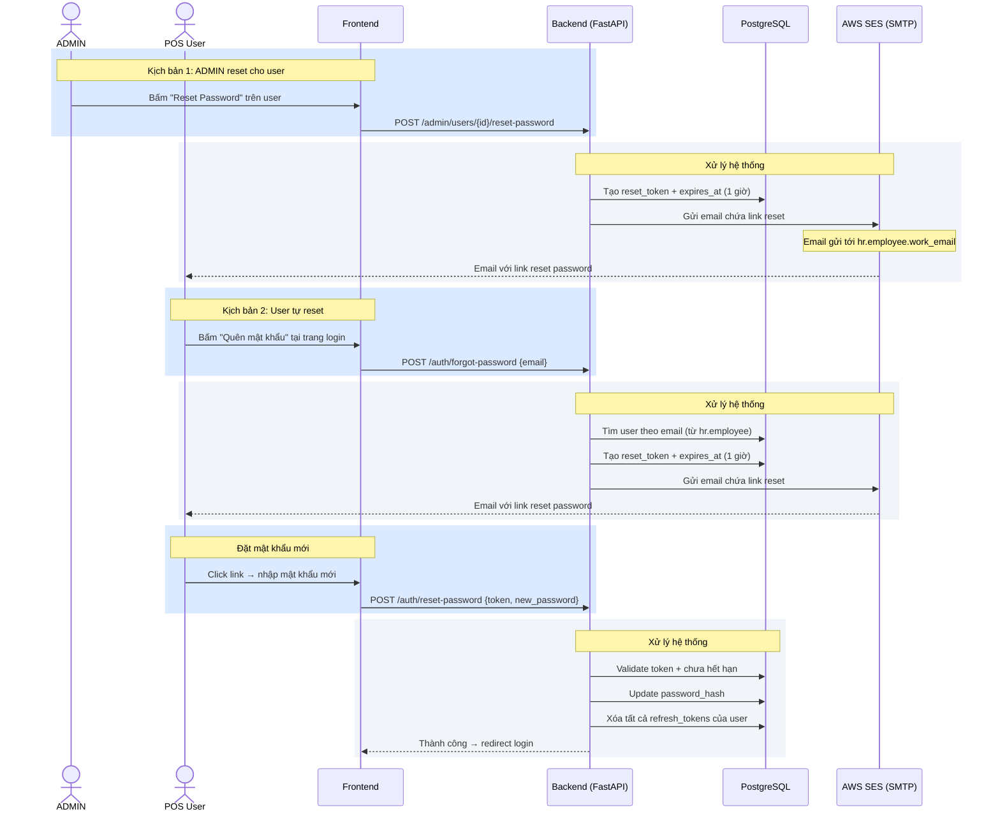
```mermaid
sequenceDiagram
    actor Admin as ADMIN
    actor User as POS User
    participant FE as Frontend
    participant BE as Backend (FastAPI)
    participant DB as PostgreSQL
    participant SES as AWS SES (SMTP)

    rect rgb(219, 234, 254)
        Note over Admin,FE: Kịch bản 1: ADMIN reset cho user
        Admin->>FE: Bấm "Reset Password" trên user
        FE->>BE: POST /admin/users/{id}/reset-password
    end
    rect rgb(241, 245, 249)
        Note over BE,SES: Xử lý hệ thống
        BE->>DB: Tạo reset_token + expires_at (1 giờ)
        BE->>SES: Gửi email chứa link reset
        Note over SES: Email gửi tới hr.employee.work_email
        SES-->>User: Email với link reset password
    end

    rect rgb(219, 234, 254)
        Note over User,FE: Kịch bản 2: User tự reset
        User->>FE: Bấm "Quên mật khẩu" tại trang login
        FE->>BE: POST /auth/forgot-password {email}
    end
    rect rgb(241, 245, 249)
        Note over BE,SES: Xử lý hệ thống
        BE->>DB: Tìm user theo email (từ hr.employee)
        BE->>DB: Tạo reset_token + expires_at (1 giờ)
        BE->>SES: Gửi email chứa link reset
        SES-->>User: Email với link reset password
    end

    rect rgb(219, 234, 254)
        Note over User,FE: Đặt mật khẩu mới
        User->>FE: Click link → nhập mật khẩu mới
        FE->>BE: POST /auth/reset-password {token, new_password}
    end
    rect rgb(241, 245, 249)
        Note over BE,DB: Xử lý hệ thống
        BE->>DB: Validate token + chưa hết hạn
        BE->>DB: Update password_hash
        BE->>DB: Xóa tất cả refresh_tokens của user
        BE-->>FE: Thành công → redirect login
    end
```

**Ghi chú:**
- Email lấy từ `hr.employee.work_email` trên Odoo
- Token reset hết hạn sau 1 giờ
- Password policy: min 8 ký tự, chữ hoa + số + ký tự đặc biệt (OQ-W01)
- Sau reset → xóa tất cả session cũ

---

## B5. Luồng Kiểm tra tồn kho

```mermaid
sequenceDiagram
    actor User as Nhân viên
    participant FE as Frontend
    participant BE as Backend (TTLCache)
    participant Odoo

    rect rgb(219, 234, 254)
        Note over User,FE: Thao tác người dùng
        User->>FE: Tìm kiếm sản phẩm
        FE->>BE: GET /inventory/stock?product_id=X&location_id=Y
    end
    rect rgb(241, 245, 249)
        Note over BE,Odoo: Xử lý hệ thống
        alt Cache hit (TTL < 5 phút)
            Note over BE: Trả từ TTLCache in-memory
        else Cache miss
            BE->>Odoo: JSON-RPC search_read stock.quant
            Odoo-->>BE: Dữ liệu tồn kho theo location
            Note over BE: Lưu vào TTLCache (5 phút)
        end
        BE-->>FE: Tồn kho theo địa điểm
    end
    rect rgb(219, 234, 254)
        Note over FE,User: Phản hồi người dùng
        FE-->>User: Hiển thị số lượng có thể bán
    end
```

---

## B6. Luồng Tra cứu MST

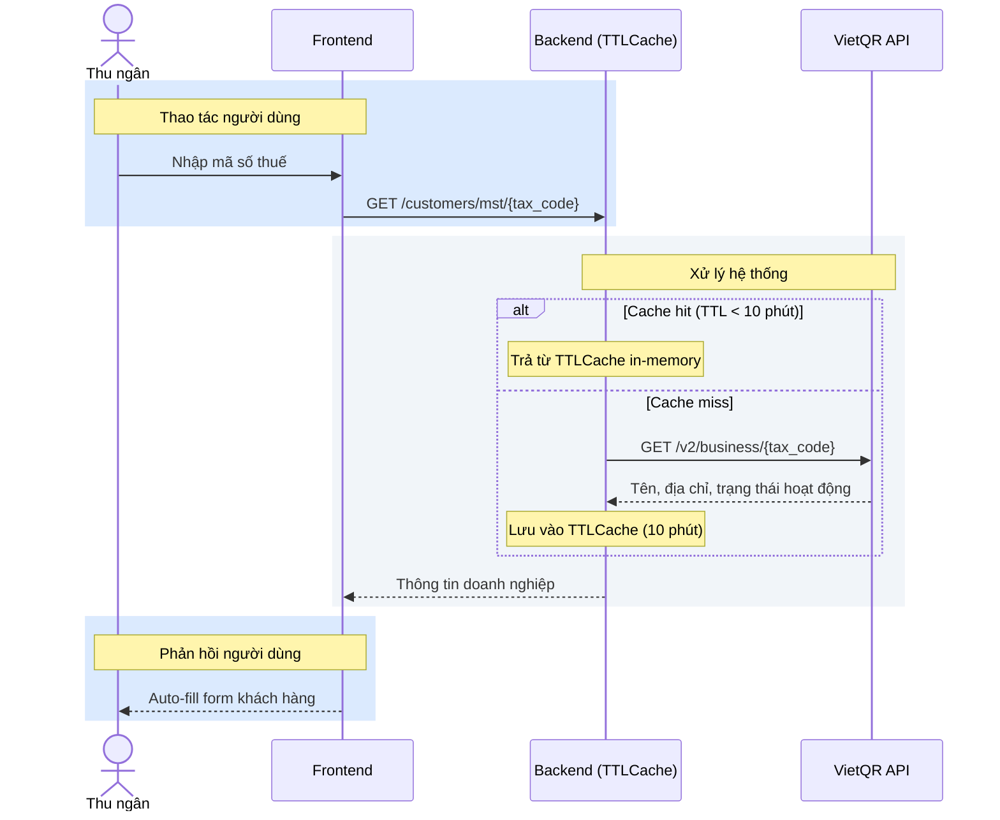
```mermaid
sequenceDiagram
    actor User as Thu ngân
    participant FE as Frontend
    participant BE as Backend (TTLCache)
    participant MST as VietQR API

    rect rgb(219, 234, 254)
        Note over User,FE: Thao tác người dùng
        User->>FE: Nhập mã số thuế
        FE->>BE: GET /customers/mst/{tax_code}
    end
    rect rgb(241, 245, 249)
        Note over BE,MST: Xử lý hệ thống
        alt Cache hit (TTL < 10 phút)
            Note over BE: Trả từ TTLCache in-memory
        else Cache miss
            BE->>MST: GET /v2/business/{tax_code}
            MST-->>BE: Tên, địa chỉ, trạng thái hoạt động
            Note over BE: Lưu vào TTLCache (10 phút)
        end
        BE-->>FE: Thông tin doanh nghiệp
    end
    rect rgb(219, 234, 254)
        Note over FE,User: Phản hồi người dùng
        FE-->>User: Auto-fill form khách hàng
    end
```

---

## B7. Luồng In phiếu bán hàng (Generate PDF)

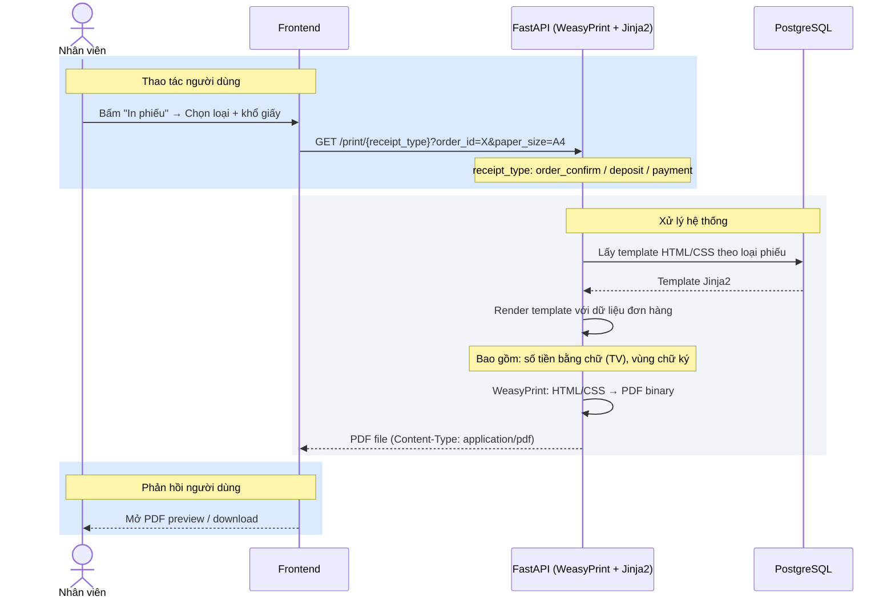
```mermaid
sequenceDiagram
    actor User as Nhân viên
    participant FE as Frontend
    participant BE as FastAPI (WeasyPrint + Jinja2)
    participant DB as PostgreSQL

    rect rgb(219, 234, 254)
        Note over User,FE: Thao tác người dùng
        User->>FE: Bấm "In phiếu" → Chọn loại + khổ giấy
        FE->>BE: GET /print/{receipt_type}?order_id=X&paper_size=A4
        Note over BE: receipt_type: order_confirm / deposit / payment
    end
    rect rgb(241, 245, 249)
        Note over BE,DB: Xử lý hệ thống
        BE->>DB: Lấy template HTML/CSS theo loại phiếu
        DB-->>BE: Template Jinja2
        BE->>BE: Render template với dữ liệu đơn hàng
        Note over BE: Bao gồm: số tiền bằng chữ (TV), vùng chữ ký
        BE->>BE: WeasyPrint: HTML/CSS → PDF binary
        BE-->>FE: PDF file (Content-Type: application/pdf)
    end
    rect rgb(219, 234, 254)
        Note over FE,User: Phản hồi người dùng
        FE-->>User: Mở PDF preview / download
    end
```

**Ghi chú:**
- User chọn A4 hoặc A5 khi in (OQ-Z01)
- Chỉ preview / download, không in trực tiếp (OQ-U02)

---

## B8. Tích hợp Misa (eInvoice) *(Planned)*

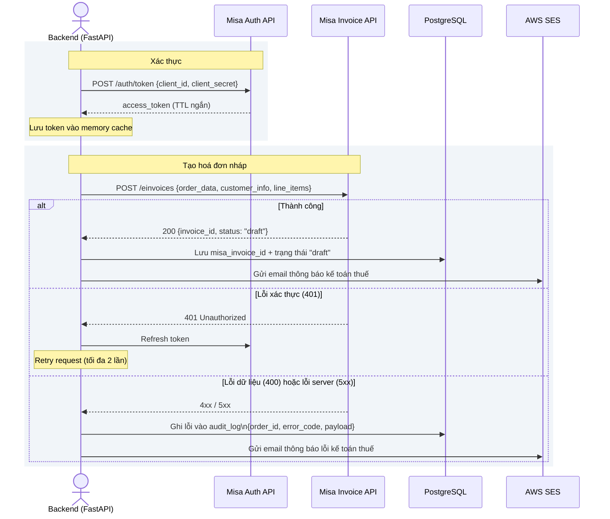
```mermaid
sequenceDiagram
    actor BE as Backend (FastAPI)
    participant MisaAuth as Misa Auth API
    participant MisaInv as Misa Invoice API
    participant DB as PostgreSQL
    participant SES as AWS SES

    rect rgb(241, 245, 249)
        Note over BE,MisaAuth: Xác thực
        BE->>MisaAuth: POST /auth/token {client_id, client_secret}
        MisaAuth-->>BE: access_token (TTL ngắn)
        Note over BE: Lưu token vào memory cache
    end

    rect rgb(241, 245, 249)
        Note over BE,MisaInv: Tạo hoá đơn nháp
        BE->>MisaInv: POST /einvoices {order_data, customer_info, line_items}
        alt Thành công
            MisaInv-->>BE: 200 {invoice_id, status: "draft"}
            BE->>DB: Lưu misa_invoice_id + trạng thái "draft"
            BE->>SES: Gửi email thông báo kế toán thuế
        else Lỗi xác thực (401)
            MisaInv-->>BE: 401 Unauthorized
            BE->>MisaAuth: Refresh token
            Note over BE: Retry request (tối đa 2 lần)
        else Lỗi dữ liệu (400) hoặc lỗi server (5xx)
            MisaInv-->>BE: 4xx / 5xx
            BE->>DB: Ghi lỗi vào audit_log\n{order_id, error_code, payload}
            BE->>SES: Gửi email thông báo lỗi kế toán thuế
        end
    end
```

**Ghi chú:**
- Access token Misa lưu cache in-memory, tự refresh khi hết hạn
- Payload hoá đơn dựa trên nội dung phiếu bán hàng (B7): danh sách SP, số lượng, đơn giá, thuế
- Hoá đơn tạo ở trạng thái `draft` — kế toán phát hành chính thức trên portal Misa
- Mọi lỗi đều ghi `audit_log` để xử lý thủ công, không ảnh hưởng đến đơn hàng
- Cần bổ sung: `client_id`, `client_secret`, `company_tax_code` vào config

---

## B9. Tích hợp Đơn vị giao hàng / COD *(Planned)*

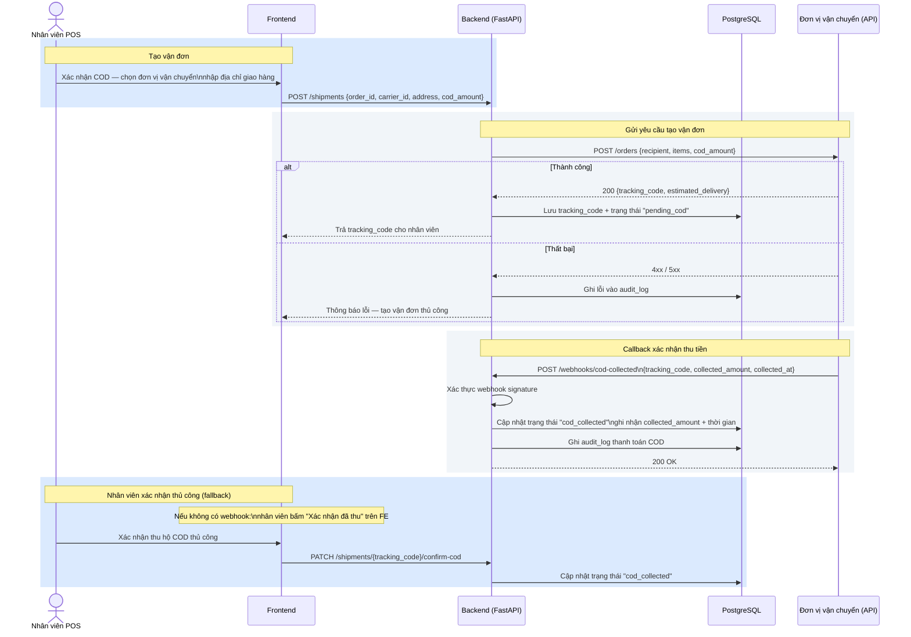
```mermaid
sequenceDiagram
    actor Staff as Nhân viên POS
    participant FE as Frontend
    participant BE as Backend (FastAPI)
    participant DB as PostgreSQL
    participant Carrier as Đơn vị vận chuyển (API)

    rect rgb(219, 234, 254)
        Note over Staff,FE: Tạo vận đơn
        Staff->>FE: Xác nhận COD — chọn đơn vị vận chuyển\nnhập địa chỉ giao hàng
        FE->>BE: POST /shipments {order_id, carrier_id, address, cod_amount}
    end

    rect rgb(241, 245, 249)
        Note over BE,Carrier: Gửi yêu cầu tạo vận đơn
        BE->>Carrier: POST /orders {recipient, items, cod_amount}
        alt Thành công
            Carrier-->>BE: 200 {tracking_code, estimated_delivery}
            BE->>DB: Lưu tracking_code + trạng thái "pending_cod"
            BE-->>FE: Trả tracking_code cho nhân viên
        else Thất bại
            Carrier-->>BE: 4xx / 5xx
            BE->>DB: Ghi lỗi vào audit_log
            BE-->>FE: Thông báo lỗi — tạo vận đơn thủ công
        end
    end

    rect rgb(241, 245, 249)
        Note over Carrier,BE: Callback xác nhận thu tiền
        Carrier->>BE: POST /webhooks/cod-collected\n{tracking_code, collected_amount, collected_at}
        BE->>BE: Xác thực webhook signature
        BE->>DB: Cập nhật trạng thái "cod_collected"\nghi nhận collected_amount + thời gian
        BE->>DB: Ghi audit_log thanh toán COD
        BE-->>Carrier: 200 OK
    end

    rect rgb(219, 234, 254)
        Note over FE,Staff: Nhân viên xác nhận thủ công (fallback)
        Note over FE: Nếu không có webhook:\nnhân viên bấm "Xác nhận đã thu" trên FE
        Staff->>FE: Xác nhận thu hộ COD thủ công
        FE->>BE: PATCH /shipments/{tracking_code}/confirm-cod
        BE->>DB: Cập nhật trạng thái "cod_collected"
    end
```

**Ghi chú:**
- Hỗ trợ nhiều đơn vị vận chuyển — cấu hình `carrier_id` và endpoint riêng cho từng đơn vị
- Webhook signature cần xác thực bằng HMAC trước khi xử lý
- Fallback thủ công khi đơn vị vận chuyển không hỗ trợ webhook
- Trạng thái COD: `pending_cod` → `cod_collected` → phản ánh vào luồng thanh toán A2
- Cần bổ sung: danh sách đơn vị vận chuyển tích hợp, cơ chế đối soát định kỳ

---

## B10. Tích hợp VNPay API *(Planned)*

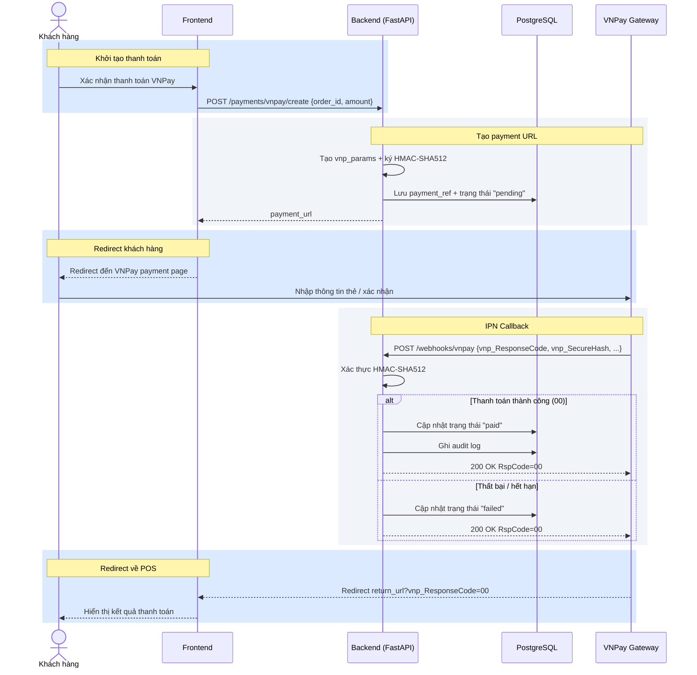
```mermaid
sequenceDiagram
    actor User as Khách hàng
    participant FE as Frontend
    participant BE as Backend (FastAPI)
    participant DB as PostgreSQL
    participant VNPay as VNPay Gateway

    rect rgb(219, 234, 254)
        Note over User,FE: Khởi tạo thanh toán
        User->>FE: Xác nhận thanh toán VNPay
        FE->>BE: POST /payments/vnpay/create {order_id, amount}
    end
    rect rgb(241, 245, 249)
        Note over BE,VNPay: Tạo payment URL
        BE->>BE: Tạo vnp_params + ký HMAC-SHA512
        BE->>DB: Lưu payment_ref + trạng thái "pending"
        BE-->>FE: payment_url
    end
    rect rgb(219, 234, 254)
        Note over FE,User: Redirect khách hàng
        FE-->>User: Redirect đến VNPay payment page
        User->>VNPay: Nhập thông tin thẻ / xác nhận
    end
    rect rgb(241, 245, 249)
        Note over VNPay,BE: IPN Callback
        VNPay->>BE: POST /webhooks/vnpay {vnp_ResponseCode, vnp_SecureHash, ...}
        BE->>BE: Xác thực HMAC-SHA512
        alt Thanh toán thành công (00)
            BE->>DB: Cập nhật trạng thái "paid"
            BE->>DB: Ghi audit log
            BE-->>VNPay: 200 OK RspCode=00
        else Thất bại / hết hạn
            BE->>DB: Cập nhật trạng thái "failed"
            BE-->>VNPay: 200 OK RspCode=00
        end
    end
    rect rgb(219, 234, 254)
        Note over FE,User: Redirect về POS
        VNPay-->>FE: Redirect return_url?vnp_ResponseCode=00
        FE-->>User: Hiển thị kết quả thanh toán
    end
```

**Ghi chú:**
- Backend phải trả `200 OK` cho VNPay IPN dù thành công hay thất bại — nếu không VNPay sẽ retry
- Xác thực `vnp_SecureHash` bắt buộc trước khi xử lý bất kỳ callback nào
- `return_url` chỉ để hiển thị kết quả cho user — không dùng để cập nhật trạng thái (dùng IPN)

---

## B11. Tích hợp MoMo API *(Planned)*

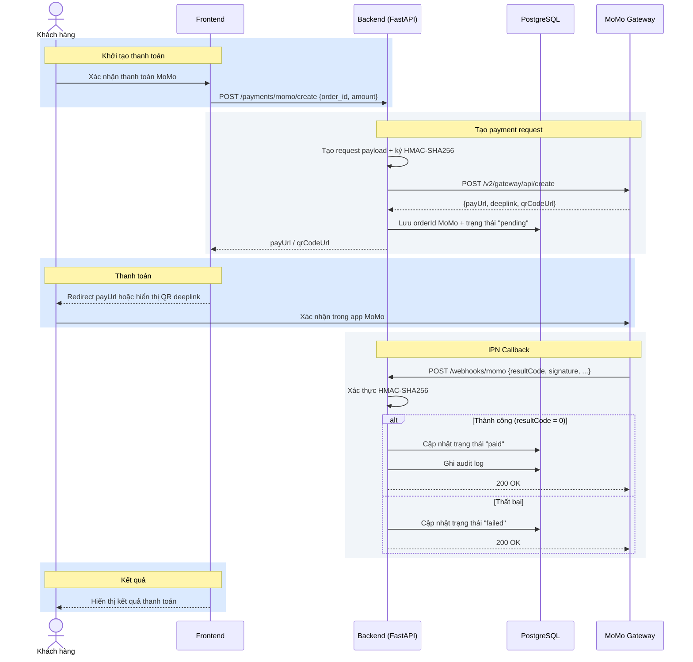
```mermaid
sequenceDiagram
    actor User as Khách hàng
    participant FE as Frontend
    participant BE as Backend (FastAPI)
    participant DB as PostgreSQL
    participant MoMo as MoMo Gateway

    rect rgb(219, 234, 254)
        Note over User,FE: Khởi tạo thanh toán
        User->>FE: Xác nhận thanh toán MoMo
        FE->>BE: POST /payments/momo/create {order_id, amount}
    end
    rect rgb(241, 245, 249)
        Note over BE,MoMo: Tạo payment request
        BE->>BE: Tạo request payload + ký HMAC-SHA256
        BE->>MoMo: POST /v2/gateway/api/create
        MoMo-->>BE: {payUrl, deeplink, qrCodeUrl}
        BE->>DB: Lưu orderId MoMo + trạng thái "pending"
        BE-->>FE: payUrl / qrCodeUrl
    end
    rect rgb(219, 234, 254)
        Note over FE,User: Thanh toán
        FE-->>User: Redirect payUrl hoặc hiển thị QR deeplink
        User->>MoMo: Xác nhận trong app MoMo
    end
    rect rgb(241, 245, 249)
        Note over MoMo,BE: IPN Callback
        MoMo->>BE: POST /webhooks/momo {resultCode, signature, ...}
        BE->>BE: Xác thực HMAC-SHA256
        alt Thành công (resultCode = 0)
            BE->>DB: Cập nhật trạng thái "paid"
            BE->>DB: Ghi audit log
            BE-->>MoMo: 200 OK
        else Thất bại
            BE->>DB: Cập nhật trạng thái "failed"
            BE-->>MoMo: 200 OK
        end
    end
    rect rgb(219, 234, 254)
        Note over FE,User: Kết quả
        FE-->>User: Hiển thị kết quả thanh toán
    end
```

**Ghi chú:**
- Hỗ trợ 2 luồng: redirect (`payUrl`) trên desktop, QR deeplink trên mobile
- `resultCode = 0` là thành công; các mã khác là lỗi — xem tài liệu MoMo
- Xác thực signature bắt buộc trước khi xử lý IPN

---

## B12. Tích hợp VietQR Payment *(Planned)*

> **Lưu ý phân biệt**: Luồng này là VietQR **thanh toán** (sinh QR chuyển khoản ngân hàng) — khác hoàn toàn với VietQR MST lookup (B6) dùng để tra cứu mã số thuế.

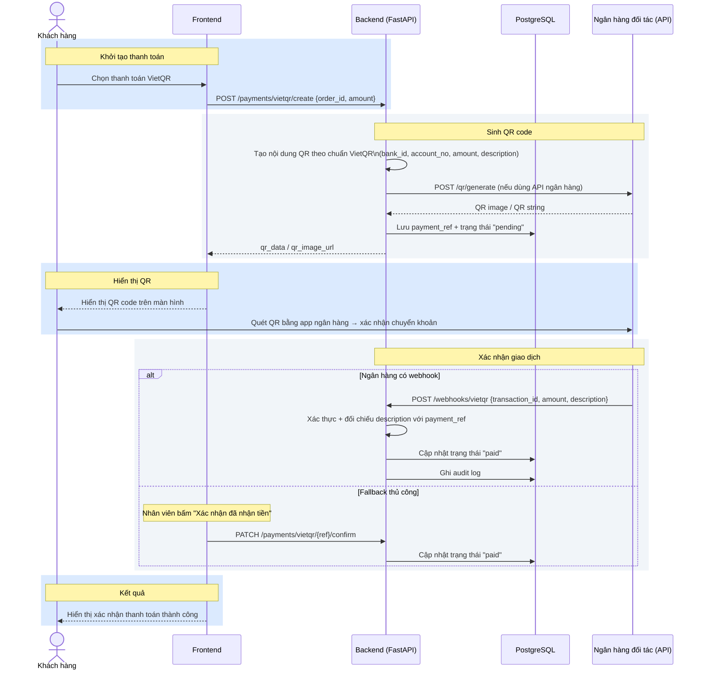
```mermaid
sequenceDiagram
    actor User as Khách hàng
    participant FE as Frontend
    participant BE as Backend (FastAPI)
    participant DB as PostgreSQL
    participant Bank as Ngân hàng đối tác (API)

    rect rgb(219, 234, 254)
        Note over User,FE: Khởi tạo thanh toán
        User->>FE: Chọn thanh toán VietQR
        FE->>BE: POST /payments/vietqr/create {order_id, amount}
    end
    rect rgb(241, 245, 249)
        Note over BE,Bank: Sinh QR code
        BE->>BE: Tạo nội dung QR theo chuẩn VietQR\n(bank_id, account_no, amount, description)
        BE->>Bank: POST /qr/generate (nếu dùng API ngân hàng)
        Bank-->>BE: QR image / QR string
        BE->>DB: Lưu payment_ref + trạng thái "pending"
        BE-->>FE: qr_data / qr_image_url
    end
    rect rgb(219, 234, 254)
        Note over FE,User: Hiển thị QR
        FE-->>User: Hiển thị QR code trên màn hình
        User->>Bank: Quét QR bằng app ngân hàng → xác nhận chuyển khoản
    end
    rect rgb(241, 245, 249)
        Note over Bank,BE: Xác nhận giao dịch
        alt Ngân hàng có webhook
            Bank->>BE: POST /webhooks/vietqr {transaction_id, amount, description}
            BE->>BE: Xác thực + đối chiếu description với payment_ref
            BE->>DB: Cập nhật trạng thái "paid"
            BE->>DB: Ghi audit log
        else Fallback thủ công
            Note over FE: Nhân viên bấm "Xác nhận đã nhận tiền"
            FE->>BE: PATCH /payments/vietqr/{ref}/confirm
            BE->>DB: Cập nhật trạng thái "paid"
        end
    end
    rect rgb(219, 234, 254)
        Note over FE,User: Kết quả
        FE-->>User: Hiển thị xác nhận thanh toán thành công
    end
```

**Ghi chú:**
- QR chuẩn VietQR có thể sinh tĩnh (không cần API ngân hàng) nếu chỉ cần nhúng số tài khoản + số tiền
- Cơ chế xác nhận phụ thuộc vào ngân hàng đối tác — không phải ngân hàng nào cũng có webhook
- `description` (nội dung chuyển khoản) dùng để đối chiếu tự động — cần format chuẩn (vd: mã đơn hàng)
- Fallback thủ công là bắt buộc khi webhook không khả dụng

---

## Tham chiếu

| Tài liệu | Mô tả |
|---|---|
| [scope.md](scope.md) | Scope & Architecture |
| [api_contract.md](api_contract.md) | API Contract (40 endpoints) |
| [frontend_design.md](frontend_design.md) | Thiết kế giao diện |
| [open_questions.md](open_questions.md) | Câu hỏi đã xác nhận |
