# VJ Mobile POS — Process Flow

> Trạng thái: Draft  
> Cập nhật: 2026-04-14  
> Phiên bản: 0.6

Chỉ bao gồm các luồng đã xác định đủ nội dung.  
Các câu hỏi còn mở xem tại [open_questions.md](open_questions.md).

---

## Chú thích màu sắc

| Màu | Ý nghĩa |
|---|---|
| 🔵 Xanh dương | Thao tác của **người dùng** |
| ⬜ Xám nhạt | Xử lý **hệ thống** / Backend |
| 🟣 Tím nhạt | Thao tác trên **Odoo** (XML-RPC) |
| 🟢 Xanh lá | Truy vấn / ghi **Database** |
| 🟡 Vàng | Điểm **quyết định** |
| 🔴 Đỏ nhạt | **Cảnh báo** / Từ chối |

---

## Mục lục

### Phần A — Business Flows (Nghiệp vụ)

| # | Luồng | Mô tả |
|---|---|---|
| A1 | Bán hàng — Tạo đơn & Xác nhận | Chọn SP, serial, xác nhận hoặc lưu nháp |
| A2 | Nhận thanh toán | Chọn KH (nếu chưa), ghi nhận thủ công, multi-payment, đặt cọc |
| A3 | Xuất kho | Auto validate picking + serial + backorder |
| A4 | Quản lý Backorder | Theo dõi, validate, hủy backorder |
| A5 | Hủy đơn hàng | Hủy theo trạng thái + phân quyền |

### Phần B — Technical Flows (Kỹ thuật)

| # | Luồng | Mô tả |
|---|---|---|
| B1 | Đăng nhập | JWT auth + hr.employee info |
| B2 | Làm mới Cache | TTL auto-expire + flush thủ công |
| B3 | Quản lý User | Tạo user liên kết hr.employee, phân quyền |
| B4 | Reset Password | Gửi email token qua AWS SES |
| B5 | Kiểm tra tồn kho | Tra cứu stock.quant theo location |
| B6 | Tra cứu MST | VietQR API + TTLCache |
| B7 | In phiếu bán hàng | Generate PDF (A4/A5) từ template |

---

# Phần A — Business Flows

---

## A1. Luồng Bán hàng — Tạo đơn & Xác nhận

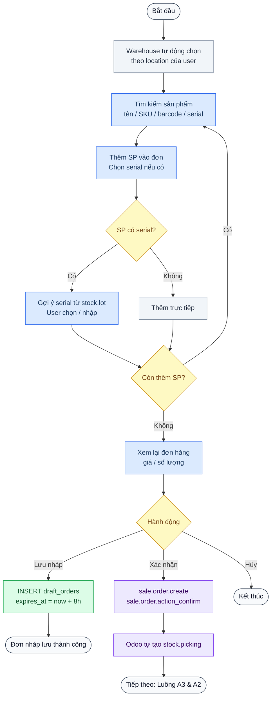

**Ghi chú:**
- KH không bắt buộc ở bước này — chỉ bắt buộc trước khi thanh toán (A2)
- SP hết hàng: cho phép thêm kèm cảnh báo, ghi `**` trong tên SP (OQ-Q04)
- Serial chọn ngay khi thêm SP (OQ-Q04)

---

## A2. Luồng Nhận thanh toán (Ghi nhận thủ công)

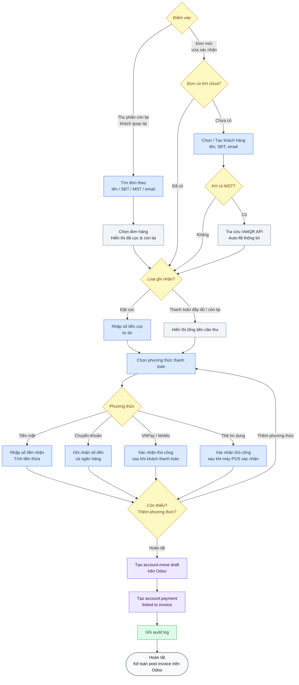

**Ghi chú:**
- **Bắt buộc chọn/tạo KH trước khi thanh toán** — nếu đơn chưa có KH sẽ mở dialog chọn KH
- Hỗ trợ đặt cọc nhiều lần (OQ-O01)
- Đơn cọc không hết hạn (OQ-O02)
- Nhiều phương thức trong 1 đơn (OQ-C03)

---

## A3. Luồng Xuất kho (Auto validate + Serial + Backorder)

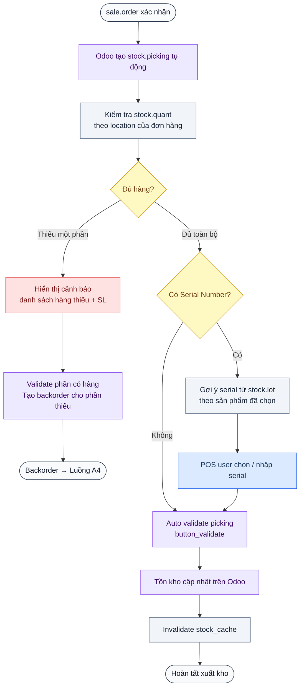

---

## A4. Luồng Quản lý Backorder

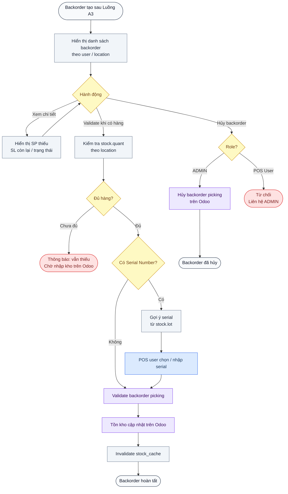

---

## A5. Luồng Hủy đơn hàng

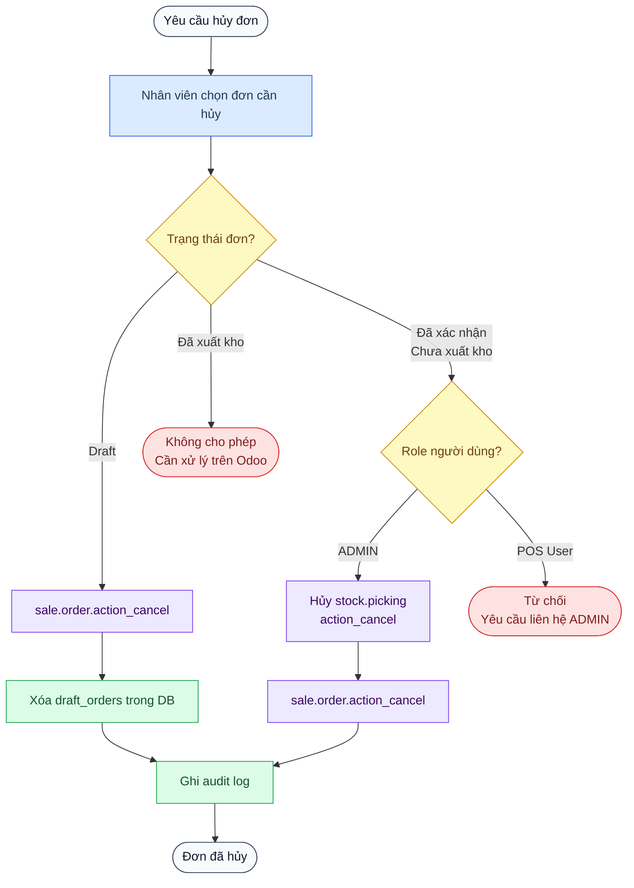

---

# Phần B — Technical Flows

---

## B1. Luồng Đăng nhập (Authentication)

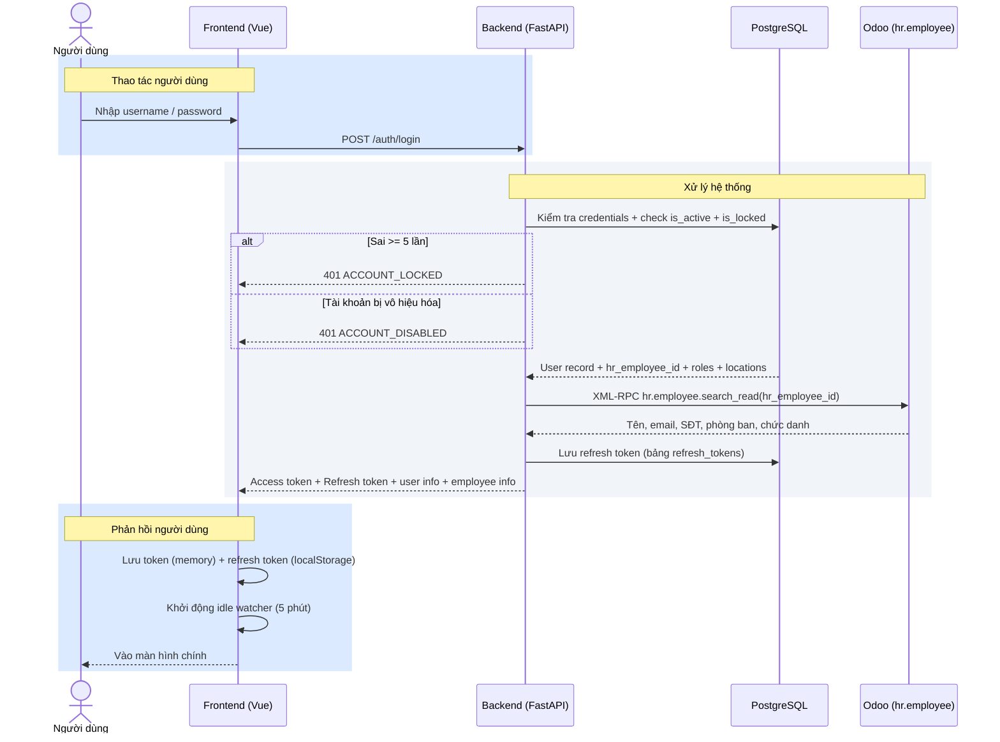

**Ghi chú:**
- Credentials quản lý trên PostgreSQL local — không dùng tài khoản Odoo
- Thông tin cá nhân (tên, email, SĐT...) lấy từ `hr.employee` trên Odoo
- Khóa tài khoản sau 5 lần sai → ADMIN mở thủ công (OQ-M04, OQ-W03)
- Idle timeout 5 phút → tự đăng xuất (OQ-M03)

---

## B2. Luồng Làm mới Cache

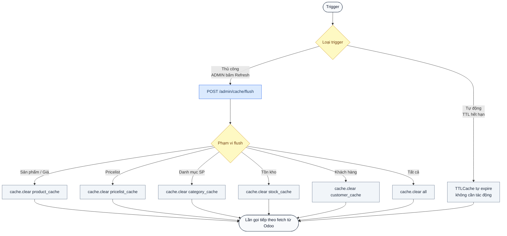

**TTL mặc định:**

| Cache | TTL |
|---|---|
| Sản phẩm + giá | 30 phút |
| Pricelist | 1 giờ |
| Danh mục SP (`product.category`) | 8 tiếng |
| Tồn kho (`stock.quant`) | 5 phút |
| Khách hàng (`res.partner`) | 60 phút |
| MST (VietQR) | 10 phút |

---

## B3. Luồng Quản lý User (ADMIN)

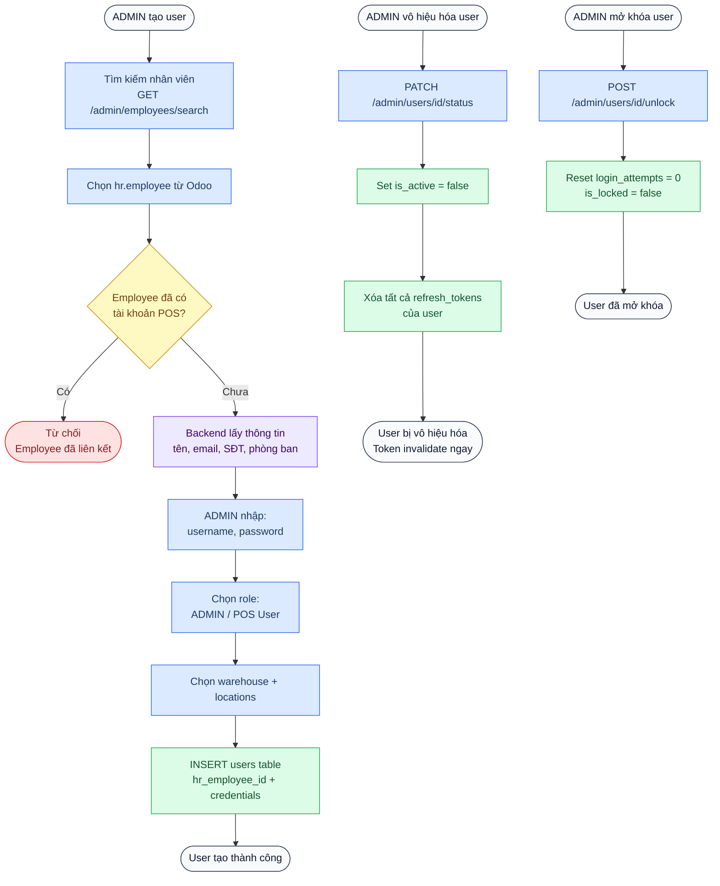

**Ghi chú:**
- Thông tin cá nhân kế thừa từ `hr.employee` — không nhập thủ công
- 1 `hr.employee` chỉ liên kết 1 user POS
- Admin mặc định không cần `hr_employee_id`
- Vô hiệu hóa → invalidate token ngay lập tức (OQ-M02)

---

## B4. Luồng Reset Password

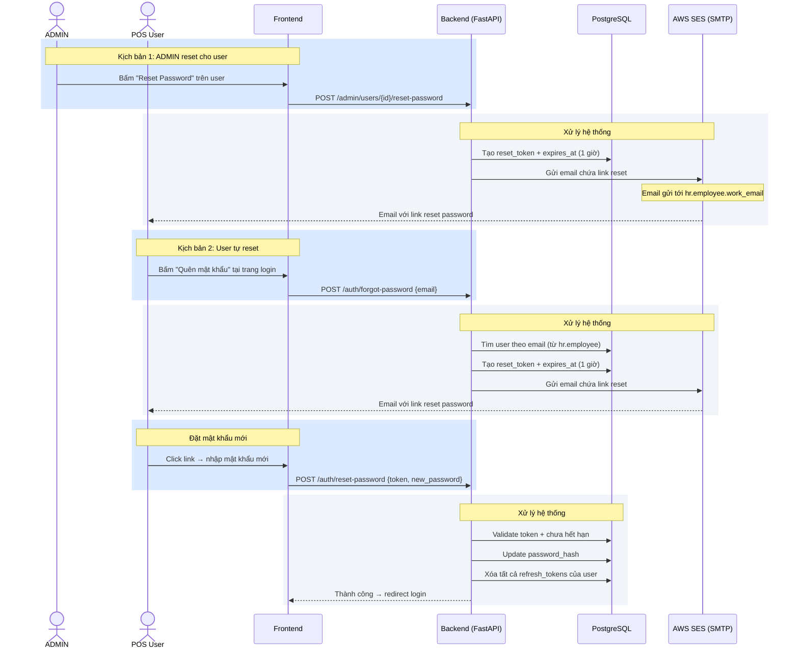

**Ghi chú:**
- Email lấy từ `hr.employee.work_email` trên Odoo
- Token reset hết hạn sau 1 giờ
- Password policy: min 8 ký tự, chữ hoa + số + ký tự đặc biệt (OQ-W01)
- Sau reset → xóa tất cả session cũ

---

## B5. Luồng Kiểm tra tồn kho

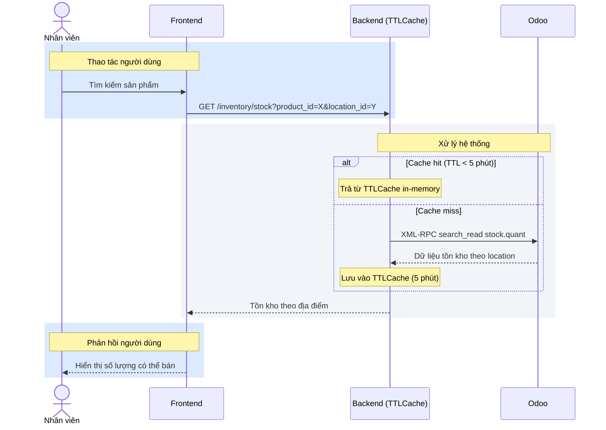

---

## B6. Luồng Tra cứu MST

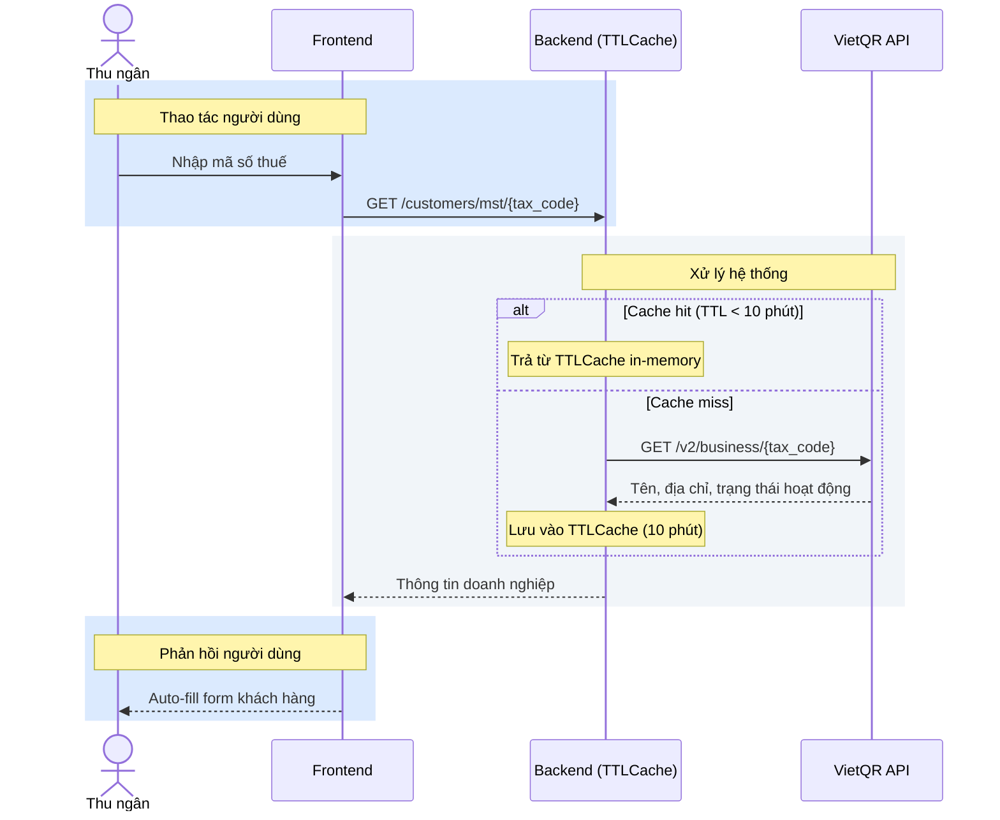

---

## B7. Luồng In phiếu bán hàng (Generate PDF)

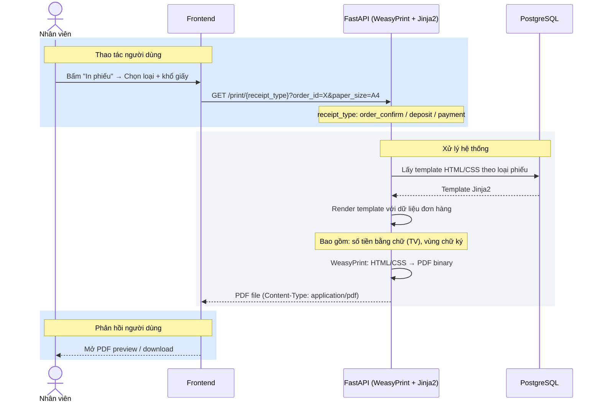

**Ghi chú:**
- User chọn A4 hoặc A5 khi in (OQ-Z01)
- Chỉ preview / download, không in trực tiếp (OQ-U02)

---

## Tham chiếu

| Tài liệu | Mô tả |
|---|---|
| [scope.md](scope.md) | Scope & Architecture |
| [api_contract.md](api_contract.md) | API Contract (40 endpoints) |
| [frontend_design.md](frontend_design.md) | Thiết kế giao diện |
| [open_questions.md](open_questions.md) | Câu hỏi đã xác nhận |
