# VJ Mobile POS — Process Flow

> Trạng thái: Draft  
> Cập nhật: 2026-09-28  
> Phiên bản: 1.1 — Giao hàng + hóa đơn theo ngày giao, đổi ngày hẹn, chuyển cọc, thu ngân / hoa hồng, Profile KH (GH #2/#3/#5/#7/#9/#10/#20/#22)

Chỉ bao gồm các luồng đã xác định đủ nội dung.  
Các câu hỏi còn mở xem tại [open_questions.md](../planning/open_questions.md).

## Flow changes sau staging testing

Xem [planning/issue_log_staging_dev.md](../planning/issue_log_staging_dev.md) cho chi tiết từng issue.

| Flow | Thay đổi | Issue |
|---|---|---|
| A1 — Tạo đơn (2026-09) | Confirm → tạo hóa đơn **nháp**, **không** khóa đơn (`INVOICE_POST_MODE=on_delivery`). Serial chỉ chọn từ lot có sẵn. Tên thu ngân tự ghi vào `sale.order.origin`; NV hoa hồng do thu ngân chọn. Xác nhận + thanh toán xong → chuyển thẳng tới **chi tiết đơn** kèm banner thành công hiện một lần (bỏ màn / dialog thành công). | GH #2, #7, #9, #20 |
| A1 — Tạo đơn (cũ) | ~~Confirm → auto create + post invoice → auto lock (state=done).~~ Chỉ còn khi `INVOICE_POST_MODE=on_confirm`. Cho phép xác nhận với partial/zero payment (đặt cọc). **3 lane song song sau bước B**: chọn KH / chọn NV hoa hồng / tìm SP. Bước E split 4 nhánh theo combo `serial × tồn kho`. | #12, #30, #52 |
| A2 — Thanh toán (2026-09) | Hóa đơn còn nháp → khoản thu ghi thành `account.payment` độc lập, gắn với đơn trong bảng `order_payment_links`, đối soát khi hóa đơn vào sổ (A9). Nút "Thu cọc" đổi tên thành **"Thu tiền"**. | GH #2, #7 |
| A2 — Thanh toán | Record qua wizard `account.payment.register` → auto reconcile với invoice (canonical Odoo flow) — khi hóa đơn đã vào sổ. Cho phép thu thêm nhiều lần qua OrderDetailPage. **Bắt buộc KH trước confirm** — BE reject `confirm=true` không có customer_id (400 CUSTOMER_REQUIRED). | #16, #28, #39, #102 |
| A5 — Hủy đơn | **REMOVED khỏi POS UI.** Toàn bộ cancellation đi Odoo sale.order → Cancel button. | #51 |
| A6 — Đổi location | Re-fetch products + inventory khi LocationBadge đổi location. Warehouse auto-resolve từ location. | #1, #2, #38 |
| A7 — Tạo KH | Form thêm DOB; 3 field (name/phone/email) bắt buộc, email optional sau staging (#85); MST auto-fill qua VietQR lookup. | #3, #48, #49, #85 |
| B4 — Reset Password | LoginPage thêm link **"Quên mật khẩu?"** (user tự reset) → `POST /auth/forgot-password`. | #110 |
| Commission | **Đã xong 2026-09-27** (không chờ module Odoo): (a) tên thu ngân ghi text vào `sale.order.origin`, (b) `commission_employee` do thu ngân chọn qua `GET /employees/search`, không bắt buộc, không tự điền. | #9, #104, GH #9 |
| A9 — Giao hàng (mới) | Nút "Giao hàng" trên chi tiết đơn → validate phiếu giao → hóa đơn vào sổ nếu đã thu đủ (ngày hóa đơn = ngày giao). | GH #2, #7 |
| A10 — Đổi ngày hẹn (mới) | Dời `scheduled_date` phiếu giao đang chờ + ghi note nội bộ. **Không động tới `mail.activity`.** | GH #3, #15, #20 |
| A11 — Chuyển cọc (mới) | Đơn cũ hủy trên Odoo → "Chuyển cọc" → cọc thành công nợ có, trừ được vào đơn mới. Hoàn cọc làm trên Odoo. | GH #5, #15 |
| A8 — Profile KH | Đã làm: coupon riêng (mã bị che), lọc theo công ty của kho đang bán, tag "Đủ điều kiện / Còn thiếu X ₫". | GH #10 |
| B6 — MST | Nguồn mặc định escodata, VietQR dự phòng. | GH #20 |
| Invoice journal | **Pending Odoo module (#103)**: thêm `stock.warehouse.sale_journal_id` → POS đọc khi tạo invoice + write `account.move.journal_id` trước `action_post`. Hiện tại fallback default → mọi đơn vào "11NPS - Bán Hàng" (sai). | #103 |

---

## Chú thích màu sắc

| Màu | Ý nghĩa |
|---|---|
| 🔵 Xanh dương | Thao tác của **Nhân viên bán hàng / Thu ngân** |
| 🩵 Xanh ngọc | Thao tác / Thông báo liên quan **Kế Toán Thuế** |
| ⬜ Xám nhạt | Xử lý **hệ thống** (Backend / Odoo / Database) |
| 🟡 Vàng | Điểm **quyết định** |
| 🔴 Đỏ nhạt | **Cảnh báo** / Từ chối |

---

## Mục lục

### Phần A — Business Flows (Nghiệp vụ)

| # | Luồng | Mô tả |
|---|---|---|
| A1 | Bán hàng — Tạo đơn & Xác nhận | Chọn SP, serial, xác nhận hoặc lưu nháp |
| A2 | Nhận thanh toán | Chọn KH (nếu chưa), ghi nhận thủ công, multi-payment, đặt cọc |
| A3 | Xuất kho | Auto validate picking + serial + backorder |
| A4 | Quản lý Backorder | Theo dõi, validate, hủy backorder |
| A5 | Hủy đơn hàng | Hủy theo trạng thái + phân quyền |
| A6 | Xuất hoá đơn điện tử | Tạo nháp trên Misa + thông báo kế toán thuế |
| A7 | Tạo / Cập nhật Khách hàng | Tìm / tạo / sửa `res.partner`, auto-fill MST (escodata, VietQR dự phòng), sync Odoo ngay |
| A8 | Xem Profile Khách hàng | Mở bảng thông tin KH + chương trình khuyến mãi đang áp dụng (Odoo `coupon.program`) |
| A9 | Giao hàng & vào sổ hóa đơn | Validate phiếu giao, hóa đơn vào sổ khi đã giao + thu đủ |
| A10 | Đổi ngày hẹn lấy hàng | Dời ngày phiếu giao + ghi note nội bộ |
| A11 | Chuyển cọc | Đổi SP: cọc của đơn đã hủy → công nợ có của khách |

### Phần B — Technical Flows (Kỹ thuật)

| # | Luồng | Mô tả |
|---|---|---|
| B1 | Đăng nhập | JWT auth + hr.employee info |
| B2 | Làm mới Cache | TTL auto-expire + flush thủ công |
| B3 | Quản lý User | Tạo user liên kết hr.employee, phân quyền |
| B4 | Reset Password | Gửi email token qua AWS SES |
| B5 | Kiểm tra tồn kho | Tra cứu stock.quant theo location |
| B6 | Tra cứu MST | escodata (VietQR dự phòng) + cache Postgres |
| B7 | In phiếu bán hàng | Generate PDF (A4/A5) từ template |
| B8 | Tích hợp Misa (eInvoice) | Xác thực, tạo hoá đơn nháp, xử lý lỗi |
| B9 | Tích hợp Đơn vị giao hàng / COD | Tạo vận đơn, nhận callback xác nhận thu tiền |
| B10 | Tích hợp VNPay API | Payment URL, IPN callback, HMAC-SHA512 |
| B11 | Tích hợp MoMo API | Payment request, IPN callback, HMAC-SHA256 |
| B12 | Tích hợp VietQR Payment | Sinh QR chuyển khoản, xác nhận từ ngân hàng |

---

# Phần A — Business Flows

---

## A1. Luồng Bán hàng — Tạo đơn & Xác nhận

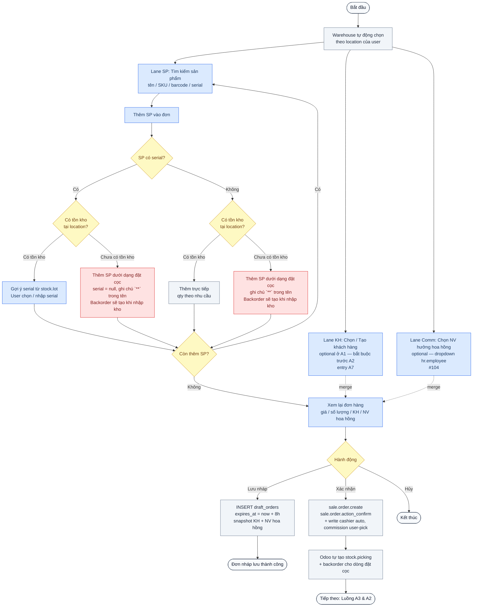
```mermaid
flowchart TD
    classDef user fill:#DBEAFE,stroke:#2563EB,color:#1e3a5f
    classDef system fill:#F1F5F9,stroke:#64748B,color:#1e293b
    classDef accountant fill:#CCFBF1,stroke:#0D9488,color:#134E4A
    classDef decision fill:#FEF9C3,stroke:#CA8A04,color:#713f12
    classDef terminal fill:#F8FAFC,stroke:#334155,color:#0f172a
    classDef warning fill:#FEE2E2,stroke:#DC2626,color:#7f1d1d

    A([Bắt đầu]):::terminal --> B[Warehouse tự động chọn\ntheo location của user]:::system

    %% Sau B, 3 lane chạy SONG SONG (cashier có thể đan xen tự do):
    %%   - Lane KH:    Chọn/tạo khách hàng (optional ở A1, bắt buộc trước A2)
    %%   - Lane Comm:  Chọn nhân viên hưởng hoa hồng (optional, per #104)
    %%   - Lane SP:    Tìm + thêm sản phẩm (vòng lặp)
    %% Cả 3 hội tụ tại I (review). Không có dependency thứ tự giữa các lane.

    B --> CUS1[Lane KH: Chọn / Tạo khách hàng\noptional ở A1 — bắt buộc trước A2\nentry A7]:::user
    B --> COMM1[Lane Comm: Chọn NV hưởng hoa hồng\noptional — dropdown hr.employee\n#104]:::user
    B --> C[Lane SP: Tìm kiếm sản phẩm\ntên / SKU / barcode / serial]:::user

    C --> D[Thêm SP vào đơn]:::user
    D --> E{SP có serial?}:::decision

    E -- Có --> F{Có tồn kho\ntại location?}:::decision
    F -- Có tồn kho --> F1[Gợi ý serial từ stock.lot\nUser chọn / nhập serial]:::user
    F -- Chưa có tồn kho --> F2[Thêm SP dưới dạng đặt cọc\nserial = null, ghi chú `**` trong tên\nBackorder sẽ tạo khi nhập kho]:::warning

    E -- Không --> G{Có tồn kho\ntại location?}:::decision
    G -- Có tồn kho --> G1[Thêm trực tiếp\nqty theo nhu cầu]:::system
    G -- Chưa có tồn kho --> G2[Thêm SP dưới dạng đặt cọc\nghi chú `**` trong tên\nBackorder sẽ tạo khi nhập kho]:::warning

    F1 --> H{Còn thêm SP?}:::decision
    F2 --> H
    G1 --> H
    G2 --> H
    H -- Có --> C
    H -- Không --> I[Xem lại đơn hàng\ngiá / số lượng / KH / NV hoa hồng]:::user

    %% 3 lane hội tụ tại I — KH lane + Comm lane đi thẳng vào I sau khi user thao tác xong
    CUS1 -.merge.-> I
    COMM1 -.merge.-> I

    I --> J{Hành động}:::decision
    J -- Lưu nháp --> K[INSERT draft_orders\nexpires_at = now + 8h\nsnapshot KH + NV hoa hồng]:::system
    K --> L([Đơn nháp lưu thành công]):::terminal
    J -- Xác nhận --> M[sale.order.create\nsale.order.action_confirm\n+ write cashier auto, commission user-pick]:::system
    M --> N[Odoo tự tạo stock.picking\n+ backorder cho dòng đặt cọc]:::system
    N --> O([Tiếp theo: Luồng A3 & A2]):::terminal
    J -- Hủy --> P([Kết thúc]):::terminal
```

**Ghi chú:**
- **3 lane song song sau B** (clarification 2026-05-19): cashier có thể xen kẽ tự do giữa (1) chọn/tạo KH, (2) chọn NV hưởng hoa hồng, (3) tìm + thêm SP. Không có thứ tự bắt buộc — UI hỗ trợ thao tác đồng thời cho đến khi user bấm "Xem lại đơn".
  - **Lane KH** — optional ở A1, **bắt buộc trước khi confirm/thanh toán** (rule A2 — issue #102 enforce). Entry: nút "Chọn khách hàng" trong cart panel. Sub-flow: A7.
  - **Lane Comm** — optional luôn (per [#104](../planning/issue_log_staging_dev.md), GH #9 — đã làm 2026-09-27). Ô chọn nhân viên hưởng hoa hồng (`CommissionEmployeePicker`, tìm qua `GET /employees/search`, không phân biệt dấu, lọc theo công ty của kho đang bán). Không chọn → `commission_employee` để trống, **không tự điền** thu ngân. Tên thu ngân luôn được ghi tự động dạng text vào `sale.order.origin` ("Tài liệu nguồn").
  - **Lane SP** — vòng lặp `C → D → E → F/G → H → C`. Đây là path bắt buộc (đơn phải có tối thiểu 1 dòng SP).
- **Bước E split 4 nhánh theo combo `có-serial × có-tồn-kho`** (clarification 2026-05-18):

| Có serial? | Tồn kho? | Behavior | Node |
|---|---|---|---|
| Có | ✓ có | Gợi ý từ `stock.lot` → cashier pick 1 serial cụ thể (qty=1/lot) | **F1** |
| Có | ✗ chưa | Thêm vào đơn với `serial_number=null`, tên SP `** ...`, backorder | **F2** |
| Không | ✓ có | Thêm trực tiếp theo qty cashier nhập (qty bất kỳ) | **G1** |
| Không | ✗ chưa | Thêm vào đơn với qty preorder, tên SP `** ...`, backorder | **G2** |

- **Pattern `**` thống nhất** cho mọi dòng "đặt cọc / chờ nhập kho" (F2 và G2) — không phân biệt có serial hay không. Cashier nhìn vào tên SP `**` là biết dòng này sẽ backorder.
- **Serial chỉ chọn, không nhập tay** (owner 2026-09-28, GH #20): dialog chọn serial chỉ liệt kê lot có sẵn trên Odoo; ô tìm chỉ lọc danh sách. Backend từ chối serial không tồn tại / của sản phẩm khác / không còn hàng tại kho bán (409 `SERIAL_NOT_FOUND` / `SERIAL_WRONG_PRODUCT` / `SERIAL_NOT_AVAILABLE`). Node F1 "chọn / nhập serial" nay chỉ còn **chọn**.
- **Sau khi xác nhận + thanh toán** (2026-09-28): app chuyển thẳng tới chi tiết đơn `/orders/{id}` và hiện banner thành công **một lần** (mã đơn để đọc cho khách). Màn / dialog "thành công" riêng đã bỏ. Tải lại trang không hiện lại banner.
- **Kho đang bán được nhớ** theo từng user (GH #17): lần sau đăng nhập vào thẳng kho đã dùng; chỉ hỏi chọn kho khi lần đầu hoặc kho cũ không còn được phép.
- **Serial gán thực tế** ở luồng A3/A4: khi hàng về kho, cashier validate picking + chọn serial từ `stock.lot` mới nhập (cho F2). G2 không cần serial nên auto-validate.
- **OQ-K03, OQ-Q04**: cho phép thêm SP hết hàng kèm cảnh báo (banner vàng); serial chọn ngay khi có tồn (F1), defer nếu không (F2, A4).

---

## A2. Luồng Nhận thanh toán (Ghi nhận thủ công)

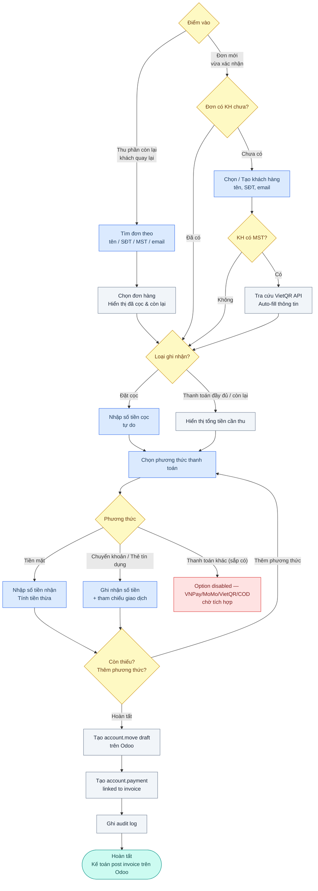
```mermaid
flowchart TD
    classDef user fill:#DBEAFE,stroke:#2563EB,color:#1e3a5f
    classDef system fill:#F1F5F9,stroke:#64748B,color:#1e293b
    classDef accountant fill:#CCFBF1,stroke:#0D9488,color:#134E4A
    classDef decision fill:#FEF9C3,stroke:#CA8A04,color:#713f12
    classDef terminal fill:#F8FAFC,stroke:#334155,color:#0f172a
    classDef warning fill:#FEE2E2,stroke:#DC2626,color:#7f1d1d

    START{Điểm vào}:::decision -- Đơn mới\nvừa xác nhận --> CK
    START -- Thu phần còn lại\nkhách quay lại --> SEARCH[Tìm đơn theo\ntên / SĐT / MST / email]:::user
    SEARCH --> FOUND[Chọn đơn hàng\nHiển thị đã cọc & còn lại]:::system
    FOUND --> B

    CK{Đơn có KH chưa?}:::decision
    CK -- Chưa có --> SELKH[Chọn / Tạo khách hàng\ntên, SĐT, email]:::user
    CK -- Đã có --> B
    SELKH --> MST{KH có MST?}:::decision
    MST -- Có --> LOOKUP[Tra cứu VietQR API\nAuto-fill thông tin]:::system
    MST -- Không --> B
    LOOKUP --> B

    B{Loại ghi nhận?}:::decision -- Đặt cọc --> C[Nhập số tiền cọc\ntự do]:::user
    B -- Thanh toán đầy đủ / còn lại --> D[Hiển thị tổng tiền cần thu]:::system
    C --> E[Chọn phương thức thanh toán]:::user
    D --> E
    E --> F{Phương thức}:::decision
    F -- Tiền mặt --> G[Nhập số tiền nhận\nTính tiền thừa]:::user
    F -- Chuyển khoản / Thẻ tín dụng --> H[Ghi nhận số tiền\n+ tham chiếu giao dịch]:::user
    F -- Thanh toán khác (sắp có) --> DISABLED[Option disabled — VNPay/MoMo/VietQR/COD\nchờ tích hợp]:::warning
    G --> K{Còn thiếu?\nThêm phương thức?}:::decision
    H --> K
    K -- Thêm phương thức --> E
    K -- Hoàn tất --> L[Tạo account.move draft\ntrên Odoo]:::system
    L --> M[Tạo account.payment\nlinked to invoice]:::system
    M --> N[Ghi audit log]:::system
    N --> O([Hoàn tất\nKế toán post invoice trên Odoo]):::accountant
```

**Ghi chú:**
- **Bắt buộc chọn/tạo KH trước khi thanh toán** — nếu đơn chưa có KH sẽ mở dialog chọn KH
- Hỗ trợ đặt cọc nhiều lần (OQ-O01)
- Đơn cọc không hết hạn (OQ-O02)
- Nhiều phương thức trong 1 đơn (OQ-C03)
- **Phương thức** (giai đoạn 1): 3 option — Tiền mặt, Chuyển khoản/Thẻ, Thanh toán khác (disabled). VNPay/MoMo/VietQR Payment/COD chờ tích hợp API trong sprint sau.
- **Cập nhật 2026-09 (GH #2/#7):** bước L–O trong sơ đồ là cách cũ (`on_confirm`). Mặc định hiện nay (`on_delivery`): hóa đơn đã được tạo **nháp** lúc xác nhận đơn; Odoo không ghi được thanh toán vào hóa đơn nháp, nên mỗi khoản thu là một `account.payment` độc lập (đã post) trên khách, gắn với đơn trong bảng `order_payment_links`. Kế toán **không** cần post hóa đơn tay: hóa đơn tự vào sổ khi đơn đã giao hết + thu đủ (A9).
- **"Thu tiền"** (đổi tên từ "Thu cọc"): nút trên chi tiết đơn và màn `/customer-deposit` (thu trước không gắn đơn, `POST /customer-deposits`). Trên điện thoại vào qua **More → Thu tiền**.
- Phương thức thanh toán hiện gán theo từng user; #26 (đang làm) sẽ đổi sang cấu hình theo cửa hàng.

---

## A3. Luồng Xuất kho (Auto validate + Serial + Backorder)

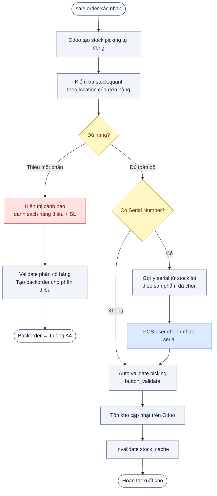
```mermaid
flowchart TD
    classDef user fill:#DBEAFE,stroke:#2563EB,color:#1e3a5f
    classDef system fill:#F1F5F9,stroke:#64748B,color:#1e293b
    classDef accountant fill:#CCFBF1,stroke:#0D9488,color:#134E4A
    classDef decision fill:#FEF9C3,stroke:#CA8A04,color:#713f12
    classDef terminal fill:#F8FAFC,stroke:#334155,color:#0f172a
    classDef warning fill:#FEE2E2,stroke:#DC2626,color:#7f1d1d

    A([sale.order xác nhận]):::terminal --> B[Odoo tạo stock.picking tự động]:::system
    B --> C[Kiểm tra stock.quant\ntheo location của đơn hàng]:::system
    C --> D{Đủ hàng?}:::decision
    D -- Đủ toàn bộ --> E{Có Serial Number?}:::decision
    D -- Thiếu một phần --> F[Hiển thị cảnh báo\ndanh sách hàng thiếu + SL]:::warning
    F --> G[Validate phần có hàng\nTạo backorder cho phần thiếu]:::system
    G --> H([Backorder → Luồng A4]):::terminal
    E -- Không --> I[Auto validate picking\nbutton_validate]:::system
    E -- Có --> J[Gợi ý serial từ stock.lot\ntheo sản phẩm đã chọn]:::system
    J --> K[POS user chọn / nhập serial]:::user
    K --> I
    I --> L[Tồn kho cập nhật trên Odoo]:::system
    L --> M[Invalidate stock_cache]:::system
    M --> N([Hoàn tất xuất kho]):::terminal
```

> **Cập nhật 2026-09 (GH #2/#7/#20):** xuất kho không còn tự validate ngay khi xác nhận đơn. Phiếu giao được validate khi thu ngân bấm **"Giao hàng"** (luồng A9) hoặc làm trực tiếp trên Odoo. Serial ở bước K chỉ **chọn** từ lot có sẵn, không nhập tay.

---

## A4. Luồng Quản lý Backorder

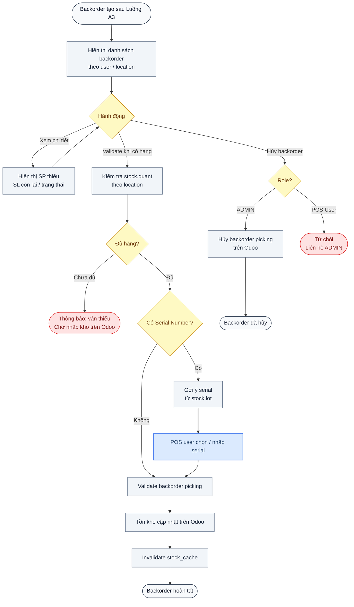
```mermaid
flowchart TD
    classDef user fill:#DBEAFE,stroke:#2563EB,color:#1e3a5f
    classDef system fill:#F1F5F9,stroke:#64748B,color:#1e293b
    classDef accountant fill:#CCFBF1,stroke:#0D9488,color:#134E4A
    classDef decision fill:#FEF9C3,stroke:#CA8A04,color:#713f12
    classDef terminal fill:#F8FAFC,stroke:#334155,color:#0f172a
    classDef warning fill:#FEE2E2,stroke:#DC2626,color:#7f1d1d

    A([Backorder tạo sau Luồng A3]):::terminal --> B[Hiển thị danh sách backorder\ntheo user / location]:::system
    B --> C{Hành động}:::decision
    C -- Xem chi tiết --> D[Hiển thị SP thiếu\nSL còn lại / trạng thái]:::system
    D --> C
    C -- Validate khi có hàng --> E[Kiểm tra stock.quant\ntheo location]:::system
    E --> F{Đủ hàng?}:::decision
    F -- Chưa đủ --> G([Thông báo: vẫn thiếu\nChờ nhập kho trên Odoo]):::warning
    F -- Đủ --> H{Có Serial Number?}:::decision
    H -- Không --> I[Validate backorder picking]:::system
    H -- Có --> J[Gợi ý serial\ntừ stock.lot]:::system
    J --> K[POS user chọn / nhập serial]:::user
    K --> I
    I --> L[Tồn kho cập nhật trên Odoo]:::system
    L --> M[Invalidate stock_cache]:::system
    M --> N([Backorder hoàn tất]):::terminal
    C -- Hủy backorder --> O{Role?}:::decision
    O -- ADMIN --> P[Hủy backorder picking\ntrên Odoo]:::system
    P --> Q([Backorder đã hủy]):::terminal
    O -- POS User --> R([Từ chối\nLiên hệ ADMIN]):::warning
```

---

## A5. Luồng Hủy đơn hàng

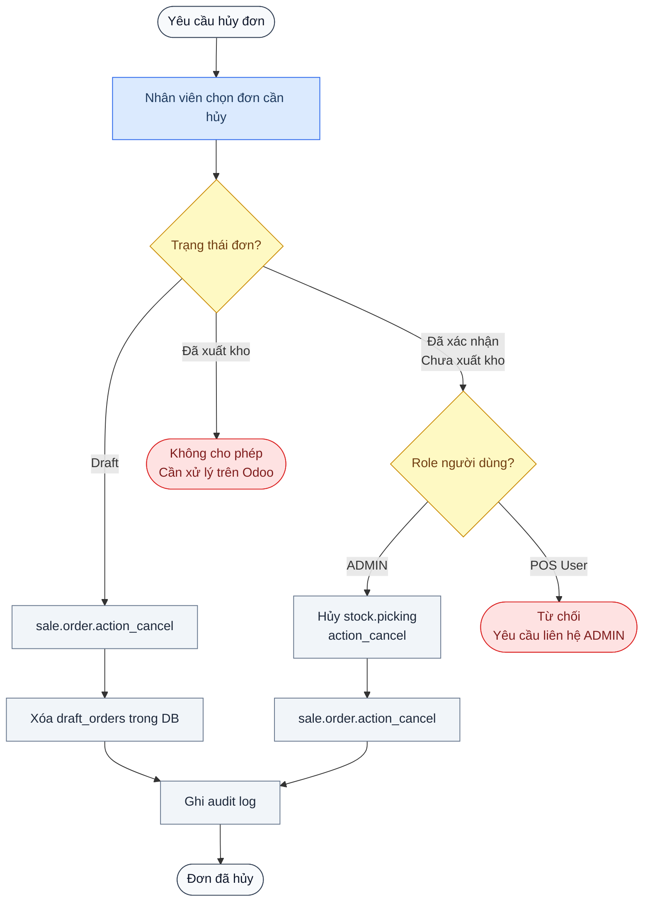
```mermaid
flowchart TD
    classDef user fill:#DBEAFE,stroke:#2563EB,color:#1e3a5f
    classDef system fill:#F1F5F9,stroke:#64748B,color:#1e293b
    classDef accountant fill:#CCFBF1,stroke:#0D9488,color:#134E4A
    classDef decision fill:#FEF9C3,stroke:#CA8A04,color:#713f12
    classDef terminal fill:#F8FAFC,stroke:#334155,color:#0f172a
    classDef warning fill:#FEE2E2,stroke:#DC2626,color:#7f1d1d

    A([Yêu cầu hủy đơn]):::terminal --> B[Nhân viên chọn đơn cần hủy]:::user
    B --> C{Trạng thái đơn?}:::decision
    C -- Draft --> D[sale.order.action_cancel]:::system
    D --> E[Xóa draft_orders trong DB]:::system
    E --> F[Ghi audit log]:::system
    F --> G([Đơn đã hủy]):::terminal
    C -- Đã xác nhận\nChưa xuất kho --> H{Role người dùng?}:::decision
    H -- ADMIN --> I[Hủy stock.picking\naction_cancel]:::system
    I --> J[sale.order.action_cancel]:::system
    J --> F
    H -- POS User --> K([Từ chối\nYêu cầu liên hệ ADMIN]):::warning
    C -- Đã xuất kho --> L([Không cho phép\nCần xử lý trên Odoo]):::warning
```

---

## A6. Luồng Xuất hoá đơn điện tử (Misa)

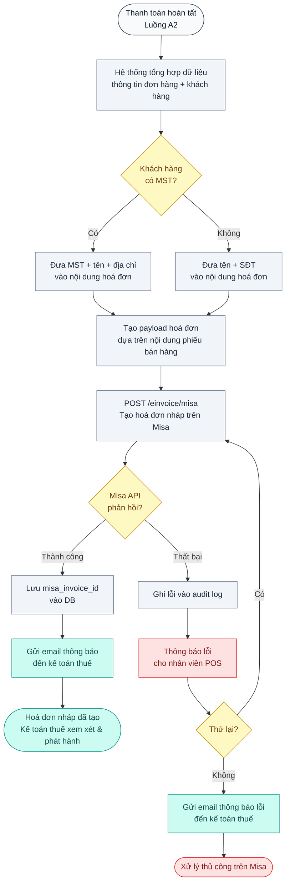
```mermaid
flowchart TD
    classDef user fill:#DBEAFE,stroke:#2563EB,color:#1e3a5f
    classDef system fill:#F1F5F9,stroke:#64748B,color:#1e293b
    classDef accountant fill:#CCFBF1,stroke:#0D9488,color:#134E4A
    classDef decision fill:#FEF9C3,stroke:#CA8A04,color:#713f12
    classDef terminal fill:#F8FAFC,stroke:#334155,color:#0f172a
    classDef warning fill:#FEE2E2,stroke:#DC2626,color:#7f1d1d

    A([Thanh toán hoàn tất\nLuồng A2]):::terminal --> B[Hệ thống tổng hợp dữ liệu\nthông tin đơn hàng + khách hàng]:::system
    B --> C{Khách hàng\ncó MST?}:::decision
    C -- Có --> D[Đưa MST + tên + địa chỉ\nvào nội dung hoá đơn]:::system
    C -- Không --> E[Đưa tên + SĐT\nvào nội dung hoá đơn]:::system
    D --> F[Tạo payload hoá đơn\ndựa trên nội dung phiếu bán hàng]:::system
    E --> F
    F --> G[POST /einvoice/misa\nTạo hoá đơn nháp trên Misa]:::system
    G --> H{Misa API\nphản hồi?}:::decision
    H -- Thành công --> I[Lưu misa_invoice_id\nvào DB]:::system
    I --> J[Gửi email thông báo\nđến kế toán thuế]:::accountant
    J --> K([Hoá đơn nháp đã tạo\nKế toán thuế xem xét & phát hành]):::accountant
    H -- Thất bại --> L[Ghi lỗi vào audit log]:::system
    L --> M[Thông báo lỗi\ncho nhân viên POS]:::warning
    M --> N{Thử lại?}:::decision
    N -- Có --> G
    N -- Không --> P[Gửi email thông báo lỗi\nđến kế toán thuế]:::accountant
    P --> O([Xử lý thủ công trên Misa]):::warning
```

**Ghi chú:**
- Hoá đơn chỉ được tạo ở trạng thái **nháp** — kế toán thuế phát hành chính thức trên Misa
- Nội dung hoá đơn dựa trên phiếu bán hàng (A8 / B7): danh sách sản phẩm, số lượng, đơn giá, tổng tiền
- Email thông báo gửi đến địa chỉ kế toán thuế được cấu hình trong hệ thống
- Nếu Misa API thất bại: audit log lưu lại để xử lý thủ công, không ảnh hưởng đến đơn hàng

---

## A7. Luồng Tạo / Cập nhật Khách hàng

Luồng quản lý `res.partner` — cả POS User và ADMIN đều được phép **tạo** và **cập nhật** (per OQ-J04, OQ-AE03). Entry points: từ màn Tạo đơn hàng (bấm "Chọn khách hàng"), hoặc từ Dialog Thanh toán (nếu chưa có KH), hoặc từ admin CRUD trong tương lai.

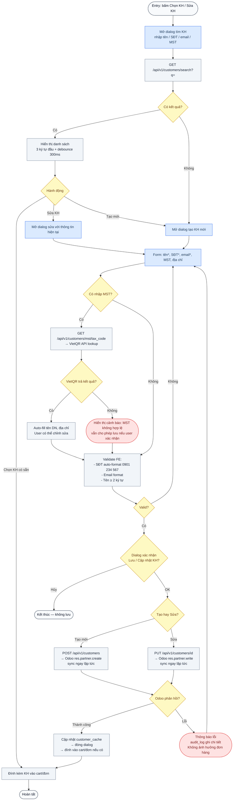
```mermaid
flowchart TD
    classDef user fill:#DBEAFE,stroke:#2563EB,color:#1e3a5f
    classDef system fill:#F1F5F9,stroke:#64748B,color:#1e293b
    classDef accountant fill:#CCFBF1,stroke:#0D9488,color:#134E4A
    classDef decision fill:#FEF9C3,stroke:#CA8A04,color:#713f12
    classDef terminal fill:#F8FAFC,stroke:#334155,color:#0f172a
    classDef warning fill:#FEE2E2,stroke:#DC2626,color:#7f1d1d

    START([Entry: bấm Chọn KH / Sửa KH]):::terminal --> SEARCH[Mở dialog tìm KH\nnhập tên / SĐT / email / MST]:::user
    SEARCH --> Q[GET /api/v1/customers/search?q=]:::system
    Q --> HAS{Có kết quả?}:::decision
    HAS -- Có --> LIST[Hiển thị danh sách\n3 ký tự đầu + debounce 300ms]:::system
    LIST --> PICK{Hành động}:::decision
    PICK -- Chọn KH có sẵn --> SELECT[Đính kèm KH vào cart/đơn]:::system
    PICK -- Sửa KH --> EDIT[Mở dialog sửa với thông tin hiện tại]:::user
    PICK -- Tạo mới --> NEW
    HAS -- Không --> NEW[Mở dialog tạo KH mới]:::user

    NEW --> FORM[Form: tên*, SĐT*, email*, MST, địa chỉ]:::user
    EDIT --> FORM
    FORM --> MST{Có nhập MST?}:::decision
    MST -- Có --> VQ[GET /api/v1/customers/mst/tax_code\n→ VietQR API lookup]:::system
    VQ --> VQR{VietQR trả kết quả?}:::decision
    VQR -- Có --> AUTOFILL[Auto-fill tên DN, địa chỉ\nUser có thể chỉnh sửa]:::system
    VQR -- Không --> WARN1([Hiển thị cảnh báo: MST không hợp lệ\nvẫn cho phép lưu nếu user xác nhận]):::warning
    AUTOFILL --> VAL
    WARN1 --> VAL
    MST -- Không --> VAL[Validate FE:\n- SĐT auto-format 0901 234 567\n- Email format\n- Tên ≥ 2 ký tự]:::system

    VAL --> VOK{Valid?}:::decision
    VOK -- Không --> FORM
    VOK -- Có --> CONFIRM{Dialog xác nhận\nLưu / Cập nhật KH?}:::decision
    CONFIRM -- Hủy --> END1([Kết thúc — không lưu]):::terminal
    CONFIRM -- OK --> API{Tạo hay Sửa?}:::decision

    API -- Tạo mới --> POST[POST /api/v1/customers\n→ Odoo res.partner.create\nsync ngay lập tức]:::system
    API -- Sửa --> PUT[PUT /api/v1/customers/id\n→ Odoo res.partner.write\nsync ngay lập tức]:::system

    POST --> RES{Odoo phản hồi?}:::decision
    PUT --> RES
    RES -- Thành công --> OK[Cập nhật customer_cache\n→ đóng dialog\n→ đính vào cart/đơn nếu có]:::system
    RES -- Lỗi --> ERR([Thông báo lỗi\naudit_log ghi chi tiết\nKhông ảnh hưởng đơn hàng]):::warning
    OK --> SELECT
    SELECT --> DONE([Hoàn tất]):::terminal
    ERR --> FORM
```

**Ghi chú:**

- **Quyền**: cả POS User và ADMIN đều được PUT/POST — per OQ-J04, OQ-AE03 ("Đã sửa trong backend").
- **Bắt buộc** (OQ-J02): `tên`, `số điện thoại`, `email`. MST + địa chỉ **tùy chọn**.
- **Tìm kiếm** (OQ-J03): tên, SĐT, email, MST — BE handle logic.
- **SĐT auto-format** (OQ-AF02): khi gõ `0901234567` → hiển thị `0901 234 567`. Regex VN: `^(0|\+84)(\d{9,10})$`.
- **Tra MST** (OQ-X01, B6): khi nhập MST và blur/submit → `GET /customers/mst/{tax_code}` (escodata mặc định, VietQR dự phòng) → auto-fill tên DN + địa chỉ. User có thể chỉnh sửa sau auto-fill.
- **Sync ngay** (OQ-X01): backend gọi `res.partner.create` / `write` qua JSON-RPC ngay khi bấm Lưu — không đợi batch. Cache `customer_cache` invalidate cho user hiện tại.
- **Confirm dialog** (OQ-Q01): xác nhận trước khi tạo/lưu/cập nhật.
- **Đính kèm vào cart**: nếu entry từ màn Tạo đơn (`/orders/new`), sau khi lưu thành công → `cart.setCustomer(...)` → đóng dialog → quay lại màn chính.
- **Error handling**: Odoo fail → giữ dialog mở, show error, audit_log ghi lại; user có thể retry hoặc hủy.
- **Không cho xóa KH**: out of scope giai đoạn này (chỉnh sửa trên Odoo nếu cần).

---

## A8. Luồng Xem Profile Khách hàng

Nhân viên mở "Profile khách hàng" để xem nhanh thông tin KH và **các chương trình khuyến mãi đang áp dụng** cho KH đó. Chỉ đọc (read-only) — không áp discount vào đơn.

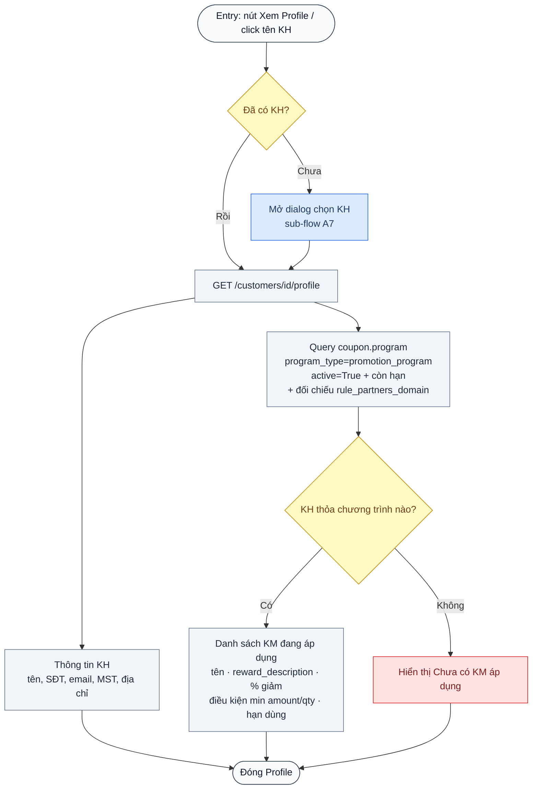
```mermaid
flowchart TD
    classDef user fill:#DBEAFE,stroke:#2563EB,color:#1e3a5f
    classDef system fill:#F1F5F9,stroke:#64748B,color:#1e293b
    classDef decision fill:#FEF9C3,stroke:#CA8A04,color:#713f12
    classDef terminal fill:#F8FAFC,stroke:#334155,color:#0f172a
    classDef warning fill:#FEE2E2,stroke:#DC2626,color:#7f1d1d

    START([Entry: nút Xem Profile / click tên KH]):::terminal --> HASKH{Đã có KH?}:::decision
    HASKH -- Chưa --> PICK[Mở dialog chọn KH\nsub-flow A7]:::user
    HASKH -- Rồi --> LOAD[GET /customers/id/profile]:::system
    PICK --> LOAD
    LOAD --> INFO[Thông tin KH\ntên, SĐT, email, MST, địa chỉ]:::system
    LOAD --> PROMO[Query coupon.program\nprogram_type=promotion_program\nactive=True + còn hạn\n+ đối chiếu rule_partners_domain]:::system
    PROMO --> CHECK{KH thỏa chương trình nào?}:::decision
    CHECK -- Có --> LIST[Danh sách KM đang áp dụng\ntên · reward_description · % giảm\nđiều kiện min amount/qty · hạn dùng]:::system
    CHECK -- Không --> EMPTY[Hiển thị Chưa có KM áp dụng]:::warning
    INFO --> DONE([Đóng Profile]):::terminal
    LIST --> DONE
    EMPTY --> DONE
```

**Ghi chú:**
- **Nguồn dữ liệu:** Odoo 14 CE `coupon.program` (module `coupon` + `sale_coupon`). Odoo 14 **không** có `loyalty.program` (Odoo 16+). abc2022 hiện có ~7 chương trình (vd "Khách hàng review giảm 100K", "Giảm giá 2%").
- **KM "đang áp dụng":** `program_type='promotion_program'` (KM tự động — khác `coupon_program` cần nhập mã) + `active=True` + `now ∈ [rule_date_from, rule_date_to]` + KH thỏa `rule_partners_domain`.
- **`rule_partners_domain` là chuỗi domain** (không phải Many2one) → với mỗi chương trình active, kiểm tra KH có match không bằng `search_count("res.partner", eval(rule_partners_domain) + [("id","=",customer_id)]) > 0`.
- **Read-only:** chỉ hiển thị để nhân viên tư vấn KH — **không** tự áp discount vào `sale.order` (áp discount vẫn ngoài phạm vi — B-03).
- **Entry points:** nút "Xem Profile" trên cart panel (`CustomerButton`) / trong dialog chọn KH (A7) / màn chi tiết đơn. Ngoài ra mục **"Khách hàng"** (điện thoại: More → Khách hàng; iPad: tab "Khách hàng"; máy tính: sidebar) mở ô tìm khách hàng để xem profile.
- Chi tiết kỹ thuật + endpoint đề xuất: [issue #115](../planning/issue_log_staging_dev.md).

**Đã làm (GH #10, 2026-09-27) — endpoint `GET /customers/{id}/profile` ([api_contract §3.5](../planning/02.%20api_contract.md)):**
- Ngoài `promotion_program` còn hiện **coupon riêng** của KH (`coupon.coupon`, trạng thái `new`/`sent`, chưa hết hạn). **Mã coupon riêng bị che ngay trong API** (chỉ còn 4 ký tự cuối, ví dụ `••••4267`); mã chung của chương trình vẫn hiện đầy đủ, có nút copy.
- **Lọc theo công ty** của kho / location đang bán (hoặc chương trình dùng chung).
- **Tag theo giỏ hàng:** API trả điều kiện có cấu trúc (`min_amount`, `min_qty`, `product_scope`); FE so với tổng giỏ để hiện "Đủ điều kiện" hoặc "Còn thiếu X ₫".
- Chương trình có `rule_partners_domain` không đánh giá được ngoài Odoo → vẫn hiện, đánh dấu `unverified`. Chương trình hết lượt (`maximum_use_number`) bị loại.
- Thông tin KH có thêm **Bảng giá** (`property_product_pricelist`).
- Vẫn **chỉ đọc**: không áp khuyến mãi vào đơn.

---

## A9. Luồng Giao hàng & vào sổ hóa đơn

Quyết định owner 2026-09-26 (GH #2, #7, phương án a; kế toán chốt ở GH #15): **ngày hóa đơn = ngày giao hàng**. Hóa đơn để nháp từ lúc xác nhận đơn và chỉ vào sổ khi đơn **đã giao hết và đã thu đủ**. API: `POST /orders/{id}/deliver` ([api_contract §5.5](../planning/02.%20api_contract.md)).

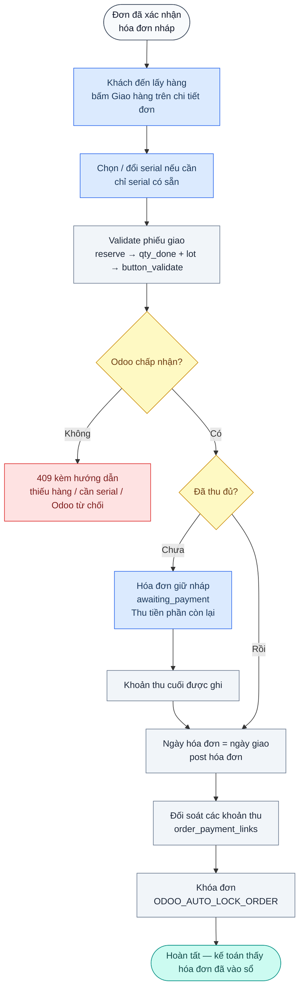
```mermaid
flowchart TD
    classDef user fill:#DBEAFE,stroke:#2563EB,color:#1e3a5f
    classDef system fill:#F1F5F9,stroke:#64748B,color:#1e293b
    classDef accountant fill:#CCFBF1,stroke:#0D9488,color:#134E4A
    classDef decision fill:#FEF9C3,stroke:#CA8A04,color:#713f12
    classDef terminal fill:#F8FAFC,stroke:#334155,color:#0f172a
    classDef warning fill:#FEE2E2,stroke:#DC2626,color:#7f1d1d

    A([Đơn đã xác nhận
hóa đơn nháp]):::terminal --> B[Khách đến lấy hàng
bấm Giao hàng trên chi tiết đơn]:::user
    B --> C[Chọn / đổi serial nếu cần
chỉ serial có sẵn]:::user
    C --> D[Validate phiếu giao
reserve → qty_done + lot → button_validate]:::system
    D --> E{Odoo chấp nhận?}:::decision
    E -- Không --> W[409 kèm hướng dẫn
thiếu hàng / cần serial / Odoo từ chối]:::warning
    E -- Có --> F{Đã thu đủ?}:::decision
    F -- Chưa --> G[Hóa đơn giữ nháp
awaiting_payment
Thu tiền phần còn lại]:::user
    G --> H[Khoản thu cuối được ghi]:::system
    H --> I
    F -- Rồi --> I[Ngày hóa đơn = ngày giao
post hóa đơn]:::system
    I --> J[Đối soát các khoản thu
order_payment_links]:::system
    J --> K[Khóa đơn
ODOO_AUTO_LOCK_ORDER]:::system
    K --> L([Hoàn tất — kế toán thấy hóa đơn đã vào sổ]):::accountant
```

**Ghi chú:**
- **3 trigger** cùng một logic vào sổ: nút "Giao hàng" trên POS; khoản thu cuối đến sau khi giao; job nền mỗi 5 phút cho đơn được giao thẳng trên Odoo. Vì vậy hạch toán chậm nhất khoảng 5 phút sau khi hoàn thành đơn (GH #7, quy định ≤ 20 phút).
- Phiếu đã validate trên Odoo được bỏ qua — nút "Giao hàng" vẫn dùng được để vào sổ hóa đơn cho đơn đã giao trên Odoo (`can_deliver` còn đúng khi hóa đơn còn nháp).
- Thu tiền trước khi giao (đặt cọc, thu đủ trước): khoản thu là `account.payment` độc lập gắn với đơn (`order_payment_links`), đối soát lúc hóa đơn vào sổ.
- Lỗi Odoo trả 409 có mã (`STOCK_NOT_RESERVED`, `SERIAL_REQUIRED`, `PICKING_NEEDS_ODOO_ACTION`, `DELIVERY_REJECTED` kèm nguyên văn lỗi Odoo cho quản lý / kế toán, `ORDER_BUSY`).
- Rollback: `INVOICE_POST_MODE=on_confirm` quay về cách cũ (post + khóa ngay khi xác nhận).
- "In phiếu giao": **không làm** (owner 2026-09-28, #18).

---

## A10. Luồng Đổi ngày hẹn lấy hàng (TH4 / TH5)

Khách đến sớm hơn hoặc muộn hơn ngày hẹn. API: `PATCH /orders/{id}/pickup-date` ([api_contract §5.7](../planning/02.%20api_contract.md)).

- **Ngày hẹn lấy hàng = `scheduled_date` của phiếu giao đi đang chờ** (sớm nhất nếu có nhiều phiếu). Chi tiết đơn hiện ở thẻ "Hẹn lấy hàng", danh sách đơn có cột / trường `pickup_date`.
- Nhân viên bấm **"Đổi ngày"**, chọn ngày mới (hôm nay → tối đa 365 ngày), nhập lý do (không bắt buộc).
- Backend dời `scheduled_date` của mọi phiếu giao đang chờ (giữ giờ trong ngày theo giờ VN) và `date_deadline` của các move chưa xong, rồi ghi **note nội bộ** lên chatter đơn: `[POS] Đổi ngày hẹn lấy hàng: cũ → mới. Lý do: …. Người đổi: …`.
- **POS không sửa, không đóng `mail.activity`** (owner 2026-09-28: "không động tới activity nữa, chỉ dời ngày phiếu giao và ghi note"). Endpoint sửa activity của bản đầu (`PATCH /orders/{id}/activities/{id}`) **đã bỏ**.
- Không đổi `commitment_date` (chỉ hiển thị).

---

## A11. Luồng Chuyển cọc (đổi sản phẩm — TH6)

API: `POST /orders/{id}/release-deposit` ([api_contract §5.6](../planning/02.%20api_contract.md)). GH #5, kế toán chốt ở GH #15.

1. **Hủy đơn cũ trên Odoo** (báo giá + phiếu giao + hoạt động cần làm; Odoo hỏi hủy hóa đơn nháp thì xác nhận). POS không có nút hủy đơn (#51).
2. Trên chi tiết đơn cũ (đã hủy, còn cọc) bấm **"Chuyển cọc"**, chọn đơn mới của cùng khách (không bắt buộc).
3. Backend bỏ liên kết giữ cọc (`order_payment_links` → `released`). `account.payment` giữ nguyên, trở thành **công nợ có của khách** (xem ở "Tiền cọc của khách"). Nếu có đơn mới → trừ luôn vào đơn mới (như `apply-credit`).
4. Chặn khi: đơn cũ chưa hủy, đã giao hàng, hóa đơn đã vào sổ đang giữ cọc (kế toán "Đặt lại về nháp" + "Hủy" hóa đơn trước), hoặc không có cọc đang giữ trên POS.

**Hoàn tiền cọc (TH7 — khách hủy cọc):** kế toán hoàn thủ công trên Odoo. POS không có chức năng hoàn tiền.

---

# Phần B — Technical Flows

---

## B1. Luồng Đăng nhập (Authentication)

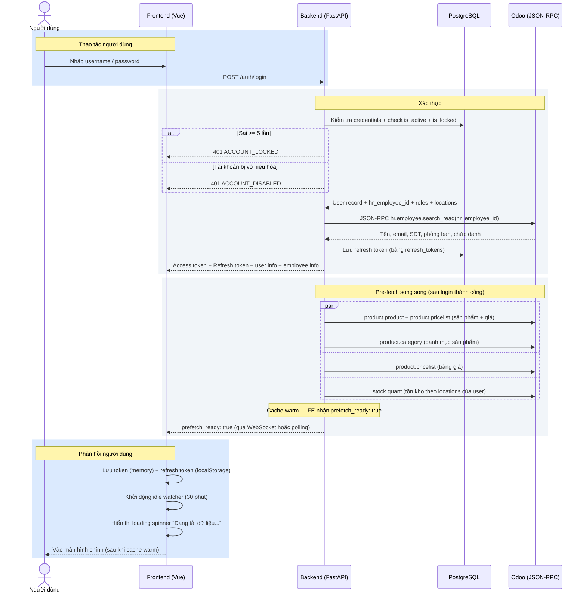
```mermaid
sequenceDiagram
    actor User as Người dùng
    participant FE as Frontend (Vue)
    participant BE as Backend (FastAPI)
    participant DB as PostgreSQL
    participant Odoo as Odoo (JSON-RPC)

    rect rgb(219, 234, 254)
        Note over User,FE: Thao tác người dùng
        User->>FE: Nhập username / password
        FE->>BE: POST /auth/login
    end
    rect rgb(241, 245, 249)
        Note over BE,Odoo: Xác thực
        BE->>DB: Kiểm tra credentials + check is_active + is_locked
        alt Sai >= 5 lần
            BE-->>FE: 401 ACCOUNT_LOCKED
        else Tài khoản bị vô hiệu hóa
            BE-->>FE: 401 ACCOUNT_DISABLED
        end
        DB-->>BE: User record + hr_employee_id + roles + locations
        BE->>Odoo: JSON-RPC hr.employee.search_read(hr_employee_id)
        Odoo-->>BE: Tên, email, SĐT, phòng ban, chức danh
        BE->>DB: Lưu refresh token (bảng refresh_tokens)
        BE-->>FE: Access token + Refresh token + user info + employee info
    end
    rect rgb(241, 245, 249)
        Note over BE,Odoo: Pre-fetch song song (sau login thành công)
        par
            BE->>Odoo: product.product + product.pricelist (sản phẩm + giá)
        and
            BE->>Odoo: product.category (danh mục sản phẩm)
        and
            BE->>Odoo: product.pricelist (bảng giá)
        and
            BE->>Odoo: stock.quant (tồn kho theo locations của user)
        end
        Note over BE: Cache warm — FE nhận prefetch_ready: true
        BE-->>FE: prefetch_ready: true (qua WebSocket hoặc polling)
    end
    rect rgb(219, 234, 254)
        Note over FE,User: Phản hồi người dùng
        FE->>FE: Lưu token (memory) + refresh token (localStorage)
        FE->>FE: Khởi động idle watcher (30 phút)
        FE->>FE: Hiển thị loading spinner "Đang tải dữ liệu..."
        FE-->>User: Vào màn hình chính (sau khi cache warm)
    end
```

**Ghi chú:**
- Credentials quản lý trên PostgreSQL local — không dùng tài khoản Odoo
- Thông tin cá nhân (tên, email, SĐT...) lấy từ `hr.employee` trên Odoo
- Khóa tài khoản sau 5 lần sai → ADMIN mở thủ công (OQ-M04, OQ-W03)
- Idle timeout 30 phút → countdown 60s → tự đăng xuất (OQ-M03; nâng từ 5 phút sau phản hồi staging — 5 phút quá ngắn cho cashier giữa 2 khách)
- Pre-fetch chạy song song ngay sau login — 4 Odoo calls đồng thời → giảm tải lần đầu dùng SP/tồn kho
- Prefetch timeout 60s — nếu vẫn fail sau 60s, hiển thị lỗi yêu cầu user liên hệ ADMIN.
- FE hiển thị loading cho đến khi `prefetch_ready: true` → không cho vào màn hình chính sớm khi cache chưa warm

---

## B2. Luồng Làm mới Cache

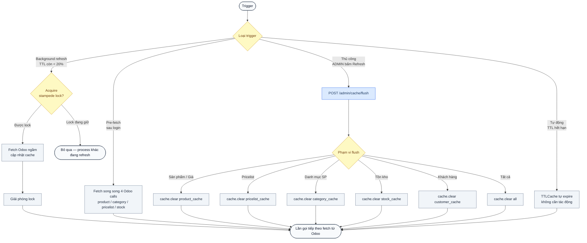
```mermaid
flowchart TD
    classDef user fill:#DBEAFE,stroke:#2563EB,color:#1e3a5f
    classDef system fill:#F1F5F9,stroke:#64748B,color:#1e293b
    classDef decision fill:#FEF9C3,stroke:#CA8A04,color:#713f12
    classDef terminal fill:#F8FAFC,stroke:#334155,color:#0f172a
    classDef warning fill:#FEE2E2,stroke:#DC2626,color:#7f1d1d

    A([Trigger]):::terminal --> B{Loại trigger}:::decision
    B -- Thủ công\nADMIN bấm Refresh --> C[POST /admin/cache/flush]:::user
    B -- Tự động\nTTL hết hạn --> D[TTLCache tự expire\nkhông cần tác động]:::system
    B -- Pre-fetch\nsau login --> PF[Fetch song song 4 Odoo calls\nproduct / category / pricelist / stock]:::system
    B -- Background refresh\nTTL còn < 20% --> BR{Acquire\nstampede lock?}:::decision
    BR -- Được lock --> BRF[Fetch Odoo ngầm\ncập nhật cache]:::system
    BR -- Lock đang giữ --> BRS([Bỏ qua — process khác đang refresh]):::terminal
    BRF --> BRD[Giải phóng lock]:::system
    BRD --> I
    PF --> I
    C --> E{Phạm vi flush}:::decision
    E -- Sản phẩm / Giá --> F[cache.clear product_cache]:::system
    E -- Pricelist --> G[cache.clear pricelist_cache]:::system
    E -- Danh mục SP --> GA[cache.clear category_cache]:::system
    E -- Tồn kho --> GB[cache.clear stock_cache]:::system
    E -- Khách hàng --> GC[cache.clear customer_cache]:::system
    E -- Tất cả --> H[cache.clear all]:::system
    F --> I([Lần gọi tiếp theo fetch từ Odoo]):::terminal
    G --> I
    GA --> I
    GB --> I
    GC --> I
    H --> I
    D --> I
```

**TTL mặc định:**

| Cache | TTL |
|---|---|
| Sản phẩm + giá | 30 phút |
| Pricelist | 1 giờ |
| Danh mục SP (`product.category`) | 8 tiếng |
| Tồn kho (`stock.quant`) | 5 phút |
| Khách hàng (`res.partner`) | 60 phút |
| MST (VietQR) | 10 phút |

---

## B3. Luồng Quản lý User (ADMIN)

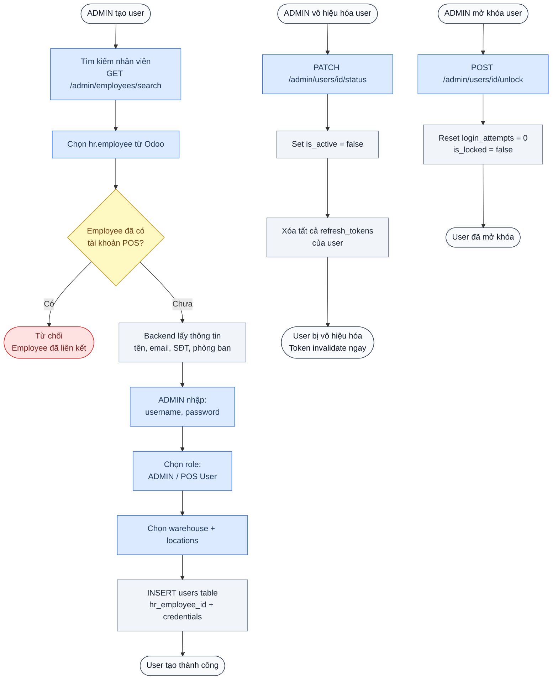
```mermaid
flowchart TD
    classDef user fill:#DBEAFE,stroke:#2563EB,color:#1e3a5f
    classDef system fill:#F1F5F9,stroke:#64748B,color:#1e293b
    classDef accountant fill:#CCFBF1,stroke:#0D9488,color:#134E4A
    classDef decision fill:#FEF9C3,stroke:#CA8A04,color:#713f12
    classDef terminal fill:#F8FAFC,stroke:#334155,color:#0f172a
    classDef warning fill:#FEE2E2,stroke:#DC2626,color:#7f1d1d

    A([ADMIN tạo user]):::terminal --> B[Tìm kiếm nhân viên\nGET /admin/employees/search]:::user
    B --> C[Chọn hr.employee từ Odoo]:::user
    C --> D{Employee đã có\ntài khoản POS?}:::decision
    D -- Có --> E([Từ chối\nEmployee đã liên kết]):::warning
    D -- Chưa --> F[Backend lấy thông tin\ntên, email, SĐT, phòng ban]:::system
    F --> G[ADMIN nhập:\nusername, password]:::user
    G --> H[Chọn role:\nADMIN / POS User]:::user
    H --> I[Chọn warehouse + locations]:::user
    I --> J[INSERT users table\nhr_employee_id + credentials]:::system
    J --> K([User tạo thành công]):::terminal

    L([ADMIN vô hiệu hóa user]):::terminal --> M[PATCH /admin/users/id/status]:::user
    M --> N[Set is_active = false]:::system
    N --> O[Xóa tất cả refresh_tokens\ncủa user]:::system
    O --> P([User bị vô hiệu hóa\nToken invalidate ngay]):::terminal

    Q([ADMIN mở khóa user]):::terminal --> R[POST /admin/users/id/unlock]:::user
    R --> S[Reset login_attempts = 0\nis_locked = false]:::system
    S --> T([User đã mở khóa]):::terminal
```

**Ghi chú:**
- Thông tin cá nhân kế thừa từ `hr.employee` — không nhập thủ công
- 1 `hr.employee` chỉ liên kết 1 user POS
- Admin mặc định không cần `hr_employee_id`
- Vô hiệu hóa → invalidate token ngay lập tức (OQ-M02)

---

## B4. Luồng Reset Password

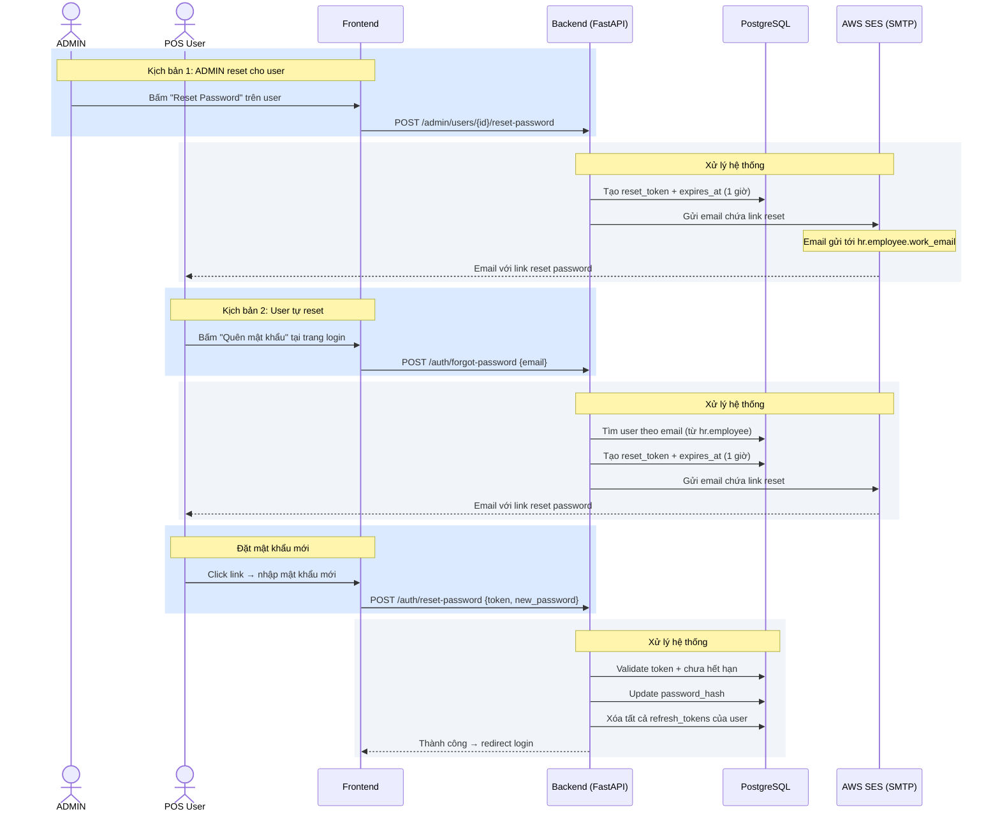
```mermaid
sequenceDiagram
    actor Admin as ADMIN
    actor User as POS User
    participant FE as Frontend
    participant BE as Backend (FastAPI)
    participant DB as PostgreSQL
    participant SES as AWS SES (SMTP)

    rect rgb(219, 234, 254)
        Note over Admin,FE: Kịch bản 1: ADMIN reset cho user
        Admin->>FE: Bấm "Reset Password" trên user
        FE->>BE: POST /admin/users/{id}/reset-password
    end
    rect rgb(241, 245, 249)
        Note over BE,SES: Xử lý hệ thống
        BE->>DB: Tạo reset_token + expires_at (1 giờ)
        BE->>SES: Gửi email chứa link reset
        Note over SES: Email gửi tới hr.employee.work_email
        SES-->>User: Email với link reset password
    end

    rect rgb(219, 234, 254)
        Note over User,FE: Kịch bản 2: User tự reset
        User->>FE: Bấm "Quên mật khẩu" tại trang login
        FE->>BE: POST /auth/forgot-password {email}
    end
    rect rgb(241, 245, 249)
        Note over BE,SES: Xử lý hệ thống
        BE->>DB: Tìm user theo email (từ hr.employee)
        BE->>DB: Tạo reset_token + expires_at (1 giờ)
        BE->>SES: Gửi email chứa link reset
        SES-->>User: Email với link reset password
    end

    rect rgb(219, 234, 254)
        Note over User,FE: Đặt mật khẩu mới
        User->>FE: Click link → nhập mật khẩu mới
        FE->>BE: POST /auth/reset-password {token, new_password}
    end
    rect rgb(241, 245, 249)
        Note over BE,DB: Xử lý hệ thống
        BE->>DB: Validate token + chưa hết hạn
        BE->>DB: Update password_hash
        BE->>DB: Xóa tất cả refresh_tokens của user
        BE-->>FE: Thành công → redirect login
    end
```

**Ghi chú:**
- **Entry Kịch bản 2 (#110)**: LoginPage có link **"Quên mật khẩu?"** hiển thị ngay dưới form đăng nhập → mở dialog nhập email → `POST /auth/forgot-password`. User không cần ADMIN can thiệp.
- Email lấy từ `hr.employee.work_email` trên Odoo
- Token reset hết hạn sau 1 giờ
- Password policy: min 8 ký tự, chữ hoa + số + ký tự đặc biệt (OQ-W01)
- Sau reset → xóa tất cả session cũ

---

## B5. Luồng Kiểm tra tồn kho

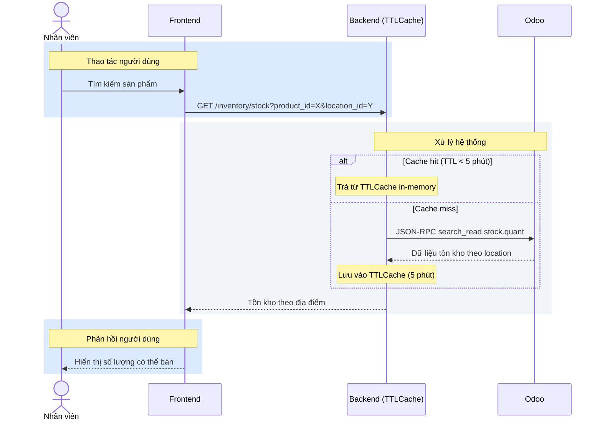
```mermaid
sequenceDiagram
    actor User as Nhân viên
    participant FE as Frontend
    participant BE as Backend (TTLCache)
    participant Odoo

    rect rgb(219, 234, 254)
        Note over User,FE: Thao tác người dùng
        User->>FE: Tìm kiếm sản phẩm
        FE->>BE: GET /inventory/stock?product_id=X&location_id=Y
    end
    rect rgb(241, 245, 249)
        Note over BE,Odoo: Xử lý hệ thống
        alt Cache hit (TTL < 5 phút)
            Note over BE: Trả từ TTLCache in-memory
        else Cache miss
            BE->>Odoo: JSON-RPC search_read stock.quant
            Odoo-->>BE: Dữ liệu tồn kho theo location
            Note over BE: Lưu vào TTLCache (5 phút)
        end
        BE-->>FE: Tồn kho theo địa điểm
    end
    rect rgb(219, 234, 254)
        Note over FE,User: Phản hồi người dùng
        FE-->>User: Hiển thị số lượng có thể bán
    end
```

---

## B6. Luồng Tra cứu MST

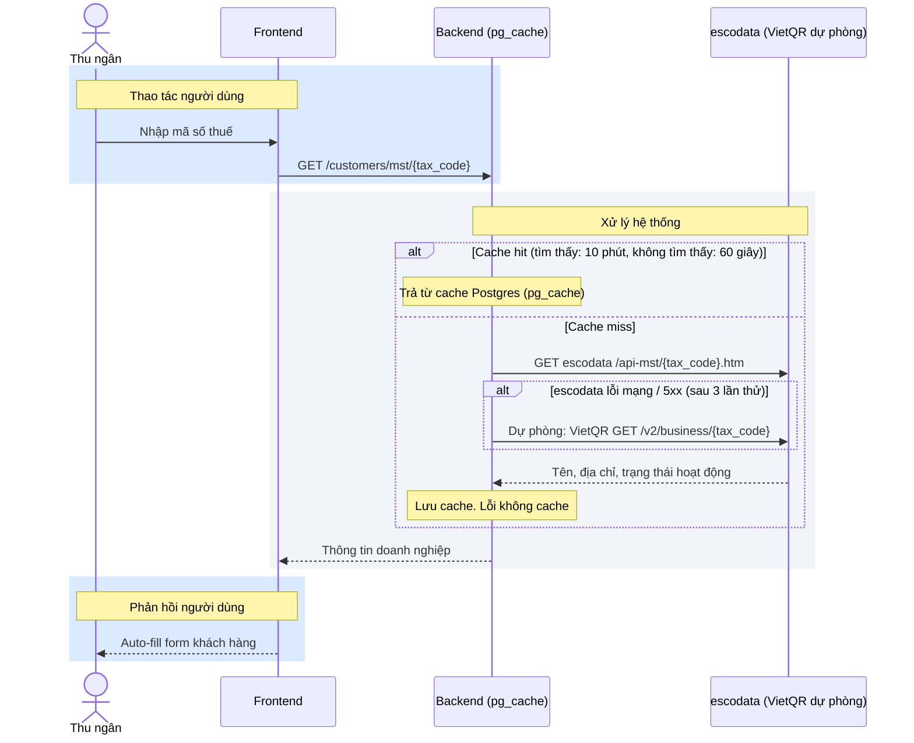
```mermaid
sequenceDiagram
    actor User as Thu ngân
    participant FE as Frontend
    participant BE as Backend (pg_cache)
    participant MST as escodata (VietQR dự phòng)

    rect rgb(219, 234, 254)
        Note over User,FE: Thao tác người dùng
        User->>FE: Nhập mã số thuế
        FE->>BE: GET /customers/mst/{tax_code}
    end
    rect rgb(241, 245, 249)
        Note over BE,MST: Xử lý hệ thống
        alt Cache hit (tìm thấy: 10 phút, không tìm thấy: 60 giây)
            Note over BE: Trả từ cache Postgres (pg_cache)
        else Cache miss
            BE->>MST: GET escodata /api-mst/{tax_code}.htm
            alt escodata lỗi mạng / 5xx (sau 3 lần thử)
                BE->>MST: Dự phòng: VietQR GET /v2/business/{tax_code}
            end
            MST-->>BE: Tên, địa chỉ, trạng thái hoạt động
            Note over BE: Lưu cache. Lỗi không cache
        end
        BE-->>FE: Thông tin doanh nghiệp
    end
    rect rgb(219, 234, 254)
        Note over FE,User: Phản hồi người dùng
        FE-->>User: Auto-fill form khách hàng
    end
```

---

## B7. Luồng In phiếu bán hàng (Generate PDF)

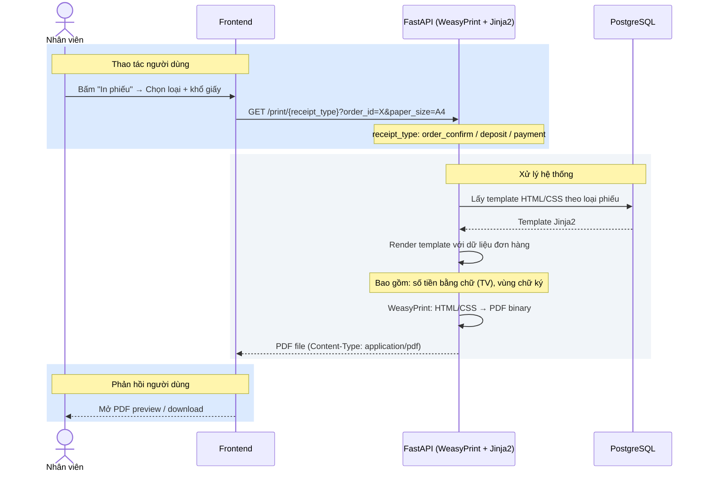
```mermaid
sequenceDiagram
    actor User as Nhân viên
    participant FE as Frontend
    participant BE as FastAPI (WeasyPrint + Jinja2)
    participant DB as PostgreSQL

    rect rgb(219, 234, 254)
        Note over User,FE: Thao tác người dùng
        User->>FE: Bấm "In phiếu" → Chọn loại + khổ giấy
        FE->>BE: GET /print/{receipt_type}?order_id=X&paper_size=A4
        Note over BE: receipt_type: order_confirm / deposit / payment
    end
    rect rgb(241, 245, 249)
        Note over BE,DB: Xử lý hệ thống
        BE->>DB: Lấy template HTML/CSS theo loại phiếu
        DB-->>BE: Template Jinja2
        BE->>BE: Render template với dữ liệu đơn hàng
        Note over BE: Bao gồm: số tiền bằng chữ (TV), vùng chữ ký
        BE->>BE: WeasyPrint: HTML/CSS → PDF binary
        BE-->>FE: PDF file (Content-Type: application/pdf)
    end
    rect rgb(219, 234, 254)
        Note over FE,User: Phản hồi người dùng
        FE-->>User: Mở PDF preview / download
    end
```

**Ghi chú:**
- User chọn A4 hoặc A5 khi in (OQ-Z01)
- Chỉ preview / download, không in trực tiếp (OQ-U02)

---

## B8. Tích hợp Misa (eInvoice) *(Planned)*

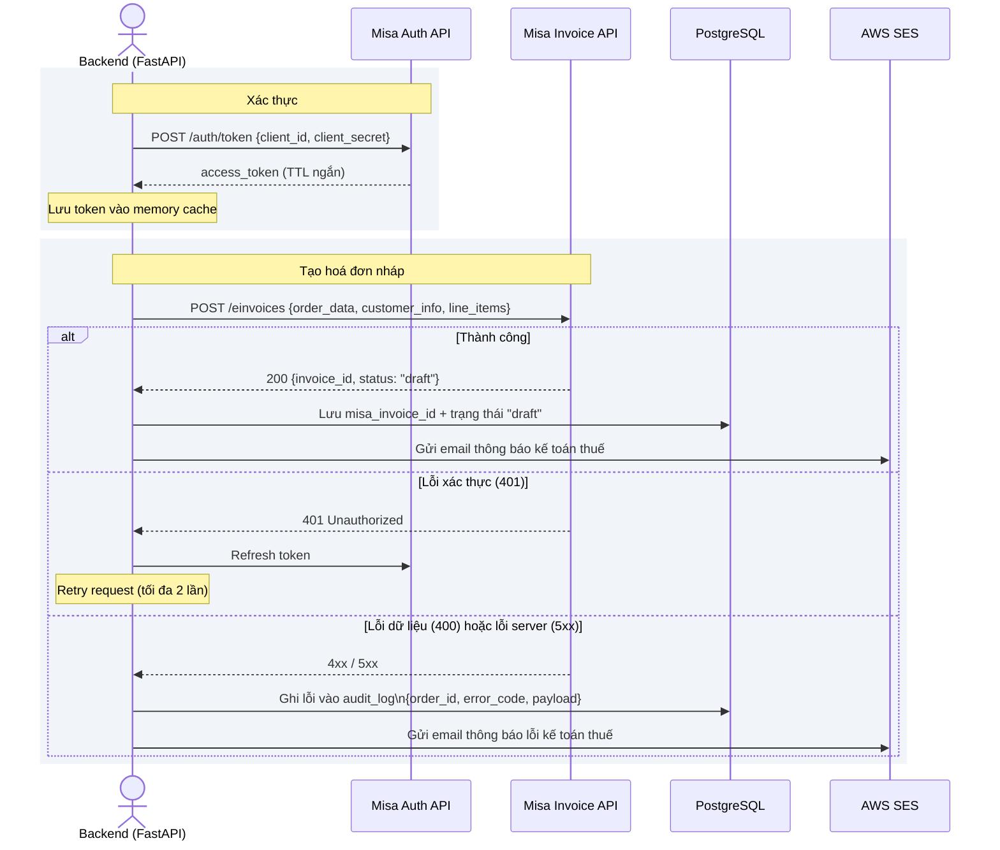
```mermaid
sequenceDiagram
    actor BE as Backend (FastAPI)
    participant MisaAuth as Misa Auth API
    participant MisaInv as Misa Invoice API
    participant DB as PostgreSQL
    participant SES as AWS SES

    rect rgb(241, 245, 249)
        Note over BE,MisaAuth: Xác thực
        BE->>MisaAuth: POST /auth/token {client_id, client_secret}
        MisaAuth-->>BE: access_token (TTL ngắn)
        Note over BE: Lưu token vào memory cache
    end

    rect rgb(241, 245, 249)
        Note over BE,MisaInv: Tạo hoá đơn nháp
        BE->>MisaInv: POST /einvoices {order_data, customer_info, line_items}
        alt Thành công
            MisaInv-->>BE: 200 {invoice_id, status: "draft"}
            BE->>DB: Lưu misa_invoice_id + trạng thái "draft"
            BE->>SES: Gửi email thông báo kế toán thuế
        else Lỗi xác thực (401)
            MisaInv-->>BE: 401 Unauthorized
            BE->>MisaAuth: Refresh token
            Note over BE: Retry request (tối đa 2 lần)
        else Lỗi dữ liệu (400) hoặc lỗi server (5xx)
            MisaInv-->>BE: 4xx / 5xx
            BE->>DB: Ghi lỗi vào audit_log\n{order_id, error_code, payload}
            BE->>SES: Gửi email thông báo lỗi kế toán thuế
        end
    end
```

**Ghi chú:**
- Access token Misa lưu cache in-memory, tự refresh khi hết hạn
- Payload hoá đơn dựa trên nội dung phiếu bán hàng (B7): danh sách SP, số lượng, đơn giá, thuế
- Hoá đơn tạo ở trạng thái `draft` — kế toán phát hành chính thức trên portal Misa
- Mọi lỗi đều ghi `audit_log` để xử lý thủ công, không ảnh hưởng đến đơn hàng
- Cần bổ sung: `client_id`, `client_secret`, `company_tax_code` vào config

---

## B9. Tích hợp Đơn vị giao hàng / COD *(Planned)*

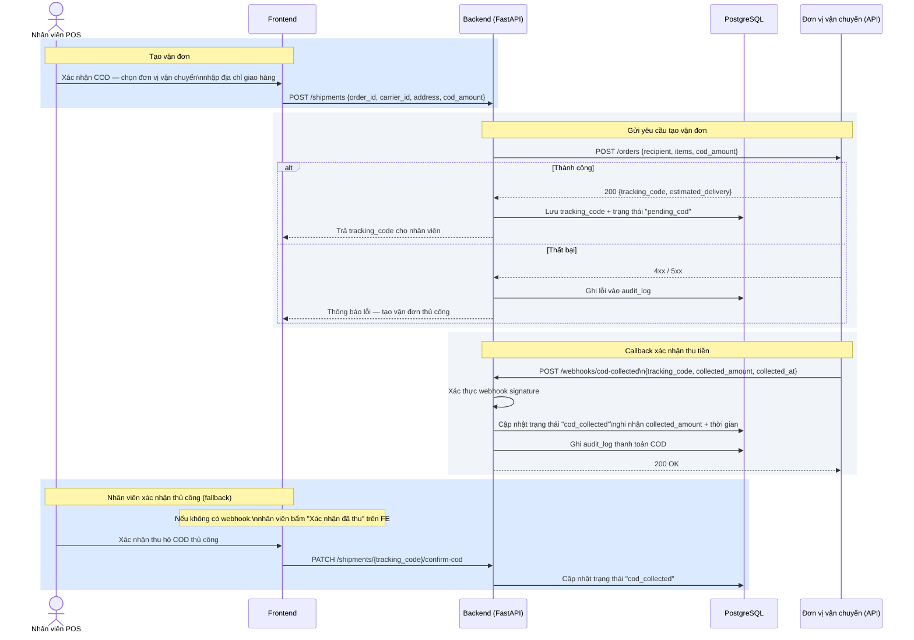
```mermaid
sequenceDiagram
    actor Staff as Nhân viên POS
    participant FE as Frontend
    participant BE as Backend (FastAPI)
    participant DB as PostgreSQL
    participant Carrier as Đơn vị vận chuyển (API)

    rect rgb(219, 234, 254)
        Note over Staff,FE: Tạo vận đơn
        Staff->>FE: Xác nhận COD — chọn đơn vị vận chuyển\nnhập địa chỉ giao hàng
        FE->>BE: POST /shipments {order_id, carrier_id, address, cod_amount}
    end

    rect rgb(241, 245, 249)
        Note over BE,Carrier: Gửi yêu cầu tạo vận đơn
        BE->>Carrier: POST /orders {recipient, items, cod_amount}
        alt Thành công
            Carrier-->>BE: 200 {tracking_code, estimated_delivery}
            BE->>DB: Lưu tracking_code + trạng thái "pending_cod"
            BE-->>FE: Trả tracking_code cho nhân viên
        else Thất bại
            Carrier-->>BE: 4xx / 5xx
            BE->>DB: Ghi lỗi vào audit_log
            BE-->>FE: Thông báo lỗi — tạo vận đơn thủ công
        end
    end

    rect rgb(241, 245, 249)
        Note over Carrier,BE: Callback xác nhận thu tiền
        Carrier->>BE: POST /webhooks/cod-collected\n{tracking_code, collected_amount, collected_at}
        BE->>BE: Xác thực webhook signature
        BE->>DB: Cập nhật trạng thái "cod_collected"\nghi nhận collected_amount + thời gian
        BE->>DB: Ghi audit_log thanh toán COD
        BE-->>Carrier: 200 OK
    end

    rect rgb(219, 234, 254)
        Note over FE,Staff: Nhân viên xác nhận thủ công (fallback)
        Note over FE: Nếu không có webhook:\nnhân viên bấm "Xác nhận đã thu" trên FE
        Staff->>FE: Xác nhận thu hộ COD thủ công
        FE->>BE: PATCH /shipments/{tracking_code}/confirm-cod
        BE->>DB: Cập nhật trạng thái "cod_collected"
    end
```

**Ghi chú:**
- Hỗ trợ nhiều đơn vị vận chuyển — cấu hình `carrier_id` và endpoint riêng cho từng đơn vị
- Webhook signature cần xác thực bằng HMAC trước khi xử lý
- Fallback thủ công khi đơn vị vận chuyển không hỗ trợ webhook
- Trạng thái COD: `pending_cod` → `cod_collected` → phản ánh vào luồng thanh toán A2
- Cần bổ sung: danh sách đơn vị vận chuyển tích hợp, cơ chế đối soát định kỳ

---

## B10. Tích hợp VNPay API *(Planned)*

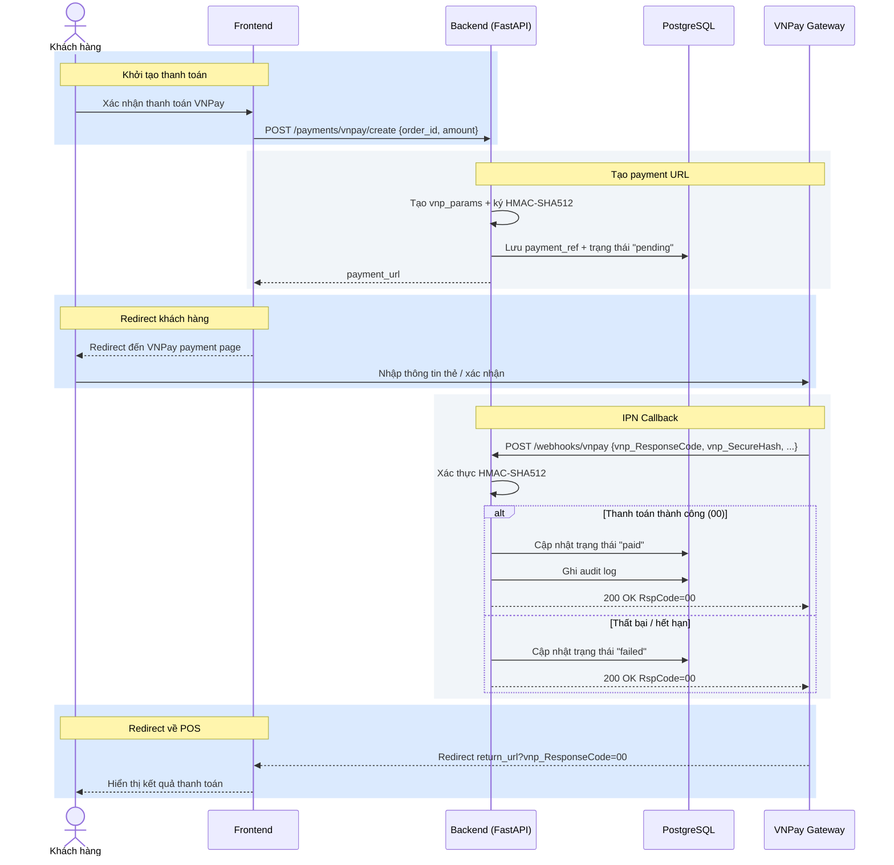
```mermaid
sequenceDiagram
    actor User as Khách hàng
    participant FE as Frontend
    participant BE as Backend (FastAPI)
    participant DB as PostgreSQL
    participant VNPay as VNPay Gateway

    rect rgb(219, 234, 254)
        Note over User,FE: Khởi tạo thanh toán
        User->>FE: Xác nhận thanh toán VNPay
        FE->>BE: POST /payments/vnpay/create {order_id, amount}
    end
    rect rgb(241, 245, 249)
        Note over BE,VNPay: Tạo payment URL
        BE->>BE: Tạo vnp_params + ký HMAC-SHA512
        BE->>DB: Lưu payment_ref + trạng thái "pending"
        BE-->>FE: payment_url
    end
    rect rgb(219, 234, 254)
        Note over FE,User: Redirect khách hàng
        FE-->>User: Redirect đến VNPay payment page
        User->>VNPay: Nhập thông tin thẻ / xác nhận
    end
    rect rgb(241, 245, 249)
        Note over VNPay,BE: IPN Callback
        VNPay->>BE: POST /webhooks/vnpay {vnp_ResponseCode, vnp_SecureHash, ...}
        BE->>BE: Xác thực HMAC-SHA512
        alt Thanh toán thành công (00)
            BE->>DB: Cập nhật trạng thái "paid"
            BE->>DB: Ghi audit log
            BE-->>VNPay: 200 OK RspCode=00
        else Thất bại / hết hạn
            BE->>DB: Cập nhật trạng thái "failed"
            BE-->>VNPay: 200 OK RspCode=00
        end
    end
    rect rgb(219, 234, 254)
        Note over FE,User: Redirect về POS
        VNPay-->>FE: Redirect return_url?vnp_ResponseCode=00
        FE-->>User: Hiển thị kết quả thanh toán
    end
```

**Ghi chú:**
- Backend phải trả `200 OK` cho VNPay IPN dù thành công hay thất bại — nếu không VNPay sẽ retry
- Xác thực `vnp_SecureHash` bắt buộc trước khi xử lý bất kỳ callback nào
- `return_url` chỉ để hiển thị kết quả cho user — không dùng để cập nhật trạng thái (dùng IPN)

---

## B11. Tích hợp MoMo API *(Planned)*

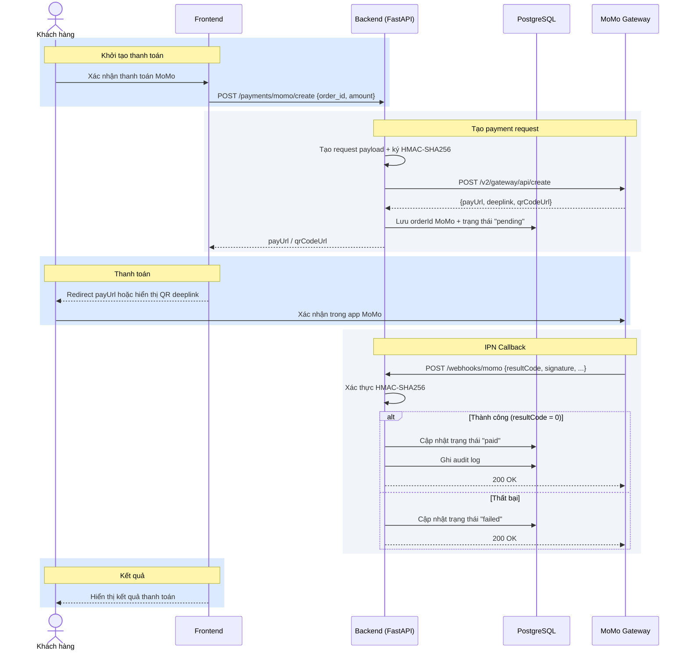
```mermaid
sequenceDiagram
    actor User as Khách hàng
    participant FE as Frontend
    participant BE as Backend (FastAPI)
    participant DB as PostgreSQL
    participant MoMo as MoMo Gateway

    rect rgb(219, 234, 254)
        Note over User,FE: Khởi tạo thanh toán
        User->>FE: Xác nhận thanh toán MoMo
        FE->>BE: POST /payments/momo/create {order_id, amount}
    end
    rect rgb(241, 245, 249)
        Note over BE,MoMo: Tạo payment request
        BE->>BE: Tạo request payload + ký HMAC-SHA256
        BE->>MoMo: POST /v2/gateway/api/create
        MoMo-->>BE: {payUrl, deeplink, qrCodeUrl}
        BE->>DB: Lưu orderId MoMo + trạng thái "pending"
        BE-->>FE: payUrl / qrCodeUrl
    end
    rect rgb(219, 234, 254)
        Note over FE,User: Thanh toán
        FE-->>User: Redirect payUrl hoặc hiển thị QR deeplink
        User->>MoMo: Xác nhận trong app MoMo
    end
    rect rgb(241, 245, 249)
        Note over MoMo,BE: IPN Callback
        MoMo->>BE: POST /webhooks/momo {resultCode, signature, ...}
        BE->>BE: Xác thực HMAC-SHA256
        alt Thành công (resultCode = 0)
            BE->>DB: Cập nhật trạng thái "paid"
            BE->>DB: Ghi audit log
            BE-->>MoMo: 200 OK
        else Thất bại
            BE->>DB: Cập nhật trạng thái "failed"
            BE-->>MoMo: 200 OK
        end
    end
    rect rgb(219, 234, 254)
        Note over FE,User: Kết quả
        FE-->>User: Hiển thị kết quả thanh toán
    end
```

**Ghi chú:**
- Hỗ trợ 2 luồng: redirect (`payUrl`) trên desktop, QR deeplink trên mobile
- `resultCode = 0` là thành công; các mã khác là lỗi — xem tài liệu MoMo
- Xác thực signature bắt buộc trước khi xử lý IPN

---

## B12. Tích hợp VietQR Payment *(Planned)*

> **Lưu ý phân biệt**: Luồng này là VietQR **thanh toán** (sinh QR chuyển khoản ngân hàng) — khác hoàn toàn với VietQR MST lookup (B6) dùng để tra cứu mã số thuế.

```mermaid
sequenceDiagram
    actor User as Khách hàng
    participant FE as Frontend
    participant BE as Backend (FastAPI)
    participant DB as PostgreSQL
    participant Bank as Ngân hàng đối tác (API)

    rect rgb(219, 234, 254)
        Note over User,FE: Khởi tạo thanh toán
        User->>FE: Chọn thanh toán VietQR
        FE->>BE: POST /payments/vietqr/create {order_id, amount}
    end
    rect rgb(241, 245, 249)
        Note over BE,Bank: Sinh QR code
        BE->>BE: Tạo nội dung QR theo chuẩn VietQR\n(bank_id, account_no, amount, description)
        BE->>Bank: POST /qr/generate (nếu dùng API ngân hàng)
        Bank-->>BE: QR image / QR string
        BE->>DB: Lưu payment_ref + trạng thái "pending"
        BE-->>FE: qr_data / qr_image_url
    end
    rect rgb(219, 234, 254)
        Note over FE,User: Hiển thị QR
        FE-->>User: Hiển thị QR code trên màn hình
        User->>Bank: Quét QR bằng app ngân hàng → xác nhận chuyển khoản
    end
    rect rgb(241, 245, 249)
        Note over Bank,BE: Xác nhận giao dịch
        alt Ngân hàng có webhook
            Bank->>BE: POST /webhooks/vietqr {transaction_id, amount, description}
            BE->>BE: Xác thực + đối chiếu description với payment_ref
            BE->>DB: Cập nhật trạng thái "paid"
            BE->>DB: Ghi audit log
        else Fallback thủ công
            Note over FE: Nhân viên bấm "Xác nhận đã nhận tiền"
            FE->>BE: PATCH /payments/vietqr/{ref}/confirm
            BE->>DB: Cập nhật trạng thái "paid"
        end
    end
    rect rgb(219, 234, 254)
        Note over FE,User: Kết quả
        FE-->>User: Hiển thị xác nhận thanh toán thành công
    end
```

**Ghi chú:**
- QR chuẩn VietQR có thể sinh tĩnh (không cần API ngân hàng) nếu chỉ cần nhúng số tài khoản + số tiền
- Cơ chế xác nhận phụ thuộc vào ngân hàng đối tác — không phải ngân hàng nào cũng có webhook
- `description` (nội dung chuyển khoản) dùng để đối chiếu tự động — cần format chuẩn (vd: mã đơn hàng)
- Fallback thủ công là bắt buộc khi webhook không khả dụng

---

## Tham chiếu

| Tài liệu | Mô tả |
|---|---|
| [scope.md](scope.md) | Scope & Architecture |
| [api_contract.md](api_contract.md) | API Contract (40 endpoints) |
| [frontend_design.md](frontend_design.md) | Thiết kế giao diện |
| [open_questions.md](open_questions.md) | Câu hỏi đã xác nhận |
