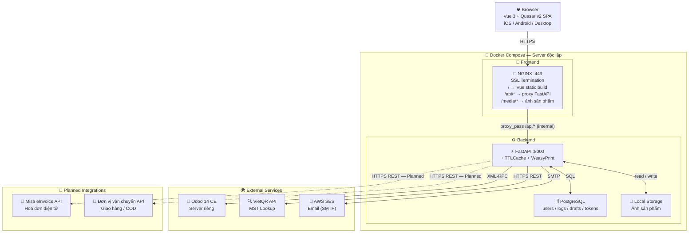

# VJ Mobile POS — Scope & Architecture Document

> Trạng thái: Draft  
> Cập nhật: 2026-04-15  
> Phiên bản: 0.5

---

## 1. Tổng quan dự án

VJ Mobile POS là một ứng dụng web POS nhẹ, chạy trên trình duyệt, tích hợp với hệ thống Odoo 14 CE thông qua XML-RPC.

**Thiết bị & trình duyệt mục tiêu:**
- Máy tính — Chrome (desktop layout)
- iPad — Safari (tablet layout, touch-friendly) Hệ thống **không thay thế module POS của Odoo** mà đóng vai trò là một UI nghiệp vụ riêng, gọi vào Odoo để thực hiện các thao tác bán hàng và quản lý kho.

---

## 2. Phạm vi nghiệp vụ (In Scope)

| # | Nghiệp vụ | Mô tả | Trạng thái |
|---|---|---|---|
| 1 | Bán hàng | Tạo và xác nhận `sale.order`, lưu đơn nháp tối đa 8 giờ (PostgreSQL). KH không bắt buộc khi tạo đơn — chỉ bắt buộc trước khi thanh toán | Đã xác nhận |
| 2 | Nhận thanh toán | Ghi nhận thủ công: tiền mặt, chuyển khoản, VNPay, MoMo, thẻ | Đã xác nhận |
| 3 | Đặt cọc | Nhân viên nhập số tiền cọc tự do. sale.order giữ trạng thái confirmed. Thu phần còn lại bằng cách tìm đơn theo thông tin KH | Đã xác nhận |
| 4 | Xuất tồn kho | Auto validate `stock.picking` + gán serial, tạo backorder nếu thiếu hàng | Đã xác nhận |
| 5 | Quản lý backorder | Hiển thị, theo dõi và xử lý backorder trong Mobile POS | Đã xác nhận |
| 6 | Kiểm tra tồn kho | Tra cứu `stock.quant` theo địa điểm được phân quyền | Đã xác nhận |
| 7 | Tra cứu MST | Tra cứu mã số thuế khách hàng qua VietQR API | Đã xác nhận |
| 8 | Quản lý user | Tạo user liên kết `hr.employee` Odoo (trừ admin mặc định), vô hiệu hóa, phân quyền (ADMIN) | Đã xác nhận |
| 9 | In phiếu bán hàng | Generate PDF từ template HTML/CSS. 3 loại phiếu: xác nhận đơn, đặt cọc, thanh toán | Đã xác nhận |
| 10 | Quản lý template in | ADMIN chỉnh sửa template HTML/CSS trong app, lưu PostgreSQL | Đã xác nhận |
| 11 | Hoá đơn điện tử — Misa | Sau thanh toán tự động tạo hoá đơn nháp trên Misa qua API; thông báo email kế toán thuế | Đang thiết kế |
| 12 | Thanh toán COD | Giao hàng & thu tiền hộ qua đơn vị vận chuyển; ghi nhận vận đơn, theo dõi trạng thái thu hộ | Đang thiết kế |

### Ngoài phạm vi (Out of Scope)

- Module POS (`pos.order`) của Odoo
- Offline mode / PWA sync
- Tích hợp phần cứng (máy in, barcode scanner, màn hình phụ)
- Quản lý sản phẩm / danh mục (thực hiện trực tiếp trên Odoo)
- Hoàn trả hàng (return) — giai đoạn đầu
- Báo cáo / BI
- Tích hợp trực tiếp payment gateway API (VNPay, MoMo) — giai đoạn này
- Chiết khấu (discount)
- Nhập hàng (stock receipt) — thực hiện trên Odoo

---

## 3. Người dùng & Phân quyền

Giai đoạn phát triển ban đầu, hệ thống có **2 role**:

| Role | Mô tả | Quyền chính |
|---|---|---|
| ADMIN | Quản trị hệ thống | Toàn quyền: quản lý user, cấu hình, hủy đơn đã xác nhận |
| POS User | Nhân viên sử dụng POS | Tạo đơn, ghi nhận thanh toán, kiểm tra tồn kho, xử lý backorder |

**Ghi chú:**
- 1 user có thể được gán nhiều role
- Không quản lý ca làm việc (shift)
- Phân quyền theo địa điểm kho (location): user chỉ thấy tồn kho tại location được gán
- Warehouse tự động chọn dựa trên warehouse/location được gán cho user
- Quản lý user (tạo, vô hiệu hóa) thực hiện trong app bởi ADMIN
- **User account quản lý riêng trên hệ thống** (PostgreSQL) — không dùng tài khoản Odoo
- **Thông tin cá nhân kế thừa từ `hr.employee` trên Odoo** (tên, email, SĐT, phòng ban, chức danh) thông qua `hr_employee_id`
- Khi tạo user mới (trừ admin mặc định), ADMIN phải chọn `hr.employee` từ Odoo
- 1 `hr.employee` chỉ liên kết với 1 user POS (không trùng)

**Số lượng người dùng đồng thời**: ~30 người, không có giao dịch trùng lúc.

---

## 4. Kiến trúc hệ thống



### 4.1 Tech Stack

| Layer | Công nghệ | Ghi chú |
|---|---|---|
| Frontend | Vue 3 + Quasar v2 | Mobile-first, SPA |
| State Management | Pinia | Shared state: user session, cart, draft order |
| Backend | Python FastAPI | Async, Swagger auto-doc |
| Cache | `cachetools.TTLCache` (in-process) | Hot data: sản phẩm, tồn kho, MST, pricelist |
| Database | PostgreSQL | Users, audit log, draft orders, refresh tokens, print templates, config |
| Auth | JWT (access + refresh token) | Stateless |
| Reverse Proxy | NGINX | Single entry point :443 — SSL termination, serve Vue static build (`/`), proxy_pass API calls (`/api/*`) tới FastAPI nội bộ, serve ảnh sản phẩm (`/media/*`) |
| Container | Docker Compose | Server riêng với Odoo |
| Odoo connector | `xmlrpc.client` (Python built-in) | Service account model |
| PDF generation | `WeasyPrint` + `Jinja2` (Python, backend) | FastAPI render HTML/CSS template → PDF binary |
| Ảnh sản phẩm | Local storage (server) | ADMIN upload trong app, backend resize + crop → thumbnail. Max 5MB |
| Email | AWS SES via `smtplib` | Reset password, thông báo (mở rộng sau) |

### 4.2 Mô hình Auth — Service Account

- Backend duy trì **1 Odoo service account** dùng chung cho tất cả lời gọi XML-RPC
- **Service account được cấp toàn quyền (admin) trên Odoo** — phân quyền kiểm soát hoàn toàn tại tầng backend
- Người dùng đăng nhập vào hệ thống backend riêng (PostgreSQL)
- JWT access token (TTL ngắn) + refresh token (TTL dài, lưu PostgreSQL)
- Logout: xóa refresh token khỏi DB — không cần JWT blacklist

### 4.3 Chiến lược Cache

**In-memory TTLCache** (`cachetools`, trong FastAPI process) — hot data, tự expire, không cần service ngoài:

| Dữ liệu | TTL | Ghi chú |
|---|---|---|
| Danh mục sản phẩm, giá | 30 phút | Flush thủ công khi cập nhật trên Odoo |
| Thông tin khách hàng | 60 phút | On-demand |
| Tồn kho (`stock.quant`) | 5 phút | Chấp nhận được vì không giao dịch đồng thời |
| Pricelist (fixed price) | 1 giờ | 1 pricelist duy nhất, flush thủ công |
| Kết quả tra cứu MST | 10 phút | VietQR API |
| Danh mục SP (`product.category`) | 8 tiếng | Flush riêng khi cần |
| Danh sách khách hàng | 60 phút | Tìm kiếm on-demand, cache kết quả |

**PostgreSQL** — dữ liệu cần persistence qua restart:

| Dữ liệu | Bảng | Ghi chú |
|---|---|---|
| Đơn nháp (draft order) | `draft_orders` + cột `expires_at` | Cleanup job định kỳ xóa bản ghi hết hạn |
| Refresh token | `refresh_tokens` + cột `expires_at` | Xóa khi logout hoặc hết hạn |

---

## 5. Tích hợp Odoo 14 CE

### 5.1 Odoo Models sử dụng

| Nghiệp vụ | Model | Phương thức |
|---|---|---|
| Bán hàng | `sale.order`, `sale.order.line` | `create`, `action_confirm`, `action_cancel` |
| Xuất kho | `stock.picking`, `stock.move.line` | `button_validate` |
| Backorder | `stock.backorder.confirmation` | `process` |
| Serial / Lot | `stock.lot` | `search_read` (gợi ý), `create` (nếu mới) |
| Invoice | `account.move` | `create` (draft — kế toán post trên Odoo) |
| Thanh toán | `account.payment` | `create` (từ Mobile POS, dựa trên thanh toán thực tế) |
| Tồn kho | `stock.quant` | `search_read` |
| Khách hàng | `res.partner` | `search_read`, `create`, `write` |
| Sản phẩm | `product.product` | `search_read` |
| Pricelist | `product.pricelist` | `get_product_price` |
| Nhân viên | `hr.employee` | `search_read` (lấy thông tin cá nhân khi tạo user POS) |

### 5.2 Ghi chú thiết kế quan trọng

- **Service account**: Cấp toàn quyền Odoo admin — kiểm soát truy cập qua backend
- **Pricelist**: Fixed price, 1 pricelist duy nhất, không chiết khấu
- **UoM**: 1 đơn vị tính duy nhất cho tất cả sản phẩm
- **VAT**: Chưa áp dụng giai đoạn đầu
- **Invoice**: Tạo ở trạng thái **draft** — kế toán post trên Odoo riêng
- **account.payment**: Tạo từ Mobile POS dựa trên thanh toán thực tế của khách
- **Serial Number**: POS user nhập / chọn serial, hệ thống **gợi ý từ `stock.lot` có sẵn** theo sản phẩm
- **Warehouse**: Tự động chọn dựa trên warehouse/location được gán cho user (14 warehouse, 20+ location)
- **Backorder**: Được hiển thị và xử lý trong Mobile POS

---

## 6. Tích hợp External APIs

### 6.1 Tra cứu MST (Mã số thuế)

- **Provider**: VietQR API (miễn phí)
- **Endpoint**: `GET https://api.vietqr.io/v2/business/{mst}`
- **Trả về**: Tên doanh nghiệp, địa chỉ, trạng thái hoạt động
- **Cache**: TTLCache in-memory, TTL = 10 phút
- **Rate limit**: Miễn phí — cần theo dõi giới hạn khi traffic tăng

### 6.2 Email — AWS SES

- **Provider**: AWS SES (Simple Email Service)
- **Kết nối**: Python `smtplib` (SMTP protocol)
- **Dùng cho**: Reset password (token qua email)
- **Giai đoạn sau**: Gửi biên lai, xác nhận đơn, thông báo đặt cọc cho KH (xem Backlog B-14)

### 6.3 Thanh toán

- **Phương thức**: Tiền mặt, Chuyển khoản, VNPay, MoMo, Thẻ tín dụng, COD
- **Mô hình**: Ghi nhận **thủ công** — thu ngân xác nhận sau khi khách thanh toán
- **Gateway API**: Ngoài phạm vi giai đoạn này
- **Đặc điểm**: Hỗ trợ nhiều phương thức trong 1 đơn
- **Đặt cọc**: Hỗ trợ — nhân viên nhập tự do, tìm đơn theo thông tin KH khi thu phần còn lại
- **COD**: Xem mục 6.5

### 6.4 Hoá đơn điện tử — Misa *(Planned)*

- **Provider**: Misa eInvoice API
- **Kích hoạt**: Sau khi thanh toán hoàn tất (luồng A2) → tự động gọi API tạo hoá đơn
- **Trạng thái hoá đơn**: Luôn tạo ở dạng `draft` — kế toán thuế phát hành chính thức trên portal Misa
- **Xác thực**: OAuth 2.0 — `access_token` lưu in-memory cache, tự refresh khi hết hạn
- **Nội dung**: Dựa trên phiếu bán hàng (danh sách SP, số lượng, đơn giá); đính kèm MST nếu khách hàng có
- **Thông báo**: Email tự động đến kế toán thuế khi tạo thành công hoặc khi xảy ra lỗi
- **Xử lý lỗi**: Retry tối đa 2 lần (lỗi 401); ghi `audit_log` và thông báo email kế toán khi lỗi 4xx/5xx
- **Cần xác nhận**: `client_id`, `client_secret`, `company_tax_code`; endpoint môi trường staging/production
- **Luồng chi tiết**: Xem [process_flow.md — B8](process_flow.md)

### 6.5 Giao hàng & Thu tiền hộ — COD Carrier *(Planned)*

- **Provider**: Đơn vị vận chuyển (chưa xác định — GHN, GHTK, hoặc đơn vị nội bộ)
- **Kích hoạt**: Nhân viên chọn phương thức COD tại luồng thanh toán (A2) → tạo vận đơn qua API
- **Thông tin cần thiết**: Địa chỉ giao hàng, tên người nhận, SĐT, `cod_amount`, danh sách sản phẩm
- **Trạng thái**: `pending_cod` → `cod_collected` (qua webhook hoặc xác nhận thủ công)
- **Webhook**: Carrier callback khi đã thu tiền → backend xác thực HMAC signature → cập nhật trạng thái
- **Fallback thủ công**: Nhân viên bấm "Xác nhận đã thu" nếu carrier không hỗ trợ webhook
- **Đối soát**: Cơ chế đối soát định kỳ giữa `cod_amount` và `collected_amount` — thiết kế giai đoạn tiếp theo
- **Hỗ trợ đa carrier**: Cấu hình `carrier_id` riêng cho từng đơn vị vận chuyển
- **Cần xác nhận**: Carrier cụ thể, API key, cấu trúc webhook payload, quy trình đối soát
- **Luồng chi tiết**: Xem [process_flow.md — B9](process_flow.md)

---

## 7. Cấu trúc thư mục dự kiến

```
vj-mobile-pos/
├── backend/
│   ├── app/
│   │   ├── api/          # routes: auth, orders, products, inventory, payment, templates, print
│   │   ├── core/         # config, security (JWT), cache (TTLCache)
│   │   ├── odoo/         # XML-RPC client wrapper + model helpers
│   │   ├── external/     # MST (VietQR), Misa eInvoice (planned), COD Carrier (planned)
│   │   └── print/        # WeasyPrint + Jinja2: render template → PDF
│   ├── .env
│   └── requirements.txt
├── frontend/
│   └── (Vue 3 + Quasar v2 project)
├── nginx/
│   └── nginx.conf
├── docker-compose.yml
└── docs/
    ├── scope.md
    ├── process_flow.md
    └── open_questions.md
```

---

## 8. Non-functional Requirements

| Tiêu chí | Yêu cầu | Trạng thái |
|---|---|---|
| Concurrent users | ~30, không giao dịch trùng lúc | Đã xác nhận |
| Response time | < 2s cho các thao tác thường | Cần xác nhận |
| Availability | 24/7 | Đã xác nhận |
| Deploy | Docker Compose, server riêng với Odoo | Đã xác nhận |
| SSL / Reverse Proxy | NGINX | Đã xác nhận |
| Backup | Tự backup PostgreSQL qua Docker | Đã xác nhận |
| Audit log | File `*.log`, stream Loki (roadmap) | Đã xác nhận |
| HTTPS | Bắt buộc qua NGINX | Đã xác nhận |
| Ngôn ngữ UI | Tiếng Việt | Đã xác nhận |
| Thiết bị | Máy tính (Chrome) + iPad (Safari) | Đã xác nhận |
| Responsive | Desktop layout + Tablet layout | Đã xác nhận |
| Browser support | Chrome latest, Safari (iOS/iPadOS) | Đã xác nhận |

---

## 9. Các vấn đề còn mở

Xem file [open_questions.md](open_questions.md) để theo dõi toàn bộ câu hỏi cần làm rõ.

---

## 10. Backlog — Future Development

Các hạng mục chưa triển khai trong giai đoạn này, để dành cho các phiên bản tiếp theo.

**Mức độ ưu tiên**: `Cao` / `Trung bình` / `Thấp`

### 10.1 Nghiệp vụ

| # | Hạng mục | Mô tả | Ưu tiên | Trạng thái |
|---|---|---|---|---|
| B-01 | Hoàn trả hàng (Return) | Tạo phiếu nhập hàng trả về từ Mobile POS, reverse stock.picking | Cao | Backlog |
| B-02 | Tích hợp payment gateway | Kết nối trực tiếp VNPay / MoMo API, xử lý callback tự động | Cao | Backlog |
| B-03 | Chiết khấu (Discount) | Chiết khấu theo dòng sản phẩm hoặc theo tổng đơn | Trung bình | Backlog |
| B-04 | Thuế VAT | Tự động tính thuế theo cấu hình sản phẩm trên Odoo | Trung bình | Backlog |
| B-05 | Hoá đơn điện tử — Misa | Tạo hoá đơn nháp tự động sau thanh toán qua Misa eInvoice API; thông báo email kế toán thuế. Luồng: A6, B8 | Cao | **Đang thiết kế** |
| B-06 | Giao hàng & Thu tiền hộ — COD | Tích hợp đơn vị vận chuyển: tạo vận đơn, webhook xác nhận thu tiền, fallback thủ công. Luồng: A2, B9 | Cao | **Đang thiết kế** |
| B-07 | Báo cáo / Dashboard | Doanh thu theo ngày, theo nhân viên, tồn kho tổng hợp cho Manager | Trung bình | Backlog |
| B-08 | Quản lý ca làm việc | Mở / đóng ca thu ngân, tổng kết doanh thu theo ca | Thấp | Backlog |
| B-09 | Role chi tiết hơn | Thêm role: Thủ kho, Kế toán, Manager với permission riêng | Thấp | Backlog |

### 10.2 Kỹ thuật & Infrastructure

| # | Hạng mục | Mô tả | Ưu tiên | Trạng thái |
|---|---|---|---|---|
| B-10 | Audit log stream Loki | Chuyển từ file `*.log` sang Loki + Grafana để query và alert | Trung bình | Backlog |
| B-11 | Webhook từ Odoo | Nhận sự kiện cập nhật sản phẩm / giá từ Odoo để invalidate cache tự động | Trung bình | Backlog |
| B-12 | Push notification | Thông báo cho nhân viên khi backorder sẵn sàng validate | Thấp | Backlog |
| B-13 | Scale multi-worker | Nếu cần scale FastAPI lên nhiều worker → thêm Redis cho shared cache | Thấp | Backlog |
| B-14 | Monitoring / Alerting | Tích hợp Prometheus + Grafana để theo dõi uptime và performance | Thấp | Backlog |

### 10.3 Thông báo & Messaging

| # | Hạng mục | Mô tả | Ưu tiên | Trạng thái |
|---|---|---|---|---|
| B-15 | Email Service (mở rộng) | Gửi email xác nhận đơn hàng, biên lai thanh toán, thông báo đặt cọc cho KH. Provider: **AWS SES** (đã xác nhận). Giai đoạn đầu chỉ dùng cho reset password | Trung bình | Backlog |
| B-16 | Zalo Messaging | Gửi thông báo tự động qua Zalo OA (Official Account): xác nhận đơn, trạng thái giao hàng, nhắc thanh toán phần còn lại | Trung bình | Backlog |

### 10.4 Ngoài phạm vi dài hạn

| # | Hạng mục | Lý do chưa xem xét |
|---|---|---|
| B-17 | Offline mode / PWA sync | Phức tạp, nghiệp vụ yêu cầu live network |
| B-18 | Native mobile app (iOS / Android) | Không cần — chỉ dùng Chrome (PC) và Safari (iPad) |
| B-19 | Tích hợp phần cứng | Máy in hóa đơn, barcode scanner, customer display |
| B-20 | BI / Analytics nâng cao | Ngoài phạm vi hệ thống POS — dùng Odoo reporting |
